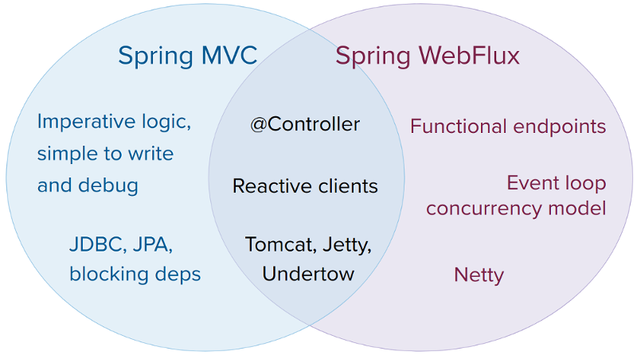

原生的web框架是内嵌在spring框架，spring Web MVC中，是针对Servlet API 和Servlet容器定制化的。响应栈web框架，Spring WebFlux，是在5.0之后增加的。完全非阻塞，支持[Reactive Streams](https://www.reactive-streams.org/)背压，运行在类似Netty，Undertow或Servlet 3.1+ 容器上。

两个web框架如同他们的源模块名称一样([spring-webmvc](https://github.com/spring-projects/spring-framework/tree/main/spring-webmvc) and [spring-webflux](https://github.com/spring-projects/spring-framework/tree/main/spring-webflux))并存在spring框架中。任何一个模块都是可选的。应用可以使用其中一个或者另一个，另或者，在一些情况下同时使用。例如，带有响应式`webClient`的spring MVC controllers。

# 1.1. 概述

为什么要创建 Spring WebFlux？

一部分原因是因为需要一个可通过更少的硬件资源扩展，可通过少量线程处理并发的非阻塞web堆栈。Servlet 3.1 确实提供了支持非阻塞IO的API，然而，使用它会导致脱离Servlet API，有一些协议就是同步的(`Filter`, `Servlet`)或者是阻塞的(`getParameter`，`getPart`)。这就是一个新的通用API来服务非阻塞基础服务运行的动机。这很重要，因为类似Netty那些服务器在异步和非阻塞方面非常完善。

另一部分原因是函数式编程。就像Java 5增加的注解一样（用于controller或者单元测试的注解），Java 8增加的lambda表达式给了更多函数API在java中的机会。这对非阻塞应用和链式API益处很大（例如`CompletableFuture` and [ReactiveX](http://reactivex.io/)的普及），他们允许通过声明的方式构建异步逻辑。在编程模型级别上，Java 8启用 Spring WebFlux来提供函数式web端点与注解的controller共存。

## 1.1.1. 定义“reactive”

我们谈到了“非阻塞”和“函数式”，但是reactive含义是什么呢？

这个术语，“reactive”，指的是一种建立在对变化做出相应基础上的编程模型—网络组件对IO事件的响应，前端控制器对鼠标事件的响应以及其他。从这个意义上，非阻塞就是响应式的。因为，在这种模式下我们要对操作完成或者数据可用通知后做出响应，而不是阻塞在那里。

Spring团队关于“reactive”的另一个重要的机制是非阻塞背压（back pressure）。在同步调用下，关键的代码，阻塞调用是一种自然的背压模式，迫使调用方等待。在非阻塞代码中，控制事件速率很重要，这样一个高效的生产者就不会对下方造成压力。

Reactive Streams是一个[小的规范](https://github.com/reactive-streams/reactive-streams-jvm/blob/master/README.md#specification)（Java 9[已采用](https://docs.oracle.com/javase/9/docs/api/java/util/concurrent/Flow.html)），他定义了带有背压的异步组件之间的交互。例如一个数据资料库（充当[发布者](https://www.reactive-streams.org/reactive-streams-1.0.1-javadoc/org/reactivestreams/Publisher.html)）可以生产数据，一个HTTP服务（充当[订阅者](https://www.reactive-streams.org/reactive-streams-1.0.1-javadoc/org/reactivestreams/Subscriber.html)）可以将其写入响应体。Reactive Streams的主要目的就是让订阅者控制发布者何时快或者何时慢的生产数据。

> 常见问题：如果我的发布者无法放慢速度怎么办？
> 
> Reactive Streams的目的仅仅是建立机制和边界。如果发布者无法慢下来，那就要自行决定哪些缓存，哪些丢弃或者失败。

## 1.1.2. Reactive API

Reactive Streams对于互通性起着至关重要的作用。主要作用于函数库与基础组件，因为太底层，对于应用程序的api帮助不大。应用程序需要的是更高级并且丰富的函数API来构成异步逻辑—类似Java 8的`Stream` API，但不仅适用于集合。这就是Reactive库的定位。

[Reactor](https://github.com/reactor/reactor)是Spring WebFlux选择的reactive库。它提供了[`Mono`](https://projectreactor.io/docs/core/release/api/reactor/core/publisher/Mono.html)和[`Flux`](https://projectreactor.io/docs/core/release/api/reactor/core/publisher/Flux.html) 的API类型以处理0..1(`Mono`)和0..N(`Flux`)的数据序列，同时通过丰富的选项操作来满足ReactiveX的[运算符要求](http://reactivex.io/documentation/operators.html)。reactor是Reactive Streams库，所以所有的操作项都支持非阻塞背压。reactor非常注重java服务端。它是与Spring紧密合作开发的。

WebFlux要求Reactor作为核心依赖项，但是它可以通过Reactive Streams与其他reactive库互操作。通常，WebFlux接受一个常规`Publisher`作为输入，在内部将其转化为适应Reactor类型，通过这样，返回一个`Flux`或者`Mono`作为输出。所以，你可以将任何`Publisher`作为输入并且可以对输出应用操作，但是你需要调整输出与另一个reactive库配合使用。只要可行（例如，带注释的controller），WebFlux 就会通过可见的适应 RxJava 或其他reactive库的使用。查看[Reactive库](https://docs.spring.io/spring-framework/docs/current/reference/html/web-reactive.html#webflux-reactive-libraries)获取更多信息。

> 除了Reactive API，WebFlux还可以与[Coroutines](https://docs.spring.io/spring-framework/docs/current/reference/html/languages.html#coroutines) API一同适用于Kotlin，提供一系列命令式编程。Kotlin相关样例代码可查看Coroutines API。

## 1.1.3. 编程模型

`spring-web`模块中的Spring WebFlux底层包含了reactive的基础，包括HTTP抽象，用于支持的服务器的 Reactive Streams [适配器](https://docs.spring.io/spring-framework/docs/current/reference/html/web-reactive.html#webflux-httphandler)，[编解码器](https://docs.spring.io/spring-framework/docs/current/reference/html/web-reactive.html#webflux-codecs)，以及与 Servlet API 类似但具有非阻塞合同的核心[`WebHandler` API](https://docs.spring.io/spring-framework/docs/current/reference/html/web-reactive.html#webflux-web-handler-api)。

这种基础下，Spring WebFlux提供了两种编程模型二选一：

[注解Controllers](https://docs.spring.io/spring-framework/docs/current/reference/html/web-reactive.html#webflux-controller)：延续Spring MVC方式，基于spring-web模块相同的注解。Spring MVC和WebFlux的controller都支持reactive（Reactor和RxJava）返回类型。因此，区分它们并不容易。一个显着的区别是 WebFlux 还支持反应式`@RequestBody` 参数。

[函数式端点](https://docs.spring.io/spring-framework/docs/current/reference/html/web-reactive.html#webflux-fn)：基于lambda轻量的函数式编程模型。你可以将其视为一个小的库或者小的组件，应用程序可以使用它们路由和和处理请求。与注解controller最大的区别在于，应用程序负责请求的从头到尾的全部过程，而不是通过注释声明意图并被回调。

## 1.1.4. 适用性

Spring MVC还是 WebFlux？

这是一个很自然的问题但是却建立了一个不合理的二分法。实际上，两者共同工作可以扩展可用选项的空间。两者都是为彼此之间的连续性与一致性设计的，他们可以并存，并且每一方的反馈都双方都是有利的。下面图片展示了两者涉及内容，以及共同之处与独特之处。



我们建议你考虑下面具体的几点：

- 如果你已经有了一个运行良好的Spring MVC应用，那你不需要改变它。命令式编程对于编写，理解和调试都是最简便明了的。你有最大程度的库选择权，因为从历史上看大多数还是阻塞库。

- 如果你已经购买了非阻塞web栈，Spring WebFlux在该领域提供与其他模型相同的执行模型优势，同时还提供服务器的选择（Netty，Tomcat，Jetty，Undertow和Servlet 3.1+服务器），编程模型的选择（注解controller或者函数式endpoint），reactive库的选择（Reactor，RxJava或者其他）。

- 如果你对使用Java 8 lambdas或者Kotlin搭建的轻量的，函数式web框架，你可以使用Spring WebFlux函数式web端点。对于复杂度不高的小型服务或者微服务，这种得益于更高的透明度与自由控制权的服务，这是一个不错的选择。

- 在微服务架构中，你可以在一个应用中将Spring MVC或者Spring WebFlux controllers或者Spring WebFlux函数式端点任意混合使用。两个框架都支持基于注解的变成模式，可以更方便的知识重用并且选择正确的工具做正确的事情。
  
- 一个简单的评估应用选择依赖的方式。如果你要使用阻塞API（JPA,JDBC）或者使用网络API，Spring MVC则是常见体系结构的最佳选择。通过一个单独的分离线程使用Reactor和RxJava来应用阻塞调用从技术上是可行的，但在大多数非阻塞web栈中是不会这样用的。

- 如果你有一个需要调用远程服务的Spring MVC应用，尝试reactive `WebClient`。你可以在Spring MVC 控制器方法直接返回reactive类型（Reactor，RxJava或者[其他](https://docs.spring.io/spring-framework/docs/current/reference/html/web-reactive.html#webflux-reactive-libraries)）。每个调用的等待时间越长或者相互依赖性越大，好处就越明显。Spring MVC控制器也可以调用其他reactive组件。

- 如果你有一个庞大的团队，请牢记转向非阻塞，函数式和声明式编程的学习曲线很陡。一种无需完全切换即可开始的实用方法是使用reactive `WebClient`。除此之外，从小着手并衡量收益。我们希望会广泛的应用而言，这种转变是不必要的。如果你不确定带来的好处，请先学习非阻塞IO如何工作（例如，单线程Node.js上的并发）以及影响。

## 1.1.5. 服务器

Tomcat，Jetty，Servlet 3.1+ 容器以及非Servlet运行时服务例如Netty和Undertow都支持Spring WebFlux。所有服务器都适用于低级[通用API](https://docs.spring.io/spring-framework/docs/current/reference/html/web-reactive.html#webflux-httphandler)，因此可以跨服务器支持高级别的[编程模型](https://docs.spring.io/spring-framework/docs/current/reference/html/web-reactive.html#webflux-programming-models)。

Spring WebFlux没有内置支持启停的服务。但是，从spring配置和[WebFlux基础组件](https://docs.spring.io/spring-framework/docs/current/reference/html/web-reactive.html#webflux-web-handler-api)[构建](https://docs.spring.io/spring-framework/docs/current/reference/html/web-reactive.html#webflux-config)应用程序并[运行](https://docs.spring.io/spring-framework/docs/current/reference/html/web-reactive.html#webflux-httphandler)起来很简单，仅仅需要很少的代码。

Spring Boot 有一个 WebFlux starter自动化执行这些步骤。默认情况下，starter使用Netty，但是也很容易切换到Tomcat，Jetty或者Undertow，修改maven或者gradle依赖即可。Srping Boot默认使用Netty，因为它更广泛的使用在异步非阻塞领域，并且共享了客户端和服务端资源库。

Tomcat和Jetty可以同时适用于Spring MVC和WebFlux。记住，然而，他们的使用方式却是不同的。Spring MVC本身就是依靠Servlet阻塞IO所以当我们需要时候应用可以直接使用Servlet API。Spring WebFlux 依赖的是Servlet 3.1 非阻塞IO并且是作为一个低级适配器来使用Servlet API。并不能直接使用。

至于Undertow，Spring WebFlux直接使用Undertow API，并不会使用Servlet API。

## 1.1.6. 性能

性能有很多特征和意义。reactive和非阻塞一般来说不一定能使应用运行的更快。一些情况下（例如，如果使用`WebClient`并行进行远程调用），他们可以。大体上，通过非阻塞方式进行更对的工作可能会稍微增加所需的处理时间。

reactive和非阻塞的预期好处是可以通过很少的固定线程和内存进行扩展。这使得应用程序在负载下更具弹性，因为它们可以通过与预测的方式扩展。为了观察这种优点，你需要一些延迟（包括慢的IO或者不可预期的IO的混合）。这就是reactive栈开始展示其优势的地方，差异可能很大。

## 1.1.7. 并发模式

Spring MVC和Spring WebFlux都支持注解控制器，但是他们在并发模式以及阻塞和线程规模上有不同的默认假定设计。

在Spring MVC（一般的servlet应用）中，应用程序被假定可以阻塞当前线程（例如远程调用）。因此，servlet容器用一个很大的线程池来规避请求过程中可能存在的阻塞。

在Spring WebFlux（一般指非阻塞应用）中，应用被假定不会阻塞。所以，非阻塞的服务器用少量固定的线程池（事件循环处理器）去执行请求。

> “按比例缩放”和“线程数少”听起来可能是矛盾的，但是为了永远不阻塞（靠事件回调）当前线程意味着你不需要额外的线程，因为没有阻塞的请求来使用。

### 调用阻塞API

如果确实需要使用阻塞API怎么办？Reactor和RxJava都提供了`publishOn`选项在另一个线程上实现继续处理。这意味着容易逃生。记住，所以阻塞API并不适用于并发模式。

### 可变状态

在Reactive和RxJava中，你可以通过运算符声明逻辑。在运行期，会形成一个反应式管道，其中在不同的阶段依次处理数据。这样的一个好处是可以释放应用不用再不得不保护变化的状态，因为该管道中的应用代码永远不会被同时调用。

### 线程模型

你期望在Spring WebFlux运行时看到什么样的线程？
  
- 在一个叫“vanilla”的Spring WebFlux服务中（例如，没有数据权限也没有其他配置依赖），你可以期望服务器使用一个线程，其他几个用于执行请求（通常数量与cpu数量一致）。但是，servlet容器可能开启多个线程（例如，tomcat是10个），用来支持servlet IO（阻塞的）和servlet 3.1 IO(非阻塞)。
 
- reactive `WebClient`是事件循环模式运行的。所以你可以看到与之相关的小量的固定数量的处理线程（例如，Reactor Netty连接器的`reactor-htpp-nio-`）。然而，如果Reactor Netty同时用于客户端和服务端，两端会默认共享事件循环资源。

- Reactor和RxJava提供了称为调度程序的线程池抽象，以与`publishOn`运算符配合使用，该运算符用于将处理切换到其他线程池。这个调度程序的命名建议能表明具体并发策略 — 例如，“parallel”（用于具有有限数量的线程的 CPU 工作）或者“elastic”（用于具有大量线程的 I / O ）。如果看到这样的线程，则意味着某些代码正在使用特定的线程池`Scheduler`策略。

- 数据访问库或者其他第三方依赖也可以创建和使用自己的线程。

### 配置

spring框架没有提供对[服务器](https://docs.spring.io/spring-framework/docs/current/reference/html/web-reactive.html#webflux-server-choice)启停的支持。对于一个服务器的线程模型设置，
你需要使用服务器具体的配置API，或者如果你使用Spring Boot，查看对应服务器的Spring Boot配置选项。
你可以直接[配置](https://docs.spring.io/spring-framework/docs/current/reference/html/web-reactive.html#webflux-client-builder)`WebClient`。对于其他库，查看他们各自的文档。

# 1.2. Reactive 核心

`spring-web`模块包含了对以下reactive web应用的基本支持：

- 对于服务请求处理有两个级别支持。
    - [HttpHandler](https://docs.spring.io/spring-framework/docs/current/reference/html/web-reactive.html#webflux-httphandler)：基于具有非阻塞IO和Reactive Streams背压的HTTP请求处理基本协议，伴随在Reactor Netty，Undertow，Tomcat，Jetty和任何Servlet 3.1+ 容器的适配器。
    - [`WebHandler` API](https://docs.spring.io/spring-framework/docs/current/reference/html/web-reactive.html#webflux-web-handler-api)：稍微高级别的用于请求处理的通用API，在此基础上构建了具体的编程模型，例如带注解的控制器和函数端点。
- 对于客户端方面，`ClientHttpConnector`提供了基础协议来履行非阻塞和Reactive Streams背压的HTTP请求，伴随在[Reactor Netty](https://github.com/reactor/reactor-netty)，reactive [jetty HttpClient](https://github.com/jetty-project/jetty-reactive-httpclient)和[Apache Http Components]()的配置器。在应用中高级别的[WebClient](https://hc.apache.org/)的使用基于这个基础协议。
- 对于客户端和服务端，[编解码器](https://docs.spring.io/spring-framework/docs/current/reference/html/web-reactive.html#webflux-codecs)用于HTTP请求和响应内容的序列化和反序列化。

## 1.2.1. HttpHandler

[HttpHandler](https://docs.spring.io/spring-framework/docs/5.3.8/javadoc-api/org/springframework/http/server/reactive/HttpHandler.html)是一个拥有唯一方法的简单协议，用来处理请求和响应。它故意保持最小化，主要且唯一的目的是成为对不同HTTP服务器API的最小化抽象。

下列表格描述了支持的服务器API：

服务器名|使用的API|Reactive Streams 支持
---|---|---
Netty|Netty API|[Reactor Netty](https://github.com/reactor/reactor-netty)
Undertow|Undertow API|spring-web: Undertow to Reactive Streams bridge
Tomcat|Servlet 3.1非阻塞I/O；Tomcat API读写字节缓冲区vs字节[]|spring-web: Servlet 3.1 non-blocking I/O to Reactive Streams 桥接
Jetty|Servlet 3.1非阻塞I/O；Jetty API写字节缓冲区vs字节[]|spring-web: Servlet 3.1 non-blocking I/O to Reactive Streams 桥接
Servlet 3.1 容器|Servlet 3.1 non-blocking I/O|spring-web: Servlet 3.1 non-blocking I/O to Reactive Streams 桥接

下列表格描述了服务器依赖（也可以查看[支持版本](https://github.com/spring-projects/spring-framework/wiki/What%27s-New-in-the-Spring-Framework)）

服务器名称|Group id|Artifact name
---|---|---
Reactor Netty|io.projectreactor.netty|reactor-netty
Undertow|io.undertow|undertow-core
Tomcat|org.apache.tomcat.embed|tomcat-embed-core
Jetty|org.eclipse.jetty|jetty-server, jetty-servlet

以下代码片段展示使用HttpHandler适配各个服务器API：

### Reactor Netty

**java.**
```
HttpHandler handler = ...
ReactorHttpHandlerAdapter adapter = new ReactorHttpHandlerAdapter(handler);
HttpServer.create().host(host).port(port).handle(adapter).bind().block();
```

**Kotlin.**
```
val handler: HttpHandler = ...
val adapter = ReactorHttpHandlerAdapter(handler)
HttpServer.create().host(host).port(port).handle(adapter).bind().block()
```

### Undertow

**java.**
```
HttpHandler handler = ...
UndertowHttpHandlerAdapter adapter = new UndertowHttpHandlerAdapter(handler);
Undertow server = Undertow.builder().addHttpListener(port, host).setHandler(adapter).build();
server.start();
```

**Kotlin.**
```
val handler: HttpHandler = ...
val adapter = UndertowHttpHandlerAdapter(handler)
val server = Undertow.builder().addHttpListener(port, host).setHandler(adapter).build()
server.start()
```

### Tomcat

**java.**
```
HttpHandler handler = ...
Servlet servlet = new TomcatHttpHandlerAdapter(handler);

Tomcat server = new Tomcat();
File base = new File(System.getProperty("java.io.tmpdir"));
Context rootContext = server.addContext("", base.getAbsolutePath());
Tomcat.addServlet(rootContext, "main", servlet);
rootContext.addServletMappingDecoded("/", "main");
server.setHost(host);
server.setPort(port);
server.start();
```

**Kotlin.**
```
val handler: HttpHandler = ...
val servlet = TomcatHttpHandlerAdapter(handler)

val server = Tomcat()
val base = File(System.getProperty("java.io.tmpdir"))
val rootContext = server.addContext("", base.absolutePath)
Tomcat.addServlet(rootContext, "main", servlet)
rootContext.addServletMappingDecoded("/", "main")
server.host = host
server.setPort(port)
server.start()
```

### Jetty

**java.**
```
HttpHandler handler = ...
Servlet servlet = new JettyHttpHandlerAdapter(handler);

Server server = new Server();
ServletContextHandler contextHandler = new ServletContextHandler(server, "");
contextHandler.addServlet(new ServletHolder(servlet), "/");
contextHandler.start();

ServerConnector connector = new ServerConnector(server);
connector.setHost(host);
connector.setPort(port);
server.addConnector(connector);
server.start();
```

**Kotlin.**
```
val handler: HttpHandler = ...
val servlet = JettyHttpHandlerAdapter(handler)

val server = Server()
val contextHandler = ServletContextHandler(server, "")
contextHandler.addServlet(ServletHolder(servlet), "/")
contextHandler.start();

val connector = ServerConnector(server)
connector.host = host
connector.port = port
server.addConnector(connector)
server.start()
```

### Servlet 3.1+ Container

如果以war包部署在Servlet 3.1+ 容器中，你要保证war包中包含继承[`AbstractReactiveWebInitializer`](https://docs.spring.io/spring-framework/docs/5.3.8/javadoc-api/org/springframework/web/server/adapter/AbstractReactiveWebInitializer.html)的实现。这个类使用`ServletHttpHandlerAdapter`包装了`HttpHandler`，并注册成了一个`Servlet`。

## 1.2.2. `WebHandler` API

`org.springframework.web.server`是基于[`HttpHandler`](https://docs.spring.io/spring-framework/docs/current/reference/html/web-reactive.html#webflux-httphandler)规范构建的包，提供了通过多个[`WebExceptionHandler`](https://docs.spring.io/spring-framework/docs/5.3.8/javadoc-api/org/springframework/web/server/WebExceptionHandler.html)，多个[`WebFilter`](https://docs.spring.io/spring-framework/docs/5.3.8/javadoc-api/org/springframework/web/server/WebFilter.html)和一个[`WebHandler`](https://docs.spring.io/spring-framework/docs/5.3.8/javadoc-api/org/springframework/web/server/WebHandler.html)组件组成的链来处理请求的一般通用的web API。这个处理链可以通过简单的指向[自动检测](https://docs.spring.io/spring-framework/docs/current/reference/html/web-reactive.html#webflux-web-handler-api-special-beans)的Spring `ApplicationContext`与`WebHttpHandlerBuilder`放在一起，或者通过向这个builder注册。

尽管`HttpHandler`最简单的目标是抽象不同HTTP服务的使用，但`WebHandler` API旨在提供web应用中常用广泛的功能集，例如：

- 带有属性的用户会话
- 请求属性
- 解决请求的Local和Principal
- 访问已解析和缓存的表单数据
- multipart数据的抽象
- 更多

### 特别的bean类型

下列表格中的`WebHttpHandlerBuilder`组件可以在Spring ApplicationContext中自动检测，或者可以直接注册：

Bean name|Bean type|Count|描述
---|---|---|---
\<any\>|`WebExceptionHandler`|0..N|提供来自`WebFilter`链和目标`WebHandler`的异常处理。更新信息查看[Exceptions](https://docs.spring.io/spring-framework/docs/current/reference/html/web-reactive.html#webflux-exception-handler)
\<any\>|`WebFilter`|0..N|在其他过滤器链和目标`WebHandler`前后处理拦截逻辑。更新信息查看[Filters](https://docs.spring.io/spring-framework/docs/current/reference/html/web-reactive.html#webflux-filters)
`webHandler`|`webHandler`|1|处理请求
`webSessionManager`|`webSessionManager`|0..1|通过`ServerWebExchange`上的方法管理公开的`WebSession`实例。默认是`DefaultWebSessionManager`
`serverCodecConfigurer`|`serverCodecConfigurer`|0..1|用于访问`HttpMessageReader`实例以解析表单数据和multipart数据，然后通过`ServerWebExchange`的方法将其暴露出来。默认`ServerCodecConfigurer.create()`
`localeContextResolver`|`localeContextResolver`|0..1|通过`ServerWebExchange`提供的方法处理公开的`LocaleContext`。默认是`AcceptHeaderLocaleContextResolver`
`forwardedHeaderTransformer`|`forwardedHeaderTransformer`|0..1|用于处理转发后的header，通过提取，删除他们或者仅删除二选一。没有默认值

### 表单数据

`ServerWebExchange`暴露以下接口来处理表单数据：

**java.**
```
Mono<MultiValueMap<String, String>> getFormData();
```

**Kotlin.**
```
suspend fun getFormData(): MultiValueMap<String, String>
```

`DefaultServerWebExchange`使用已配置的`HttpMessageReader`来将表单数据（`application/x-www-form-urlencoded`）解析为一个`MultiValueMap`。默认情况下，`FormHttpMessageReader`是通过`ServerCodecConfigurer`实例配置使用的（查看[Web Handler API](https://docs.spring.io/spring-framework/docs/current/reference/html/web-reactive.html#webflux-web-handler-api)）。

### Multipart 数据

[Web MVC](https://docs.spring.io/spring-framework/docs/current/reference/html/web.html#mvc-multipart)

`ServerWebExchange`暴露以下接口来处理multipart数据：

**java.**
```
Mono<MultiValueMap<String, Part>> getMultipartData();
```

**Kotlin.**
```
suspend fun getMultipartData(): MultiValueMap<String, Part>
```

`DefaultServerWebExchange`使用已配置的`HttpMessageReader<MultiValueMap<String, Part>>`将`multipart/form-data`内容数据解析为一个`MultiValueMap`。默认情况是`DefaultPartHttpMessageReader`，它没有任何第三方依赖。或者，依赖[Synchronoss NIO Multipart](https://github.com/synchronoss/nio-multipart)库，使用`SynchronossPartHttpMessageReader`。两者都是通过`ServerCodecConfigurer`实例配置的（查看[Web Handler API](https://docs.spring.io/spring-framework/docs/current/reference/html/web-reactive.html#webflux-web-handler-api)）。

你可以使用从`HttpMessageReader<Part>`返回的`Flux<Part>`以流方式解析multipart数据。例如，在一个注解控制器中，使用`@RequestPart`意味着按名称对各个部分进行类似于 `Map` 的访问，因此需要完整地解析multipart数据。相比之下，你可以使用`@RequestBody`将内容解码成`Flux<Part>`，而不需要收集到`MultiValueMap`。

### 转发Headers

[Web MVC](https://docs.spring.io/spring-framework/docs/current/reference/html/web.html#filters-forwarded-headers)

当请求通过代理（例如负载平衡器）进行处理时，域名，端口和格式可能会更改。从客户端来看，这使创建一个指向正确的域名，端口和格式的链接变成了一个难点。

[RFC 7239](https://datatracker.ietf.org/doc/html/rfc7239) 定义了`Forwarded` HTTP header，代理可以通过此用来提供有关原始请求信息。还有其他非标准的header信息，包括`X-Forwarded-Host`，`X-Forwarded-Port`，`X-Forwarded-Proto`，`X-Forwarded-Ssl`和`X-Forwarded-Prefix`。

`ForwardedHeaderTransformer`是一个基于转发请求头，可以修改请求的域名，端口和格式或者删除他们的组件。如果你使用`forwardedHeaderTransformer`名称声明一个这样的实例，他将会被[检测](https://docs.spring.io/spring-framework/docs/current/reference/html/web-reactive.html#webflux-web-handler-api-special-beans)和使用。

对转发的请求头有一些安全方面的考虑，因为应用并不知道请求头是由代理直接添加的还是被恶意请求客户端添加的。这就是为什么应配置信任边界处的代理以删除来自外部的不受信任的转发流量的原因。你可以在`ForwardedHeaderTransformer`配置上`removeOnly=true`，这样就是删除从而不使用请求头。

> 在5.1，`ForwardedHeaderFilter`不推荐使用，取而代之的是`ForwardedHeaderTransformer`，所以转发请求头将在exchange创建之前被更早的处理。如果已经配置了filter，它将会被删除，`ForwardedHeaderTransformer`代替它被使用。

## 1.2.3. Filters

[Web MVC](https://docs.spring.io/spring-framework/docs/current/reference/html/web.html#filters)

在[`WebHandler` API](https://docs.spring.io/spring-framework/docs/current/reference/html/web-reactive.html#webflux-web-handler-api)中，你可以使用一个`WebFilter`，在其他filter和目标`WebHandler`前后处理拦截逻辑。使用[WebFlux Config](https://docs.spring.io/spring-framework/docs/current/reference/html/web-reactive.html#webflux-config)的话，注册一个`WebFilter`就像将其声明为一个spring bean一样简单，并且（可选）通过在bean声明上使用`@Order`或者实现`Ordered`来表达优先级。

CORS（跨域资源共享）

[Web MVC](https://docs.spring.io/spring-framework/docs/current/reference/html/web.html#filters-cors)

Spring WebFlux通过控制器上的注解提供了对CORS配置的支持。然而，当你在Spring Security中使用它，我们建议依靠内置的`CorsFilter`，它必须要保证在Spring Security filter链的最前端。

查看[CORS](https://docs.spring.io/spring-framework/docs/current/reference/html/web-reactive.html#webflux-cors)部分以及[webflux-cors.html](https://docs.spring.io/spring-framework/docs/current/reference/html/webflux-cors.html#webflux-cors-webfilter)更多详细内容 

## 1.2.4. Exceptions

[Web MVC](https://docs.spring.io/spring-framework/docs/current/reference/html/web.html#mvc-ann-customer-servlet-container-error-page)

在[`WebHandler` API](https://docs.spring.io/spring-framework/docs/current/reference/html/web-reactive.html#webflux-web-handler-api)中，你可以使用一个`WebExceptionHandler`，处理来自`WebFilter`链和目标`WebHandler`的异常。使用[WebFlux Config](https://docs.spring.io/spring-framework/docs/current/reference/html/web-reactive.html#webflux-config)的话，注册一个`WebExceptionHandler`就像将其声明为一个spring bean一样简单，并且（可选）通过在bean声明上使用`@Order`或者实现`Ordered`来表达优先级。 

下列表格描述了可用的`WebExceptionHandler`实现：

Exception Handler|描述
---|---
`ResponseStatusExceptionHandler`|通过将响应设置为异常的HTTP状态代码，来提供对[`ResponseStatusException`](https://docs.spring.io/spring-framework/docs/5.3.8/javadoc-api/org/springframework/web/server/ResponseStatusException.html)类型的异常的处理。
`WebFluxResponseStatusExceptionHandler`|扩展`ResponseStatusExceptionHandler`，它也可以确定任何异常时`@ResponseStatus`批注的HTTP状态代码。<br/><br/>该处理程序在[WebFlux Config](https://docs.spring.io/spring-framework/docs/current/reference/html/web-reactive.html#webflux-config)中声明

## 1.2.5. 编解码器

[Web MVC](https://docs.spring.io/spring-framework/docs/current/reference/html/integration.html#rest-message-conversion)

`spring-web` 和 `spring-core` 模块通过具有 Reactive Streams 背压的非阻塞 I / O，对高级对象与字节之间的序列化与反序列化提供了支持。下面是支持的描述：

- [`Encoder`](https://docs.spring.io/spring-framework/docs/5.3.8/javadoc-api/org/springframework/core/codec/Encoder.html)和[`Decoder`](https://docs.spring.io/spring-framework/docs/5.3.8/javadoc-api/org/springframework/core/codec/Decoder.html)适用于独立编解码HTTP内容的底层协议。
- [`HttpMessageReader`](https://docs.spring.io/spring-framework/docs/5.3.8/javadoc-api/org/springframework/http/codec/HttpMessageReader.html)和[`HttpMessageWriter`](https://docs.spring.io/spring-framework/docs/5.3.8/javadoc-api/org/springframework/http/codec/HttpMessageWriter.html)是编解码HTTP消息内容的协议。
- 一个`Encoder`可以被`HttpMessageWriter`包装从而转为适用于web应用。那么`Decoder`可以被`DecoderHttpMessageReader`包装。
- [`DataBuffer`](https://docs.spring.io/spring-framework/docs/5.3.8/javadoc-api/org/springframework/core/io/buffer/DataBuffer.html)抽象了不同字节缓冲区的表现形式（例如，Netty `ByteBuf`，`java.nio.ByteBuffer`等），这是所有的编解码器都要做的事。在“Spring Core”部分查看更多关于[Data Buffers and Codecs](https://docs.spring.io/spring-framework/docs/current/reference/html/core.html#databuffers)的内容。

`spring-core`模块提供了`byte[]`, `ByteBuffer`, `DataBuffer`, `Resource`, 和 `String`的编码和解码的实现。`spring-web`模块提供了Jackson JSON, Jackson Smile, JAXB2, Protocol Buffers和基于其他仅适用web HTTP信息读写实现并用于表单数据，multipart内容，服务器发送事件以及其他的编码器和解码器。

`ClientCodecConfigurer`和`ServerCodecConfigurer`通常用于在一个应用中配置和自定义编解码器。在 [HTTP message codecs](https://docs.spring.io/spring-framework/docs/current/reference/html/web-reactive.html#webflux-config-message-codecs)中查看这部分的配置项。

### Jackson JSON

Jackson库同时支持JSON和二进制JSON（[Smile](https://github.com/FasterXML/smile-format-specification)）。

`Jackson2Decoder`的工作方式如下：

- Jackson的异步、非阻塞解析器用于将字节块流聚合到表示JSON对象的`TokenBuffer`中。
- 每一个`TokenBuffer`被传递给 Jackson的`ObjectMapper`用来创建高级别对象。
- 当解码一个单值发布者（例如`Mono`）,只有一个`TokenBuffer`。
- 当解码一个多值发布者（例如`Flux`）,每个`TokenBuffer`一旦为一个完整的对象接收到足够的字节，就会传递给`ObjectMapper`。输入内容可以是一个JSON数组，或者任何例如NDJSON,JSON Lines或JSON Text Sequences的[line-delimited JSON](https://en.wikipedia.org/wiki/JSON_streaming)格式。

`Jackson2Encoder`的工作方式如下：

- 对于一个单值发布者（例如`Mono`），通过`ObjectMapper`简单序列化。
- 对于`application/json`格式的多值发布者，默认使用`Flux#collectToList()`收集值然后序列化结果集合。
- 对于例如`application/x-ndjson`或者`application/stream+x-jackson-smile`流媒体类型的多值发布，使用[line-delimited JSON](https://en.wikipedia.org/wiki/JSON_streaming)格式分别对每个值编码，写入和刷新。其他流媒体类型可以在编码器中注册。
- 对于SSE，`Jackson2Encoder`为每个事件调用，并且刷新输出以确保交付没有延迟。

> 默认情况下 `Jackson2Decoder`和`Jackson2Encoder`都不支持`String`元素。代替方案是用`CharSequenceEncoder`来呈现一个字符串或者字符串序列表示的序列化JSON内容。如果您需要从`Flux <String>`呈现JSON数组，请使用`Flux＃collectToList()`并对`Mono <List <String >>`进行编码。

### 表单数据

`FormHttpMessageReade`r和`FormHttpMessageWriter`支持编码和解码`application/x-www-form-urlencoded`内容。

在服务端，表单内容通常需要从多个地方访问，`ServerWebExchange`提供一个专用的方法`getFormData()`，通过`FormHttpMessageReader`来解析内容，然后缓存以重复访问。在[`WebHandler` API](https://docs.spring.io/spring-framework/docs/current/reference/html/web-reactive.html#webflux-web-handler-api)中查看[Form Data](https://docs.spring.io/spring-framework/docs/current/reference/html/web-reactive.html#webflux-form-data)。

一旦使用`getFormData()`，就无法再从请求正文中读取原始row内容。因此，应用程序应始终通过`ServerWebExchange`来访问缓存的表单数据，而不是从原始请求正文中进行读取。

### Multipart

`MultipartHttpMessageReader`和`MultipartHttpMessageWriter` 支持编码和解码multipart/form-data内容。反过来，`MultipartHttpMessageReader`委托给另一个`HttpMessageReader`用来实际处理解析给一个`Flux<Part>` 然后简单将这部分收集到一个`MultiValueMap`。默认是`DefaultPartHttpMessageReader`，但可以通过`ServerCodecConfigurer`改变. 有关`DefaultPartHttpMessageReader`更多的信息, 参考[javadoc of `DefaultPartHttpMessageReader`](https://docs.spring.io/spring-framework/docs/5.3.8/javadoc-api/org/springframework/http/codec/multipart/DefaultPartHttpMessageReader.html).

在服务端，multipart内容可能需要从多个地方访问，`ServerWebExchange`提供一个专用的方法`getMultipartData()`，通过`MultipartHttpMessageReader`来解析内容，然后缓存以重复访问。在[`WebHandler` API](https://docs.spring.io/spring-framework/docs/current/reference/html/web-reactive.html#webflux-web-handler-api)中查看[Multipart Data](https://docs.spring.io/spring-framework/docs/current/reference/html/web-reactive.html#webflux-multipart)。

一旦使用`getMultipartData()`，就无法再从请求正文中读取原始row内容。 因此，应用程序必须始终使用`getMultipartData()`来重复，类似Map访问元素，否则必须依靠`SynchronossPartHttpMessageReader`来一次性访问`Flux <Part>`。

### 限制

一些或者所有的`Decoder`和`HttpMessageReader`的实现类写入流都可以通过配置最大字节数来限制在内存中的缓冲。一些情况下缓冲会发生因为写入被聚合并代表了一个单体的对象 — 例如，一个带有`@RequestBody byte[]`的控制器方法, `x-www-form-urlencoded`数据等等。当拆分接入流时，可以发生缓冲 —例如，delimited text，一个JSON对象流，等等。对于那些流情况，limit适合将字节数量关联到流中的一个对象。

要配置缓冲区大小，您可以检查给定的`Decoder`或`HttpMessageReader`是否公开了`maxInMemorySize`属性，如果这样，则Javadoc将具有有关默认值的详细信息。在服务端，`ServerCodecConfigurer`提供了唯一配置所有编解码器的地方，查看 [HTTP message codecs](https://docs.spring.io/spring-framework/docs/current/reference/html/web-reactive.html#webflux-config-message-codecs)。在客户端端，在[WebClient.Builder](https://docs.spring.io/spring-framework/docs/current/reference/html/web-reactive.html#webflux-client-builder-maxinmemorysize)可以修改所有的编解码器的限制。

对于[Multipart 解析](https://docs.spring.io/spring-framework/docs/current/reference/html/web-reactive.html#webflux-codecs-multipart)，`maxInMemorySize`配置项提供了限制非文件part的大小。对于文件part，它决定了该部分被写入磁盘的阈值。 对于文件part写入磁盘，额外的`maxDiskUsagePerPart`配置项用来限制每个part的磁盘空间数量。还有一个maxParts配置项用来限制一个multipart请求的整体part数量。为了在WebFlux中配置所有这三个配置项，你需要为`ServerCodecConfigurer`提供一个预配置实例`MultipartHttpMessageReader`。

### Streaming

[Web MVC](https://docs.spring.io/spring-framework/docs/current/reference/html/web.html#mvc-ann-async-http-streaming)

当HTTP响应体是流形式时（例如，`text/event-stream`，`application/x-ndjson`），定时发送数据是非常重要的，为了尽早而不是稍晚的可靠的检测出客户端的断开连接。 这样的发送可以是一个仅注解，空的SSE事件或者任何可以充当有效心跳的“无操作”数据。

### `DataBuffer`

`DataBuffer`在WebFlux代表一个字节缓冲。本参考资料的Spring Core部分在 [Data Buffers and Codecs](https://docs.spring.io/spring-framework/docs/current/reference/html/core.html#databuffers) 部分中有更多介绍。要理解的关键点是，在诸如Netty之类的某些服务器上，字节缓冲区是池化的，并且对引用计数进行计数，并且在使用时必须将其释放，以避免内存泄漏。

WebFlux应用程序一般不需要关注这些问题，除非它们直接消费或生产数据缓冲区，而不是依靠编解码器来转换为更高层次的对象，或者除非它们选择创建自定义编解码器。对于这种情况，请查看 [Data Buffers and Codecs](https://docs.spring.io/spring-framework/docs/current/reference/html/core.html#databuffers) 中的信息，特别是 [Using DataBuffer](https://docs.spring.io/spring-framework/docs/current/reference/html/core.html#databuffers-using) 的部分。

## 1.2.6. 日志

[Web MVC](https://docs.spring.io/spring-framework/docs/current/reference/html/web.html#mvc-logging)

`DEBUG`级别日志在Spring WebFlux中被设计为紧凑、最小化和人性化的。它侧重于高价值的信息，这些信息一次又一次地有用，而其他信息只在调试特定问题时有用。

`TRACE`级别的日志通常遵循与`DEBUG`相同的原则（例如，也不应该是firehose），但是可以用于调试任何问题。一些日志消息可能在`TRACE`和`DEBUG`上显示不同级别的细节。

好的日志记录来自于使用日志的经验。如果您发现任何不符合规定目标的情况，请告诉我们。

### Log id

在WebFlux中，单个请求可以在多个线程上运行，而线程标识对于关联属于特定请求的日志消息是没有用的。这就是为什么默认情况下，网络流量日志消息的前缀是特定于请求的标识。

在服务端，日志标识被存储在`ServerWebExchange`属性（[`LOG_ID_ATTRIBUTE`](https://docs.spring.io/spring-framework/docs/5.3.8/javadoc-api/org/springframework/web/server/ServerWebExchange.html#LOG_ID_ATTRIBUTE)）中，而基于该标识的完全格式化前缀可从`ServerWebExchange#getLogPrefix()`获得。在`WebClient`端，日志标识存储在`ClientRequest`属性([`LOG_ID_ATTRIBUTE`](https://docs.spring.io/spring-framework/docs/5.3.8/javadoc-api/org/springframework/web/reactive/function/client/ClientRequest.html#LOG_ID_ATTRIBUTE))中，而完全格式化的前缀可从`ClientRequest#logPrefix()`获得。

### 敏感数据

[Web MVC](https://docs.spring.io/spring-framework/docs/current/reference/html/web.html#mvc-logging-sensitive-data)

`DEBUG`和`TRACE`可以记录敏感信息。这就是为什么默认情况下表单参数和标题被屏蔽，并且您必须显式地完全启用它们的日志记录。

以下示例显示了如何对服务器端请求执行此操作:

**java.**
```
@Configuration
@EnableWebFlux
class MyConfig implements WebFluxConfigurer {

    @Override
    public void configureHttpMessageCodecs(ServerCodecConfigurer configurer) {
        configurer.defaultCodecs().enableLoggingRequestDetails(true);
    }
}
```

**Kotlin.**
```
@Configuration
@EnableWebFlux
class MyConfig : WebFluxConfigurer {

    override fun configureHttpMessageCodecs(configurer: ServerCodecConfigurer) {
        configurer.defaultCodecs().enableLoggingRequestDetails(true)
    }
}
```

以下示例显示了如何对客户端请求执行此操作:

**java.**
```
Consumer<ClientCodecConfigurer> consumer = configurer ->
        configurer.defaultCodecs().enableLoggingRequestDetails(true);

WebClient webClient = WebClient.builder()
        .exchangeStrategies(strategies -> strategies.codecs(consumer))
        .build();
```

**Kotlin.**
```
val consumer: (ClientCodecConfigurer) -> Unit  = { configurer -> configurer.defaultCodecs().enableLoggingRequestDetails(true) }

val webClient = WebClient.builder()
        .exchangeStrategies({ strategies -> strategies.codecs(consumer) })
        .build()
```

### Appenders

SLF4J和Log4J 2等日志库提供了避免阻塞的异步日志程序。虽然它们有自己的缺点，例如可能会丢弃无法排队等待日志记录的消息，但它们是目前在反应性、非阻塞应用程序中使用的最佳选项。

### 自定义 编解码器

应用程序可以注册自定义编解码器来支持其他媒体类型，或者默认编解码器不支持的特定行为。

开发人员表达的一些配置选项在默认编解码器上强制实施。自定义编解码器可能希望有机会与这些首选项保持一致，如[强制实施缓冲限制](https://docs.spring.io/spring-framework/docs/current/reference/html/web-reactive.html#webflux-codecs-limits)或[记录敏感数据](https://docs.spring.io/spring-framework/docs/current/reference/html/web-reactive.html#webflux-logging-sensitive-data)。

以下示例显示了如何对客户端请求执行此操作:

**java.**
```
WebClient webClient = WebClient.builder()
        .codecs(configurer -> {
                CustomDecoder decoder = new CustomDecoder();
                configurer.customCodecs().registerWithDefaultConfig(decoder);
        })
        .build();
```

**Kotlin.**
```
val webClient = WebClient.builder()
        .codecs({ configurer ->
                val decoder = CustomDecoder()
                configurer.customCodecs().registerWithDefaultConfig(decoder)
         })
        .build()
```

# 1.3. `DispatcherHandler`

[Web MVC](https://docs.spring.io/spring-framework/docs/current/reference/html/web.html#mvc-servlet)

Spring WebFlux类似于Spring MVC，是围绕前端控制器模式设计的，其中一个中央`WebHandler`，`DispatcherHandler`，为请求处理提供了一个共享算法，而实际工作是由可配置的委托组件执行的。该模型灵活，支持不同的工作流程。

`DispatcherHandler`从Spring配置中发现它需要的代理组件。它本身也被设计成一个Spring bean，并实现`ApplicationContextAware`来访问它运行的上下文。如果`DispatcherHandler`是用`webHandler`的bean名称声明的，它又被[`WebHttpHandlerBuilder`](https://docs.spring.io/spring-framework/docs/5.3.8/javadoc-api/org/springframework/web/server/adapter/WebHttpHandlerBuilder.html)发现，后者将请求处理链放在一起，如[`WebHandler` API](https://docs.spring.io/spring-framework/docs/current/reference/html/web-reactive.html#webflux-web-handler-api)中所述。

WebFlux应用程序中的Spring配置通常包含:

- bean名为`webHandler`的`DispatcherHandler`
- `WebFilter`和`WebExceptionHandler`beans
- [`DispatcherHandler`特殊beans](https://docs.spring.io/spring-framework/docs/current/reference/html/web-reactive.html#webflux-special-bean-types)
- 其他

该配置被提供给`WebHttpHandlerBuilder`来构建处理链，如下例所示:

**java.**
```
ApplicationContext context = ...
HttpHandler handler = WebHttpHandlerBuilder.applicationContext(context).build();
```

**Kotlin.**
```
val context: ApplicationContext = ...
val handler = WebHttpHandlerBuilder.applicationContext(context).build()
```

产生的`HttpHandler`已准备好与[服务器适配器](https://docs.spring.io/spring-framework/docs/current/reference/html/web-reactive.html#webflux-httphandler)一起使用。

## 1.3.1. 特殊实例类型

[Web MVC](https://docs.spring.io/spring-framework/docs/current/reference/html/web.html#mvc-servlet-special-bean-types)

`DispatcherHandler`委托给特殊的beans来处理请求并提供适当的响应。“特殊bean”是指实现网络流量框架协议的Spring管理的`Object`实例。这些通常带有内置的协议，但是您可以自定义它们的属性、扩展它们或替换它们。

下表列出了`DispatcherHandler`检测到的特殊beans。请注意，在较低的级别上还检测到一些其他的bean(请参见Web Handler API中的[特殊bean类型](https://docs.spring.io/spring-framework/docs/current/reference/html/web-reactive.html#webflux-web-handler-api-special-beans))。

Bean type|解释
---|---
`HandlerMapping`|将请求映射到处理程序。映射是基于一些标准的，其细节因`HandlerMapping`实现而异——带注释的控制器、简单的网址模式映射等。<br/><br/>主要的`HandlerMapping`实现是`RequestMappingHandlerMapping`注释方法的`@RequestMapping`，功能端点路由的`RouterFunctionMapping`，以及URI路径模式和`WebHandler`实例的显式注册的`SimpleUrlHandlerMapping`。
`HandlerAdapter`|帮助`DispatcherHandler`调用映射到请求的处理程序，而不管该处理程序实际上是如何调用的。例如，调用带注释的控制器需要解析注释。`HandlerAdapter`的主要目的是保护`DispatcherHandler`免受这些细节的影响。
`HandlerResultHandler`|处理处理程序调用的结果并最终确定响应。请参见[结果处理](https://docs.spring.io/spring-framework/docs/current/reference/html/web-reactive.html#webflux-resulthandling)。

## 1.3.2. WebFlux 配置

[Web MVC](https://docs.spring.io/spring-framework/docs/current/reference/html/web.html#mvc-servlet-config)

应用程序可以声明处理请求所需的基础设施beans(在[Web Handler API](https://docs.spring.io/spring-framework/docs/current/reference/html/web-reactive.html#webflux-web-handler-api-special-beans)和[`DispatcherHandler`](https://docs.spring.io/spring-framework/docs/current/reference/html/web-reactive.html#webflux-special-bean-types)下列出)。然而，在大多数情况下，[WebFlux Config](https://docs.spring.io/spring-framework/docs/current/reference/html/web-reactive.html#webflux-config)是最好的起点。它声明了所需的beans，并提供了一个更高级别的配置回调API来定制它。

> Spring Boot依赖于WebFlux配置来配置Spring WebFlux，并且还提供了许多额外的方便选项。

## 1.3.3. 处理

[Web MVC](https://docs.spring.io/spring-framework/docs/current/reference/html/web.html#mvc-servlet-sequence)

`DispatcherHandler`按如下方式处理请求:

- 每个`HandlerMapping`都被要求找到一个匹配的句柄，并使用第一个匹配。
- 如果找到了一个处理程序，它将通过一个适当的`HandlerAdapter`运行，该处理程序将执行的返回值公开为`HandlerResult`。
- `HandlerResult`提供一个合适的`HandlerResultHandler`通过直接写入响应或使用视图进行呈现，以完成处理。

## 1.3.4. 结果处理

通过`HandlerAdapter`调用处理程序的返回值被包装为`HandlerResult`，以及一些附加的上下文，并被传递给第一个支持它的`HandlerResultHandler`。下表显示了可用的`HandlerResultHandler`实现，所有这些实现都在[WebFlux Config](https://docs.spring.io/spring-framework/docs/current/reference/html/web-reactive.html#webflux-config)中声明:

Result Handler Type|Return Values|Default Order
---|---|---
`ResponseEntityResultHandler`|`ResponseEntity`，通常来自`@Controller`实例。|0
`ServerResponseResultHandler`|`ServerResponse`，通常来自响应式端点。|0
`ResponseBodyResultHandler`|处理来自`@ResponseBody`方法或`@RestController`类的返回值。|100
`ViewResolutionResultHandler`|`CharSequence`，[`view`](https://docs.spring.io/spring-framework/docs/5.3.8/javadoc-api/org/springframework/web/reactive/result/view/View.html),[Model](https://docs.spring.io/spring-framework/docs/5.3.8/javadoc-api/org/springframework/ui/Model.html),`Map`,[Rendering](https://docs.spring.io/spring-framework/docs/5.3.8/javadoc-api/org/springframework/web/reactive/result/view/Rendering.html),或者其他被视为模型属性的`Object`<br/><br/>另请参阅[查看分辨率](https://docs.spring.io/spring-framework/docs/current/reference/html/web-reactive.html#webflux-viewresolution)|`Integer.MAX_VALUE`

## 1.3.5. 异常

[Web MVC](https://docs.spring.io/spring-framework/docs/current/reference/html/web.html#mvc-exceptionhandlers)

从`HandlerAdapter`返回的`HandlerResult`可以基于某些特定于处理程序的机制暴露一个用于错误处理的函数。如果出现以下情况，将调用此错误函数:

- 处理程序调用失败（例如，`@Controller`）
- 通过`HandlerResultHandler`处理程序处理的返回值失败。

只要在从处理程序返回的反应类型生成任何数据项之前出现错误信号，错误函数就可以更改响应(例如，更改为错误状态)。

这就是`@Controller`类中`@ExceptionHandler`方法的支持方式。相比之下，在Spring MVC中对相同内容的支持是建立在一个`HandlerExceptionResolver`之上的。这通常无关紧要。但是，请记住，在WebFlux中，您不能使用`@ControllerAdvice`来处理在选择处理程序之前发生的异常。

另请参见“带注释的控制器”部分中的[Managing Exceptions](https://docs.spring.io/spring-framework/docs/current/reference/html/web-reactive.html#webflux-ann-controller-exceptions)或WebHandler API section部分中的[Exceptions](https://docs.spring.io/spring-framework/docs/current/reference/html/web-reactive.html#webflux-exception-handler)。

## 1.3.6. 视图分辨率

[Web MVC](https://docs.spring.io/spring-framework/docs/current/reference/html/web.html#mvc-viewresolver)

视图分辨率使您能够使用一个HTML模板和一个模型在浏览器中进行渲染，而无需将您与特定的视图技术捆绑在一起。在Spring WebFlux中，视图解析是通过一个专用的[HandlerResultHandler](https://docs.spring.io/spring-framework/docs/current/reference/html/web-reactive.html#webflux-resulthandling)来支持的，该HandlerResultHandler使用`ViewResolver`实例将一个字符串(代表一个逻辑视图名称)映射到一个`View`实例。然后，`View`用于呈现响应。

### Handling

[Web MVC](https://docs.spring.io/spring-framework/docs/current/reference/html/web.html#mvc-handling)

传递到`ViewResolutionResultHandler`的`HandlerResult`包含处理程序的返回值和包含请求处理过程中添加的属性的模型。返回值按以下方式之一进行处理:

- `String`, `CharSequence`：通过已配置的`ViewResolver`实现列表解析为`View`的逻辑视图名称
- `void`：根据请求路径选择一个默认视图名称，减去前后的斜杠，并将其解析为视图。当未提供视图名称(例如，返回了模型属性)或异步返回值(例如，`Mono`完成为空)时，也会发生同样的情况。
- [渲染](https://docs.spring.io/spring-framework/docs/5.3.8/javadoc-api/org/springframework/web/reactive/result/view/Rendering.html)：视图解析场景的API。通过代码完成探索集成开发环境中的选项。
- `Model`,`Map`：请求中添加到模型中的额外模型属性。
- 任何其他：任何其他返回值(简单类型除外，由[BeanUtils#isSimpleProperty](https://docs.spring.io/spring-framework/docs/5.3.8/javadoc-api/org/springframework/beans/BeanUtils.html#isSimpleProperty-java.lang.Class-)确定)都被视为要添加到模型中的模型属性。属性名是通过使用[约定](https://docs.spring.io/spring-framework/docs/5.3.8/javadoc-api/org/springframework/core/Conventions.html)从类名派生出来的，除非存在处理方法`@ModelAttribute`注释。

该模型可以包含异步、反应类型(例如，来自Reactor或RxJava)。在渲染之前，`AbstractView`将这些模型属性解析成具体的值，并更新模型。单值反应类型被解析为单值或无值(如果为空)，而多值反应类型(例如，`Flux<T>`)被收集并解析为`List<T>`。

配置视图解析就像在Spring配置中添加一个`viewResolutionresulthandler` bean一样简单。[WebFlux Config](https://docs.spring.io/spring-framework/docs/current/reference/html/web-reactive.html#webflux-config-view-resolvers)为视图解析提供了一个专用的配置API。

有关与Spring WebFlux集成的视图技术的更多信息，请参见[View Technologies](https://docs.spring.io/spring-framework/docs/current/reference/html/web-reactive.html#webflux-view)。

### 重定向

[Web MVC](https://docs.spring.io/spring-framework/docs/current/reference/html/web.html#mvc-redirecting-redirect-prefix)

视图名称前增加特别的字首`redirect:`可以执行一个重定向。`UrlBasedViewResolver`(和子类)将此识别为需要重定向的指令。视图名称的其余部分是重定向网址。

实际效果就像控制器返回了一个`RedirectView`或`Rendering.redirectTo("abc").build()`一样，但是现在控制器本身可以根据逻辑视图名称进行操作。一个视图名称例如`redirect:/some/resource`是相对于当前应用程序的，而例如`redirect:https://example.com/arbitrary/path`之类的视图名称重定向到一个绝对URL。

### 内容协商

[Web MVC](https://docs.spring.io/spring-framework/docs/current/reference/html/web.html#mvc-multiple-representations)

`ViewResolutionResultHandler`支持内容协商。它将请求媒体类型与每个选定的`View`支持的媒体类型进行比较。使用支持所请求媒体类型的第一个`View`。

为了支持JSON、XML等媒体类型，Spring WebFlux提供了`HttpMessageWriterView`，这是一种通过[HttpMessageWriter](https://docs.spring.io/spring-framework/docs/current/reference/html/web-reactive.html#webflux-codecs)渲染的特殊视图。通常，您会通过[WebFlux Configuration](https://docs.spring.io/spring-framework/docs/current/reference/html/web-reactive.html#webflux-config-view-resolvers)将这些视图配置为默认视图。如果默认视图与请求的媒体类型匹配，则始终会选择并使用默认视图。

# 1.4. 带注释的控制器

[Web MVC](https://docs.spring.io/spring-framework/docs/current/reference/html/web.html#mvc-controller)

Spring WebFlux提供了一个基于注释的编程模型，其中`@Controller`和`@RestController`组件使用注释来表示请求映射、请求输入、处理异常等等。带注释的控制器具有灵活的方法签名，不需要扩展基类，也不需要实现特定的接口。

以下清单显示了一个基本示例:

**java.**
```
@RestController
public class HelloController {

    @GetMapping("/hello")
    public String handle() {
        return "Hello WebFlux";
    }
}
```

**Kotlin.**
```
@RestController
class HelloController {

    @GetMapping("/hello")
    fun handle() = "Hello WebFlux"
}
```

在上面的示例中，方法返回一个`String`写入响应正文。

## 1.4.1. `@Controller`

[Web MVC](https://docs.spring.io/spring-framework/docs/current/reference/html/web.html#mvc-ann-controller)

你可以使用标准的Spring bean定义来定义控制器bean。`@Controller`原型允许自动检测，并且与Spring对在类路径中检测`@Component`类以及为它们自动注册bean定义的一般支持保持一致。它还充当带注释类的原型，表明它作为web组件的角色。

要启用此类`@Controller` beans的自动检测，您可以将组件扫描添加到您的Java配置中，如下例所示:

**java.**
```
@Configuration
@ComponentScan("org.example.web") ①
public class WebConfig {

    // ...
}
```
① 扫描`org.example.web`包

**Kotlin.**
```
@Configuration
@ComponentScan("org.example.web") ①
class WebConfig {

    // ...
}
```
① 扫描`org.example.web`包

`@RestController`是一个[复合注释](https://docs.spring.io/spring-framework/docs/current/reference/html/core.html#beans-meta-annotations)，它本身是用`@Controller`和`@ResponseBody`进行元注释的，表示控制器的每个方法都继承了类型级`@ResponseBody`注释，因此直接写入响应体，而不是使用HTML模板进行视图解析和呈现。

## 1.4.2. Request Mapping

[Web MVC](https://docs.spring.io/spring-framework/docs/current/reference/html/web.html#mvc-ann-requestmapping)

`@RequestMapping`注释用于将请求映射到控制器方法。它有各种属性可以通过网址、HTTP方法、请求参数、标题和媒体类型进行匹配。您可以在类级别使用它来表示共享映射，或者在方法级别使用它来缩小到特定的端点映射。

`@RequestMapping`还有一些特定于HTTP方法的快捷方式变体:

- `@GetMapping`
- `@PostMapping`
- `@PutMapping`
- `@DeleteMapping`
- `@PatchMapping`

前面的注释是提供的[自定义注释](https://docs.spring.io/spring-framework/docs/current/reference/html/web-reactive.html#webflux-ann-requestmapping-composed)，因为可以说，大多数控制器方法应该映射到特定的HTTP方法，而不是使用`@RequestMapping`，后者默认情况下匹配所有的HTTP方法。同时，在类级别仍然需要`@RequestMapping`来表示共享映射。

以下示例使用类型和方法级别映射:

**java.**
```
@RestController
@RequestMapping("/persons")
class PersonController {

    @GetMapping("/{id}")
    public Person getPerson(@PathVariable Long id) {
        // ...
    }

    @PostMapping
    @ResponseStatus(HttpStatus.CREATED)
    public void add(@RequestBody Person person) {
        // ...
    }
}
```

**Kotlin.**
```
@RestController
@RequestMapping("/persons")
class PersonController {

    @GetMapping("/{id}")
    fun getPerson(@PathVariable id: Long): Person {
        // ...
    }

    @PostMapping
    @ResponseStatus(HttpStatus.CREATED)
    fun add(@RequestBody person: Person) {
        // ...
    }
}
```

### URI 模式

[Web MVC](https://docs.spring.io/spring-framework/docs/current/reference/html/web.html#mvc-ann-requestmapping-uri-templates)

您可以通过使用全局模式和通配符来映射请求:

Pattern|描述|示例
---|---|---
`?`|匹配一个字符|`"/pages/t?st.html"`匹配`"/pages/test.html"`和`"/pages/t3st.html"`
`*`|匹配路径段中的零个或多个字符|`"/resources/*.png"`匹配`"/resources/file.png"`<br/><br/>`"/projects/*/versions"`匹配`"/projects/spring/versions"`但是不匹配`"/projects/spring/boot/versions"`
`**`|匹配零个或多个路径段直到路径结束|`"/resources/**"`匹配`"/resources/file.png"`和`"/resources/images/file.png"`<br/><br/>`"/resources/**/file.png"`不会匹配，`**`只允许在路径的末尾。
`{name}`|匹配路径段并将其捕获为名为"name"的变量|`"/projects/{project}/versions"`匹配`"/projects/spring/versions"`并且捕获`project=spring`
`{name:[a-z]+}`|匹配正则表达式`"[a-z]+"`作为名为"name"的路径变量|`"/projects/{project:[a-z]+}/versions"`匹配`"/projects/spring/versions"`但是不匹配`"/projects/spring1/versions"`
`{*path}`|匹配零个或多个路径段，直到路径结束并将其捕获为名为"path"的变量|`"/resources/{*file}"`匹配`"/resources/images/file.png"`并且捕获`file=images/file.png`

可以使用`@PathVariable`访问捕获的 URI 变量，如下例所示：

**java.**
```
@GetMapping("/owners/{ownerId}/pets/{petId}")
public Pet findPet(@PathVariable Long ownerId, @PathVariable Long petId) {
    // ...
}
```

**Kotlin.**
```
@GetMapping("/owners/{ownerId}/pets/{petId}")
fun findPet(@PathVariable ownerId: Long, @PathVariable petId: Long): Pet {
    // ...
}
```

您可以在类和方法级别声明 URI 变量，如以下示例所示：

**java.**
```
@Controller
@RequestMapping("/owners/{ownerId}") ①
public class OwnerController {

    @GetMapping("/pets/{petId}") ②
    public Pet findPet(@PathVariable Long ownerId, @PathVariable Long petId) {
        // ...
    }
}
```
①类级别URI映射

②方法级别URI映射

**Kotlin.**
```
@Controller
@RequestMapping("/owners/{ownerId}") ①
class OwnerController {

    @GetMapping("/pets/{petId}") ②
    fun findPet(@PathVariable ownerId: Long, @PathVariable petId: Long): Pet {
        // ...
    }
}
```
①类级别URI映射

②方法级别URI映射

URI变量会自动转换为适当的类型，或者会引发`TypeMismatchException`。默认情况下支持简单类型(`int`，`long`，`Date`等)，您可以注册对任何其他数据类型的支持。请参见[类型转换](https://docs.spring.io/spring-framework/docs/current/reference/html/web-reactive.html#webflux-ann-typeconversion)和[`DataBinder`](https://docs.spring.io/spring-framework/docs/current/reference/html/web-reactive.html#webflux-ann-initbinder)。

URI变量可以显式命名(例如，`@PathVariable("customID")`)，但是如果名称相同，并且使用调试信息或Java 8上的`-parameters`编译器标志编译代码，则可以忽略该细节。

语法`{*varName}`声明了一个匹配零个或多个剩余路径段的URI变量。例如`/resources/{*path}`匹配`/resources/`下的所有文件，`"path"`变量捕获完整的相对路径。

语法`{varName:正则表达式}`用正则表达式声明了一个URI变量，其语法为:`{varName:正则表达式}`。例如，给定`/spring-web-3.0.5.jar`的URL，以下方法提取名称、版本和文件扩展名:

**java.**
```
@GetMapping("/{name:[a-z-]+}-{version:\\d\\.\\d\\.\\d}{ext:\\.[a-z]+}")
public void handle(@PathVariable String version, @PathVariable String ext) {
    // ...
}
```

**Kotlin.**
```
@GetMapping("/{name:[a-z-]+}-{version:\\d\\.\\d\\.\\d}{ext:\\.[a-z]+}")
fun handle(@PathVariable version: String, @PathVariable ext: String) {
    // ...
}
```

URI路径模式还可以嵌入`${…}`个占位符，这些占位符在启动时通过`PropertyPlaceHolderConfigurer`针对本地、系统、环境和其他属性源进行解析。例如，您可以使用它来基于一些外部配置参数化一个基本URL。

>Spring WebFlux使用`PathPattern`和`PathPatternParser`来支持URI路径匹配。这两个类都位于`spring-web`中，并且是专门为在运行时匹配大量URI路径模式的web应用程序中使用HTTP URL路径而设计的。

Spring WebFlux不支持后缀模式匹配——不像Spring MVC那样，像`/person`这样的映射也匹配到`/person.*`.对于基于URL的内容协商，如果需要，我们建议使用查询参数，该参数更简单、更明确，并且更不易受到基于网址路径的攻击。

### 模式比较

[Web MVC](https://docs.spring.io/spring-framework/docs/current/reference/html/web.html#mvc-ann-requestmapping-pattern-comparison)

当多个模式匹配一个URL时，必须对它们进行比较以找到最佳匹配。这是通过`PathPattern.SPECIFICITY_COMPARATOR`完成的,它寻找更具体的模式。

对于每个模式，都会根据URI变量和通配符的数量来计算分数，其中URI变量的分数低于通配符。总分较低的模式获胜。如果两个模式得分相同，则选择较长的模式。

全匹配的模式(例如，`**`，`{*varName}`)被排除在评分之外，并且总是排在最后。如果两种模式都全匹配，则选择较长的模式。

### 接收媒体类型

[Web MVC](https://docs.spring.io/spring-framework/docs/current/reference/html/web.html#mvc-ann-requestmapping-consumes)

您可以根据请求的`Content-Type`缩小请求映射，如下例所示:

**java.**
```
@PostMapping(path = "/pets", consumes = "application/json")
public void addPet(@RequestBody Pet pet) {
    // ...
}
```

**Kotlin.**
```
@PostMapping("/pets", consumes = ["application/json"])
fun addPet(@RequestBody pet: Pet) {
    // ...
}
```

消费属性还支持否定表达式，例如，`!text/plain`是指除`text/plain`以外的任何内容类型。

您可以在类级别声明共享`consumes`属性。然而，与大多数其他请求映射属性不同，当在类级别使用时，方法级别`consumes`属性重写，而不是继承类级别声明。

> `MediaType`为常用的媒体类型提供常数，例如，`APPLICATION_JSON_VALUE`和`APPLICATION_XML_VALUE`。

### 生产媒体类型

[Web MVC](https://docs.spring.io/spring-framework/docs/current/reference/html/web.html#mvc-ann-requestmapping-produces)

您可以根据`Accept`请求头和控制器方法生成的内容类型列表来缩小请求映射，如下例所示:

**java.**
```
@GetMapping(path = "/pets/{petId}", produces = "application/json")
@ResponseBody
public Pet getPet(@PathVariable String petId) {
    // ...
}
```

**Kotlin.**
```
@GetMapping("/pets/{petId}", produces = ["application/json"])
@ResponseBody
fun getPet(@PathVariable String petId): Pet {
    // ...
}
```

媒体类型可以指定一个字符集。支持否定表达式，例如，`!text/plain`是指除`text/plain`以外的任何内容类型。

您可以在类级别声明共享`produces`属性。然而，与大多数其他请求映射属性不同，当在类级别使用时，方法级别`produces`属性重写，而不是扩展类级别声明。

> `MediaType`为常用的媒体类型提供常数，例如`APPLICATION_JSON_VALUE`，`APPLICATION_XML_VALUE`。

### 参数 and Headers

[Web MVC](https://docs.spring.io/spring-framework/docs/current/reference/html/web.html#mvc-ann-requestmapping-params-and-headers)

您可以根据查询参数条件缩小请求映射的范围。您可以测试查询参数(`myParam`)的存在与否(`!myParam`)，或指定的值(`myParam=myValue`)。以下示例测试具有值的参数:

**java.**
```
@GetMapping(path = "/pets/{petId}", params = "myParam=myValue") ①
public void findPet(@PathVariable String petId) {
    // ...
}
```
①检查`myParam`是否等于`myValue`

**Kotlin.**
```
@GetMapping("/pets/{petId}", params = ["myParam=myValue"]) ①
fun findPet(@PathVariable petId: String) {
    // ...
}
```
①检查`myParam`是否等于`myValue`

你也可以对请求头条件使用相同的，如下例所示:

**java.**
```
@GetMapping(path = "/pets", headers = "myHeader=myValue") ①
public void findPet(@PathVariable String petId) {
    // ...
}
```
①检查`myHeader`是否等于`myValue`

**Kotlin.**
```
@GetMapping("/pets", headers = ["myHeader=myValue"]) ①
fun findPet(@PathVariable petId: String) {
    // ...
}
```
①检查`myHeader`是否等于`myValue`

### HTTP HEAD, OPTIONS

[Web MVC](https://docs.spring.io/spring-framework/docs/current/reference/html/web.html#mvc-ann-requestmapping-head-options)

`@GetMapping`和`@RequestMapping(method=HttpMethod.GET)`为了请求映射的目的，透明地支持HTTP HEAD。控制器方法不需要改变。在`HttpHandler`服务器适配器中应用的响应包装确保`Content-Length`头被设置为写入的字节数，而不实际写入响应。

默认情况下，通过将`Allow`响应头设置为所有`@RequestMapping`方法中列出的具有匹配URL模式的HTTP方法列表来处理HTTP OPTIONS。

对于没有HTTP方法声明的`@RequestMapping`，`Allow`头设置为`GET,HEAD,POST,PUT,PATCH,DELETE,OPTIONS`。控制器方法应该总是声明受支持的HTTP方法(例如，通过使用HTTP方法特定的变量-`@GetMapping`,`@PostMapping`等)。

您可以显式地将`@RequestMapping`方法映射到HTTP HEAD和HTTP OPTIONS，但在一般情况下这不是必需的。

### 自定义注解

[Web MVC](https://docs.spring.io/spring-framework/docs/current/reference/html/web.html#mvc-ann-requestmapping-composed)

Spring WebFlux支持为请求映射使用[合成注释](https://docs.spring.io/spring-framework/docs/current/reference/html/core.html#beans-meta-annotations)。这些注释本身是用`@RequestMapping`进行元注释的，并且是为了重新声明`@RequestMapping`属性的一个子集(或全部)而组成的，具有更窄、更具体的目的。

`@GetMapping`,`@PostMapping`,`@PutMapping`,`@DeleteMapping`和`@PatchMapping`都是复合批注的示例。之所以提供它们，是因为可以说，大多数控制器方法应该映射到特定的HTTP方法，而不是使用`@RequestMapping`，后者默认情况下匹配所有的HTTP方法。如果你需要一个复合注释的例子，看看它们是如何声明的。

Spring WebFlux还支持带有自定义请求匹配逻辑的自定义请求映射属性。这是一个更高级的选项，需要对`RequestMappingHandlerMapping`进行子类化，并重写`getCustomMethodCondition`方法，在该方法中，您可以检查自定义属性并返回您自己的`RequestCondition`。

### 显式注册

[Web MVC](https://docs.spring.io/spring-framework/docs/current/reference/html/web.html#mvc-ann-requestmapping-registration)

你可以以编程方式注册处理程序方法，这些方法可用于动态注册或高级情况，例如不同网址下同一处理程序的不同实例。以下示例显示了如何做到这一点:

**java.**
```
@Configuration
public class MyConfig {

    @Autowired
    public void setHandlerMapping(RequestMappingHandlerMapping mapping, UserHandler handler) ①
            throws NoSuchMethodException {

        RequestMappingInfo info = RequestMappingInfo
                .paths("/user/{id}").methods(RequestMethod.GET).build(); ②

        Method method = UserHandler.class.getMethod("getUser", Long.class); ③

        mapping.registerMapping(info, handler, method); ④
    }

}
```
①注入目标处理程序和控制器的处理程序映射。

②准备请求映射元数据。

③获取处理程序方法。

④添加注册。

**Kotlin.**
```
@Configuration
class MyConfig {

    @Autowired
    fun setHandlerMapping(mapping: RequestMappingHandlerMapping, handler: UserHandler) { ①

        val info = RequestMappingInfo.paths("/user/{id}").methods(RequestMethod.GET).build() ②

        val method = UserHandler::class.java.getMethod("getUser", Long::class.java) ③

        mapping.registerMapping(info, handler, method) ④
    }
}
```
①注入目标处理程序和控制器的处理程序映射。

②准备请求映射元数据。

③获取处理程序方法。

④添加注册。

## 1.4.3. Handler 方法

[Web MVC](https://docs.spring.io/spring-framework/docs/current/reference/html/web.html#mvc-ann-methods)

`@RequestMapping`处理程序方法具有灵活的签名，可以从一系列支持的控制器方法参数和返回值中进行选择。

### 方法参数

[Web MVC](https://docs.spring.io/spring-framework/docs/current/reference/html/web.html#mvc-ann-arguments)

下表显示了支持的控制器方法参数。

需要解析阻塞I/O(例如，读取请求体)的参数支持反应类型(Reactor,RxJava或者[其他](https://docs.spring.io/spring-framework/docs/current/reference/html/web-reactive.html#webflux-reactive-libraries))。这在“描述”列中标记。不需要阻塞的参数上不应出现反应类型。

JDK 1.8的`java.util.Optional`作为方法参数与具有`required`属性的注释(例如，`@RequestParam`，`@RequestHeader`等)相结合得到支持，相当于`required=false`。

控制器参数|描述
---|---
`ServerWebExchange`|访问完整的`ServerWebExchange`—包含HTTP请求和响应、请求和会话属性、`checkNotModified`的方法等的容器。
`ServerHttpRequest`,<br/>`ServerHttpResponse`|访问 HTTP 请求或响应。
`WebSession`|访问会话。除非添加属性，否则这不会强制启动新会话。支持反应式。
`java.security.Principal`|当前经过身份验证的用户 — 可能是特定的`Principal`实现类（如果已知）。支持反应式。
`org.springframework.http.HttpMethod`|请求的 HTTP 方法。
`java.util.Locale`|当前请求区域设置，由可用的最特定的`LocaleResolver`确定 — 实际上是已配置的`LocaleResolver`/`LocaleContextResolver`。
`java.util.TimeZone`+<br/>`java.time.ZoneId`|与当前请求关联的时区，由`LocaleContextResolver`确定.
`@PathVariable`|用于访问 URI 模板变量。请参阅 [URI 模式](https://docs.spring.io/spring-framework/docs/current/reference/html/web-reactive.html#webflux-ann-requestmapping-uri-templates)。
`@MatrixVariable`|用于访问 URI 路径段中的名称-值对。请参阅[矩阵变量](https://docs.spring.io/spring-framework/docs/current/reference/html/web-reactive.html#webflux-ann-matrix-variables)。
`@RequestParam`|用于访问 Servlet 请求参数。参数值被转换为声明的方法参数类型。请参阅[`@RequestParam`](https://docs.spring.io/spring-framework/docs/current/reference/html/web-reactive.html#webflux-ann-requestparam)。<br/><br/>请注意，`@RequestParam`的使用是可选的 — 例如，设置其属性。请参阅此表后面的“任何其他参数”。
`@RequestHeader`|用于访问请求标头。标头值转换为声明的方法参数类型。请参阅[`@RequestHeader`](https://docs.spring.io/spring-framework/docs/current/reference/html/web-reactive.html#webflux-ann-requestheader)。
`@CookieValue`|用于访问 cookie。 Cookie 值被转换为声明的方法参数类型。请参阅[`@CookieValue`](https://docs.spring.io/spring-framework/docs/current/reference/html/web-reactive.html#webflux-ann-cookievalue)。
`@RequestBody`|用于访问 HTTP 请求正文。正文内容通过使用`HttpMessageReader`实例转换为声明的方法参数类型。支持反应式。请参阅[`@RequestBody`](https://docs.spring.io/spring-framework/docs/current/reference/html/web-reactive.html#webflux-ann-requestbody)。
`HttpEntity<B>`|用于访问请求标头和正文。正文使用`HttpMessageReader`实例进行转换。支持反应式。请参见[`HttpEntity`](https://docs.spring.io/spring-framework/docs/current/reference/html/web-reactive.html#webflux-ann-httpentity)。
`@RequestPart`|用于访问`multipart/form-data`请求中的部分。支持反应式。请参阅[Multipart Content](https://docs.spring.io/spring-framework/docs/current/reference/html/web-reactive.html#webflux-multipart-forms)和[Multipart Data](https://docs.spring.io/spring-framework/docs/current/reference/html/web-reactive.html#webflux-multipart)。
`java.util.Map`,<br/>`org.springframework.ui.Model`,and<br/>`org.springframework.ui.ModelMap`|用于访问在 HTML 控制器中使用的模型，并作为视图呈现的一部分公开给模板。
`Errors`,`BindingResult`|用于访问来自命令对象的验证和数据绑定的错误，即`@ModelAttribute`参数。`Errors`或`BindingResult`参数必须在经过验证的方法参数之后立即声明。
`SessionStatus` + class-level<br/>`@SessionAttributes`|用于标记表单处理完成，触发清除通过类级`@SessionAttributes`注释声明的会话属性。有关更多详细信息，请参阅[`@SessionAttributes`](https://docs.spring.io/spring-framework/docs/current/reference/html/web-reactive.html#webflux-ann-sessionattributes)。
`UriComponentsBuilder`|用于准备相对于当前请求的主机、端口、方案和上下文路径的 URL。请参阅 [URI 链接](https://docs.spring.io/spring-framework/docs/current/reference/html/web-reactive.html#webflux-uri-building)。
`@SessionAttribute`|用于访问任何会话属性 — 与作为类级`@SessionAttributes`声明的结果存储在会话中的模型属性相反。有关更多详细信息，请参阅[`@SessionAttribute`](https://docs.spring.io/spring-framework/docs/current/reference/html/web-reactive.html#webflux-ann-sessionattribute)。
`@RequestAttribute`|用于访问请求属性。有关更多详细信息，请参阅[`@RequestAttribute`](https://docs.spring.io/spring-framework/docs/current/reference/html/web-reactive.html#webflux-ann-requestattrib)。
任何其他参数|如果方法参数与上述任何一个都不匹配，默认情况下，如果它是简单类型，则解析为`@RequestParam`，由[BeanUtils#isSimpleProperty](https://docs.spring.io/spring-framework/docs/5.3.8/javadoc-api/org/springframework/beans/BeanUtils.html#isSimpleProperty-java.lang.Class-)确定，否则解析为`@ModelAttribute`。

### 返回值

[Web MVC](https://docs.spring.io/spring-framework/docs/current/reference/html/web.html#mvc-ann-return-types)

下表显示了支持的控制器方法返回值。请注意，所有返回值通常都支持库(如Reactor、RxJava或[其他](https://docs.spring.io/spring-framework/docs/current/reference/html/web-reactive.html#webflux-reactive-libraries))中的反应类型。

控制器方法返回值|描述
---|---
`@ResponseBody`|返回值通过`HttpMessageWriter`实例编码并写入响应。请参阅[`@ResponseBody`](https://docs.spring.io/spring-framework/docs/current/reference/html/web-reactive.html#webflux-ann-responsebody)。
`HttpEntity<B>`, `ResponseEntity<B>`|返回值指定完整的响应，包括 HTTP 标头，主体通过`HttpMessageWriter`实例编码并写入响应。请参阅[ResponseEntity](https://docs.spring.io/spring-framework/docs/current/reference/html/web-reactive.html#webflux-ann-responseentity)。
`HttpHeaders`|用于返回带有标题但没有正文的响应。
`String`|一个视图名，由`ViewResolver`实例解析，并与隐式模型一起使用——通过命令对象和`@ModelAttribute`方法确定。处理程序方法还可以通过声明一个`Model`参数([如前](https://docs.spring.io/spring-framework/docs/current/reference/html/web-reactive.html#webflux-viewresolution-handling)所述)以编程方式丰富模型。
`View`|一个`View`实例用于与命令对象和`@ModelAttribute`方法确定的隐式模型一起渲染。处理程序方法还可以通过声明一个`Model`参数([如前](https://docs.spring.io/spring-framework/docs/current/reference/html/web-reactive.html#webflux-viewresolution-handling)所述)以编程方式丰富模型。
`java.util.Map`,<br/>`org.springframework.ui.Model`|添加到隐式模型的属性，根据请求路径隐式确定视图名称。
`@ModelAttribute`|添加到模型的属性，视图名称根据请求路径隐式确定。<br/><br/>请注意，`@ModelAttribute`是可选的。请参阅此表后面的“任何其他返回值”。
`Rendering`|用于模型和视图渲染场景的 API。
`void`|如果一个方法包含`void`、可能是异步的(例如，`Mono<void>`)、返回类型(或返回`null`)包含完整的处理结果，并且该方法还包含一个`ServerHttpResponse`，一个`ServerWebExchange`参数或一个`@ResponseStatus`注释。如果控制器进行了正ETag或`lastModified`时间戳检查，也是如此。// TODO:详见[控制器](https://docs.spring.io/spring-framework/docs/current/reference/html/web-reactive.html#webflux-caching-etag-lastmodified)。<br/><br/>如果以上都不为真，则 void 返回类型还可以指示 REST 控制器的“无响应正文”或 HTML 控制器的默认视图名称选择。
`Flux<ServerSentEvent>`,<br/>`Observable<ServerSentEvent>`,或<br/>其他反应类型|发出服务器发送的事件。当只需要写入数据时，可以省略`ServerSentEvent`(但是，必须通过`produces`属性在映射中请求或声明`text/event-stream`)。
任何其他返回值|如果返回值与上述任何一项都不匹配，则默认情况下，如果返回值为`String`或`void`(默认视图名称选择适用)，它将被视为视图名称，或者被视为要添加到模型中的模型属性，除非它是由[BeanUtils#isSimpleProperty](https://docs.spring.io/spring-framework/docs/5.3.8/javadoc-api/org/springframework/beans/BeanUtils.html#isSimpleProperty-java.lang.Class-)确定的简单类型，在这种情况下，它仍然无法解析。

### 类型转换

[Web MVC](https://docs.spring.io/spring-framework/docs/current/reference/html/web.html#mvc-ann-typeconversion)

如果参数声明为字符串以外的其他形式，则一些表示基于字符串的请求输入的带注释的控制器方法参数(例如，`@RequestParam`，`@RequestHeader`，`@PathVariable`，`@MatrixVariable`和`@CookieValue`)可能需要类型转换。

在这种情况下，类型转换会根据配置的转换器自动应用。默认情况下，支持简单类型(如`int`、`long`、`Date`等)。类型转换可以通过`WebDataBinder`(参见[`DataBinder`](https://docs.spring.io/spring-framework/docs/current/reference/html/web-reactive.html#webflux-ann-initbinder))或通过使用`FormattingConversionService`注册`Formatters`(参见[Spring Field Formatting](https://docs.spring.io/spring-framework/docs/current/reference/html/core.html#format))进行自定义。

类型转换中的一个实际问题是空字符串源值的处理。如果该值由于类型转换而变为`null`，则被视为缺失。对于`Long`,`UUID`和其他目标类型来说，情况可能就是这样。如果希望允许注入`null`，可以在参数注释上使用`required`的标志，或者将参数声明为`@Nullable`。

### 矩阵变量

[Web MVC](https://docs.spring.io/spring-framework/docs/current/reference/html/web.html#mvc-ann-matrix-variables)

[RFC 3986](https://tools.ietf.org/html/rfc3986#section-3.3)讨论了路径段中的名称-值对。在Spring WebFlux中，我们将这些称为基于Tim Berners-Lee一个[“旧帖子”](https://www.w3.org/DesignIssues/MatrixURIs.html)的“矩阵变量”，但它们也可以称为URI路径参数。

矩阵变量可以出现在任何路径段中，每个变量用分号分隔，多个值用逗号分隔——例如，`"/cars;color=red,green;year=2012"`。也可以通过重复的变量名来指定多个值——例如，`"color=red;color=green;color=blue"`。

与Spring MVC不同，在WebFlux中，URL中矩阵变量的存在与否不会影响请求映射。换句话说，您不需要使用URI变量来屏蔽变量内容。也就是说，如果你想从控制器方法中访问矩阵变量，你需要在期望矩阵变量的路径段中添加一个URI变量。以下示例显示了如何做到这一点:

**java.**
```
// GET /pets/42;q=11;r=22

@GetMapping("/pets/{petId}")
public void findPet(@PathVariable String petId, @MatrixVariable int q) {

    // petId == 42
    // q == 11
}
```

**Kotlin.**
```
// GET /pets/42;q=11;r=22

@GetMapping("/pets/{petId}")
fun findPet(@PathVariable petId: String, @MatrixVariable q: Int) {

    // petId == 42
    // q == 11
}
```

假设所有路径段都可以包含矩阵变量，您有时可能需要区分矩阵变量应该位于哪个路径变量中，如下例所示:

**java.**
```
// GET /owners/42;q=11/pets/21;q=22

@GetMapping("/owners/{ownerId}/pets/{petId}")
public void findPet(
        @MatrixVariable(name="q", pathVar="ownerId") int q1,
        @MatrixVariable(name="q", pathVar="petId") int q2) {

    // q1 == 11
    // q2 == 22
}
```

**Kotlin.**
```
@GetMapping("/owners/{ownerId}/pets/{petId}")
fun findPet(
        @MatrixVariable(name = "q", pathVar = "ownerId") q1: Int,
        @MatrixVariable(name = "q", pathVar = "petId") q2: Int) {

    // q1 == 11
    // q2 == 22
}
```

您可以定义一个矩阵变量，可以定义为可选并指定默认值，如下例所示：

**java.**
```
// GET /pets/42

@GetMapping("/pets/{petId}")
public void findPet(@MatrixVariable(required=false, defaultValue="1") int q) {

    // q == 1
}
```

**Kotlin.**
```
// GET /pets/42

@GetMapping("/pets/{petId}")
fun findPet(@MatrixVariable(required = false, defaultValue = "1") q: Int) {

    // q == 1
}
```

要获取所有矩阵变量，请使用 MultiValueMap，如以下示例所示：

**java.**
```
// GET /owners/42;q=11;r=12/pets/21;q=22;s=23

@GetMapping("/owners/{ownerId}/pets/{petId}")
public void findPet(
        @MatrixVariable MultiValueMap<String, String> matrixVars,
        @MatrixVariable(pathVar="petId") MultiValueMap<String, String> petMatrixVars) {

    // matrixVars: ["q" : [11,22], "r" : 12, "s" : 23]
    // petMatrixVars: ["q" : 22, "s" : 23]
}
```

**Kotlin.**
```
// GET /owners/42;q=11;r=12/pets/21;q=22;s=23

@GetMapping("/owners/{ownerId}/pets/{petId}")
fun findPet(
        @MatrixVariable matrixVars: MultiValueMap<String, String>,
        @MatrixVariable(pathVar="petId") petMatrixVars: MultiValueMap<String, String>) {

    // matrixVars: ["q" : [11,22], "r" : 12, "s" : 23]
    // petMatrixVars: ["q" : 22, "s" : 23]
}
```

### @RequestParam

[Web MVC](https://docs.spring.io/spring-framework/docs/current/reference/html/web.html#mvc-ann-requestparam)

您可以使用`@RequestParam`注解将查询参数绑定到控制器中的方法参数。以下代码片段显示了用法：

**java.**
```
@Controller
@RequestMapping("/pets")
public class EditPetForm {

    // ...

    @GetMapping
    public String setupForm(@RequestParam("petId") int petId, Model model) { ① 
        Pet pet = this.clinic.loadPet(petId);
        model.addAttribute("pet", pet);
        return "petForm";
    }

    // ...
}
```
①使用 @RequestParam。

**Kotlin.**
```
import org.springframework.ui.set

@Controller
@RequestMapping("/pets")
class EditPetForm {

    // ...

    @GetMapping
    fun setupForm(@RequestParam("petId") petId: Int, model: Model): String { ①
        val pet = clinic.loadPet(petId)
        model["pet"] = pet
        return "petForm"
    }

    // ...
}
```
①使用 @RequestParam。

> Servlet API的“请求参数”概念将查询参数、表单数据和multiparts合并为一个。但是，在WebFlux中，每一个都是通过`ServerWebExchange`单独访问的。虽然`@RequestParam`仅绑定到查询参数，但您可以使用数据绑定将查询参数、表单数据和多部分应用到[命令对象](https://docs.spring.io/spring-framework/docs/current/reference/html/web-reactive.html#webflux-ann-modelattrib-method-args)。

默认情况下，使用`@RequestParam`注释的方法参数是必需的，但是您可以通过将`@RequestParam`的必需标志设置为`false`，或者通过用`java.util.Optional`包装器声明参数来指定方法参数是可选的。

如果目标方法参数类型不是`String`，则自动应用类型转换。请参见[类型转换](https://docs.spring.io/spring-framework/docs/current/reference/html/web-reactive.html#webflux-ann-typeconversion)。

当`@RequestParam`注释在`Map<String, String>`或`MultiValueMap<String, String>`参数上声明时，映射将填充所有查询参数。

请注意，使用`@RequestParam`是可选的，例如，设置其属性。默认情况下，任何简单值类型的参数(由[BeanUtils#isSimpleProperty](https://docs.spring.io/spring-framework/docs/5.3.8/javadoc-api/org/springframework/beans/BeanUtils.html#isSimpleProperty-java.lang.Class-)确定)如果没有被任何其他参数解析器解析，将被视为使用`@RequestParam`进行了注释。

### @RequestHeader

[Web MVC](https://docs.spring.io/spring-framework/docs/current/reference/html/web.html#mvc-ann-requestheader)

您可以使用`@RequestHeader`批注将请求标头绑定到控制器中的方法参数。

以下示例显示了一个带有标头的请求：

```
Host                    localhost:8080
Accept                  text/html,application/xhtml+xml,application/xml;q=0.9
Accept-Language         fr,en-gb;q=0.7,en;q=0.3
Accept-Encoding         gzip,deflate
Accept-Charset          ISO-8859-1,utf-8;q=0.7,*;q=0.7
Keep-Alive              300
```

以下示例获取`Accept-Encoding`和`Keep-Alive`标头的值：

**java.**
```
@GetMapping("/demo")
public void handle(
        @RequestHeader("Accept-Encoding") String encoding, ①
        @RequestHeader("Keep-Alive") long keepAlive) { ②
    //...
}
```
① 获取`Accept-Encoging`标头的值。 

② 获取`Keep-Alive`标头的值。

**Kotlin.**
```
@GetMapping("/demo")
fun handle(
        @RequestHeader("Accept-Encoding") encoding: String, ①
        @RequestHeader("Keep-Alive") keepAlive: Long) { ②
    //...
}
```
① 获取`Accept-Encoging`标头的值。 

② 获取`Keep-Alive`标头的值。

如果目标方法参数类型不是`String`，则会自动应用类型转换。请参阅[类型转换](https://docs.spring.io/spring-framework/docs/current/reference/html/web-reactive.html#webflux-ann-typeconversion)。

在`Map<String, String>`,`MultiValueMap<String, String>`或`HttpHeaders`参数上使用`@RequestHeader`注释时，映射将填充所有标头值。

> 内置支持可用于将逗号分隔的字符串转换为数组或字符串集合或类型转换系统已知的其他类型。例如，用`@RequestHeader("Accept")`注释的方法参数可以是字符串类型，但也可以是`String[]`或`List<String>`。

### @CookieValue

[Web MVC](https://docs.spring.io/spring-framework/docs/current/reference/html/web.html#mvc-ann-cookievalue)

你可以使用`@CookieValue`注释将HTTP cookie的值绑定到控制器中的方法参数。

以下示例显示了一个带有cookie的请求:

```
JSESSIONID=415A4AC178C59DACE0B2C9CA727CDD84
```

以下代码示例演示了如何获取 cookie 值：

**java.**
```
@GetMapping("/demo")
public void handle(@CookieValue("JSESSIONID") String cookie) { ①
    //...
}
```
① 获取cookie值。 

**Kotlin.**
```
@GetMapping("/demo")
fun handle(@CookieValue("JSESSIONID") cookie: String) { ①
    //...
}
```
① 获取cookie值。 

如果目标方法参数类型不是`String`，则会自动应用类型转换。请参阅[类型转换](https://docs.spring.io/spring-framework/docs/current/reference/html/web-reactive.html#webflux-ann-typeconversion)。

### @ModelAttribute

[Web MVC](https://docs.spring.io/spring-framework/docs/current/reference/html/web.html#mvc-ann-modelattrib-method-args)

您可以在方法参数上使用`@ModelAttribute`注释来访问模型中的属性，或者在属性不存在时将其实例化。模型属性还覆盖有查询参数的值和名称与字段名称匹配的表单字段。这被称为数据绑定，它使您不必处理解析和转换单个查询参数和表单字段。以下示例绑定一个`Pet`实例:

**java.**
```
@PostMapping("/owners/{ownerId}/pets/{petId}/edit")
public String processSubmit(@ModelAttribute Pet pet) { } ①
```
① 绑定一个`Pet`的实例。 

**Kotlin.**
```
@PostMapping("/owners/{ownerId}/pets/{petId}/edit")
fun processSubmit(@ModelAttribute pet: Pet): String { } ①
```
① 绑定一个`Pet`的实例。 

上例中的`Pet`实例解析如下：

- 如果已经通过[`Model`](https://docs.spring.io/spring-framework/docs/current/reference/html/web-reactive.html#webflux-ann-modelattrib-methods)添加，则来自模型。
- 通过[`@SessionAttributes`](https://docs.spring.io/spring-framework/docs/current/reference/html/web-reactive.html#webflux-ann-sessionattributes)来自HTTP会话。
- 通过调用默认构造函数。
- 通过调用带有匹配查询参数或表单字段的参数的“主构造函数”。参数名通过JavaBeans`@ConstructorProperties`或字节码中运行时保留的参数名来确定。

获取模型属性实例后，应用数据绑定。`WebExchangeDataBinder`类将查询参数和表单字段的名称与目标`Object`上的字段名称进行匹配。必要时，在应用类型转换后填充匹配字段。有关数据绑定(和验证)的更多信息，请参见[验证](https://docs.spring.io/spring-framework/docs/current/reference/html/core.html#validation)。有关自定义数据绑定的更多信息，请参见[`DataBinder`](https://docs.spring.io/spring-framework/docs/current/reference/html/web-reactive.html#webflux-ann-initbinder)。

数据绑定可能会导致错误。默认情况下，会引发`WebExchangeBindException`，但是，为了检查控制器方法中的此类错误，您可以在`@ModelAttribute`后面添加一个`BindingResult`参数，如下例所示:

**java.**
```
@PostMapping("/owners/{ownerId}/pets/{petId}/edit")
public String processSubmit(@ModelAttribute("pet") Pet pet, BindingResult result) { ①
    if (result.hasErrors()) {
        return "petForm";
    }
    // ...
}
```
① 增加一个`BindingResult`。 

**Kotlin.**
```
@PostMapping("/owners/{ownerId}/pets/{petId}/edit")
fun processSubmit(@ModelAttribute("pet") pet: Pet, result: BindingResult): String { ①
    if (result.hasErrors()) {
        return "petForm"
    }
    // ...
}
```
① 增加一个`BindingResult`。 

你可以通过添加`javax.validation.Valid`注释或Spring的`@Validated`注释（另请参阅 [Bean 验证](https://docs.spring.io/spring-framework/docs/current/reference/html/core.html#validation-beanvalidation)和 [Spring 验证](https://docs.spring.io/spring-framework/docs/current/reference/html/core.html#validation)）在数据绑定后自动应用验证。以下示例使用`@Valid`注释：

**java.**
```
@PostMapping("/owners/{ownerId}/pets/{petId}/edit")
public String processSubmit(@Valid @ModelAttribute("pet") Pet pet, BindingResult result) { ①
    if (result.hasErrors()) {
        return "petForm";
    }
    // ...
}
```
① 使用`@Valid`在模型属性参数上。 

**Kotlin.**
```
@PostMapping("/owners/{ownerId}/pets/{petId}/edit")
fun processSubmit(@Valid @ModelAttribute("pet") pet: Pet, result: BindingResult): String { ①
    if (result.hasErrors()) {
        return "petForm"
    }
    // ...
}
```
① 使用`@Valid`在模型属性参数上。

与Spring MVC不同，Spring WebFlux支持模型中的反应类型，例如，`Mono<Account>`或`io.reactivex.Single<Account>`。您可以声明一个`@ModelAttribute`参数，可以有也可以没有反应类型包装器，如果需要，它将被相应地解析为实际值。但是，请注意，要使用`BindingResult`参数，您必须在它之前声明`@ModelAttribute`参数，而不使用反应类型包装器，如前所示。或者，您可以通过反应类型处理任何错误，如下例所示:

**java.**
```
@PostMapping("/owners/{ownerId}/pets/{petId}/edit")
public Mono<String> processSubmit(@Valid @ModelAttribute("pet") Mono<Pet> petMono) {
    return petMono
        .flatMap(pet -> {
            // ...
        })
        .onErrorResume(ex -> {
            // ...
        });
}
```

**Kotlin.**
```
@PostMapping("/owners/{ownerId}/pets/{petId}/edit")
fun processSubmit(@Valid @ModelAttribute("pet") petMono: Mono<Pet>): Mono<String> {
    return petMono
            .flatMap { pet ->
                // ...
            }
            .onErrorResume{ ex ->
                // ...
            }
}
```

请注意，使用`@ModelAttribute`是可选的，例如，设置其属性。默认情况下，任何不是简单值类型(由[BeanUtils#isSimpleProperty](https://docs.spring.io/spring-framework/docs/5.3.8/javadoc-api/org/springframework/beans/BeanUtils.html#isSimpleProperty-java.lang.Class-)确定)且未被任何其他参数解析器解析的参数都被视为使用`@ModelAttribute`进行了注释。

### @SessionAttributes

[Web MVC](https://docs.spring.io/spring-framework/docs/current/reference/html/web.html#mvc-ann-sessionattributes)

`@SessionAttributes`用于在请求之间的`WebSession`中存储模型属性。它是一个类型级注释，声明特定控制器使用的会话属性。这通常会列出模型属性的名称或模型属性的类型，这些属性应该透明地存储在会话中，以供后续请求访问。

请考虑以下示例:

**java.**
```
@Controller
@SessionAttributes("pet") ①
public class EditPetForm {
    // ...
}
```
① 使用`@SessionAttributes`注解。 

**Kotlin.**
```
@Controller
@SessionAttributes("pet") ①
class EditPetForm {
    // ...
}
```
① 使用`@SessionAttributes`注解。

在第一个请求中，当名为`pet`的模型属性被添加到模型中时，它会被自动提升并保存到`WebSession`中。它一直保留在那里，直到另一个控制器方法使用`SessionStatus`方法参数来清除存储，如下例所示:

**java.**
```
@Controller
@SessionAttributes("pet") ①
public class EditPetForm {

    // ...

    @PostMapping("/pets/{id}")
    public String handle(Pet pet, BindingResult errors, SessionStatus status) { ②
        if (errors.hasErrors()) {
            // ...
        }
            status.setComplete();
            // ...
        }
    }
}
```
① 使用`@SessionAttributes`注解。 

② 使用一个`SessionStatus`变量。 

**Kotlin.**
```
@Controller
@SessionAttributes("pet") ①
class EditPetForm {

    // ...

    @PostMapping("/pets/{id}")
    fun handle(pet: Pet, errors: BindingResult, status: SessionStatus): String { ②
        if (errors.hasErrors()) {
            // ...
        }
        status.setComplete()
        // ...
    }
}
```
① 使用`@SessionAttributes`注解。 

② 使用一个`SessionStatus`变量。 

### @SessionAttribute

[Web MVC](https://docs.spring.io/spring-framework/docs/current/reference/html/web.html#mvc-ann-sessionattribute)

如果您需要访问全局管理的(即控制器之外的，例如通过筛选器管理的)预先存在的会话属性，并且这些属性可能存在也可能不存在，您可以对方法参数使用`@SessionAttribute`注释，如下例所示:

**java.**
```
@GetMapping("/")
public String handle(@SessionAttribute User user) { ①
    // ...
}
```
① 使用`@SessionAttribute`。 

**Kotlin.**
```
@GetMapping("/")
fun handle(@SessionAttribute user: User): String { ①
    // ...
}
```
① 使用`@SessionAttribute`。 

对于需要添加或删除会话属性的用例，考虑将`WebSession`注入控制器方法。

对于作为控制器工作流一部分的会话中模型属性的临时存储，考虑使用`SessionAttributes`，如[`@SessionAttributes`](https://docs.spring.io/spring-framework/docs/current/reference/html/web-reactive.html#webflux-ann-sessionattributes)中所述。

### @RequestAttribute

[Web MVC](https://docs.spring.io/spring-framework/docs/current/reference/html/web.html#mvc-ann-requestattrib)

与`@SessionAttribute`类似，您可以使用`@RequestAttribute`注释来访问先前创建的预先存在的请求属性（例如，由`WebFilter`），如以下示例所示：

**Java.**

``` java
@GetMapping("/")
public String handle(@RequestAttribute Client client) { ①
    // ...
}
```
① 使用 `@RequestAttribute`。

**Kotlin.**

``` kotlin
@GetMapping("/")
fun handle(@RequestAttribute client: Client): String { ①
    // ...
}
```
① 使用 `@RequestAttribute`。

### Multipart Content

[Web MVC](https://docs.spring.io/spring-framework/docs/current/reference/html/web.html#mvc-multipart-forms)

如[Multipart Data](https://docs.spring.io/spring-framework/docs/current/reference/html/web-reactive.html#webflux-multipart)中所述，`ServerWebExchange`提供对多部分内容的访问。在控制器中处理文件上传表单(例如，从浏览器)的最佳方式是通过数据绑定到[命令对象](https://docs.spring.io/spring-framework/docs/current/reference/html/web-reactive.html#webflux-ann-modelattrib-method-args)，如下例所示:

**Java.**

``` java
class MyForm {

    private String name;

    private MultipartFile file;

    // ...

}

@Controller
public class FileUploadController {

    @PostMapping("/form")
    public String handleFormUpload(MyForm form, BindingResult errors) {
        // ...
    }

}
```

**Kotlin.**

``` kotlin
class MyForm(
        val name: String,
        val file: MultipartFile)

@Controller
class FileUploadController {

    @PostMapping("/form")
    fun handleFormUpload(form: MyForm, errors: BindingResult): String {
        // ...
    }

}
```

您还可以在 RESTful 服务场景中提交来自非浏览器客户端的multipart请求。以下示例使用文件和 JSON：

```
POST /someUrl
Content-Type: multipart/mixed

--edt7Tfrdusa7r3lNQc79vXuhIIMlatb7PQg7Vp
Content-Disposition: form-data; name="meta-data"
Content-Type: application/json; charset=UTF-8
Content-Transfer-Encoding: 8bit

{
    "name": "value"
}
--edt7Tfrdusa7r3lNQc79vXuhIIMlatb7PQg7Vp
Content-Disposition: form-data; name="file-data"; filename="file.properties"
Content-Type: text/xml
Content-Transfer-Encoding: 8bit
... File Data ...
```

您可以使用`@RequestPart`访问各个部分，如以下示例所示：

**Java.**

``` java
@PostMapping("/")
public String handle(@RequestPart("meta-data") Part metadata, ①
        @RequestPart("file-data") FilePart file) { ②
    // ...
}
```
① 使用 `@RequestPart` 获取元数据。

② 使用 `@RequestPart` 获取文件。

**Kotlin.**

``` kotlin
@PostMapping("/")
fun handle(@RequestPart("meta-data") Part metadata, ①
        @RequestPart("file-data") FilePart file): String { ②
    // ...
}
```
① 使用 `@RequestPart` 获取元数据。

② 使用 `@RequestPart` 获取文件。

要反序列化原始部分内容（例如，到JSON — 类似于`@RequestBody`），您可以声明一个具体的目标`Object`，而不是`Part`，如下例所示：

**Java.**

``` java
@PostMapping("/")
public String handle(@RequestPart("meta-data") MetaData metadata) { ①
    // ...
}
```
① 使用 `@RequestPart` 获取元数据。

**Kotlin.**

``` kotlin
@PostMapping("/")
fun handle(@RequestPart("meta-data") metadata: MetaData): String { ①
    // ...
}
```
① 使用 `@RequestPart` 获取元数据。

您可以将`@RequestPart`与`javax.validation.Valid`或Spring的`@Validated`注释结合使用，这将导致应用标准Bean验证。验证错误会导致`WebExchangeBindException`，从而导致400 (BAD_REQUEST)响应。该异常包含一个带有错误详细信息的`BindingResult`，也可以在控制器方法中处理，方法是用异步包装声明参数，然后使用与错误相关的运算符:

**Java.**

``` java
@PostMapping("/")
public String handle(@Valid @RequestPart("meta-data") Mono<MetaData> metadata) {
    // use one of the onError* operators...
}
```

**Kotlin.**

``` kotlin
@PostMapping("/")
fun handle(@Valid @RequestPart("meta-data") metadata: MetaData): String {
    // ...
}
```

要将所有multipart数据作为`MultiValueMap`访问，您可以使用`@RequestBody`，如以下示例所示：

**Java.**

``` java
@PostMapping("/")
public String handle(@RequestBody Mono<MultiValueMap<String, Part>> parts) { ①
    // ...
}
```
① 使用 `@RequestBody`.

**Kotlin.**

``` kotlin
@PostMapping("/")
fun handle(@RequestBody parts: MultiValueMap<String, Part>): String { ①
    // ...
}
```
① 使用 `@RequestBody`.

要以流式方式顺序访问多部分数据，您可以使用`@RequestBody`和`Flux<Part>`（或Kotlin中的`Flow<Part>`），如以下示例所示：

**Java.**

``` java
@PostMapping("/")
public String handle(@RequestBody Flux<Part> parts) { ①
    // ...
}
```
① 使用 `@RequestBody`.

**Kotlin.**

``` kotlin
@PostMapping("/")
fun handle(@RequestBody parts: Flow<Part>): String { ①
    // ...
}
```
① 使用 `@RequestBody`.

### `@RequestBody`

[Web MVC](https://docs.spring.io/spring-framework/docs/current/reference/html/web.html#mvc-ann-requestbody)

你可以使用`@RequestBody`注解让请求正文通过[HttpMessageReader](https://docs.spring.io/spring-framework/docs/current/reference/html/web-reactive.html#webflux-codecs)读取并反序列化为`Object`。以下示例使用`@RequestBody`参数：

**Java.**

``` java
@PostMapping("/accounts")
public void handle(@RequestBody Account account) {
    // ...
}
```

**Kotlin.**

``` kotlin
@PostMapping("/accounts")
fun handle(@RequestBody account: Account) {
    // ...
}
```

与Spring MVC不同，在WebFlux中，`@RequestBody`方法参数支持响应式类型和完全非阻塞的读取和（客户端到服务器）流。

**Java.**

``` java
@PostMapping("/accounts")
public void handle(@RequestBody Mono<Account> account) {
    // ...
}
```

**Kotlin.**

``` kotlin
@PostMapping("/accounts")
fun handle(@RequestBody accounts: Flow<Account>) {
    // ...
}
```

您可以使用[WebFlux](https://docs.spring.io/spring-framework/docs/current/reference/html/web-reactive.html#webflux-config)配置的[HTTP消息编解码器](https://docs.spring.io/spring-framework/docs/current/reference/html/web-reactive.html#webflux-config-message-codecs)选项来配置或自定义消息读取器。

您可以将`@RequestBody`与`javax.validation.Valid`或Spring的`@Validated`注释结合使用，这将导致应用标准Bean验证。验证错误会导致`WebExchangeBindException`，从而导致400 (BAD_REQUEST)响应。该异常包含一个带有错误详细信息的`BindingResult`，可以在控制器方法中处理，方法是用异步包装声明参数，然后使用与错误相关的运算符:

**Java.**

``` java
@PostMapping("/accounts")
public void handle(@Valid @RequestBody Mono<Account> account) {
    // use one of the onError* operators...
}
```

**Kotlin.**

``` kotlin
@PostMapping("/accounts")
fun handle(@Valid @RequestBody account: Mono<Account>) {
    // ...
}
```

### `HttpEntity`

[Web MVC](https://docs.spring.io/spring-framework/docs/current/reference/html/web.html#mvc-ann-httpentity)

`HttpEntity`或多或少与使用[`@RequestBody`](https://docs.spring.io/spring-framework/docs/current/reference/html/web-reactive.html#webflux-ann-requestbody)相同，但基于公开请求标头和正文的容器对象。以下示例使用`HttpEntity`：

**Java.**

``` java
@PostMapping("/accounts")
public void handle(HttpEntity<Account> entity) {
    // ...
}
```

**Kotlin.**

``` kotlin
@PostMapping("/accounts")
fun handle(entity: HttpEntity<Account>) {
    // ...
}
```

### `@ResponseBody`

[Web MVC](https://docs.spring.io/spring-framework/docs/current/reference/html/web.html#mvc-ann-responsebody)

你可以在方法上使用`@ResponseBody`注释，通过[HttpMessageWriter](https://docs.spring.io/spring-framework/docs/current/reference/html/web-reactive.html#webflux-codecs)将返回序列化到响应体。以下示例显示了如何做到这一点:

**Java.**

``` java
@GetMapping("/accounts/{id}")
@ResponseBody
public Account handle() {
    // ...
}
```

**Kotlin.**

``` kotlin
@GetMapping("/accounts/{id}")
@ResponseBody
fun handle(): Account {
    // ...
}
```

`@ResponseBody`在类级别也受支持，在这种情况下，它被所有控制器方法继承。这就是`@RestController`的效果，无非是一个标有`@Controller`和`@ResponseBody`的元注释。

`@ResponseBody`支持反应类型，这意味着您可以返回反应器或RxJava类型，并将它们产生的异步值呈现给响应。有关更多详细信息，请参见[Streaming](https://docs.spring.io/spring-framework/docs/current/reference/html/web-reactive.html#webflux-codecs-streaming)和[JSON rendering](https://docs.spring.io/spring-framework/docs/current/reference/html/web-reactive.html#webflux-codecs-jackson)。

您可以将`@ResponseBody`方法与JSON序列化视图相结合。详见[Jackson JSON](https://docs.spring.io/spring-framework/docs/current/reference/html/web-reactive.html#webflux-ann-jackson)。

您可以使用[WebFlux Config](https://docs.spring.io/spring-framework/docs/current/reference/html/web-reactive.html#webflux-config)的[HTTP消息编解码器](https://docs.spring.io/spring-framework/docs/current/reference/html/web-reactive.html#webflux-config-message-codecs)选项来配置或自定义消息编写。

### `ResponseEntity`

[Web MVC](https://docs.spring.io/spring-framework/docs/current/reference/html/web.html#mvc-ann-responseentity)

`ResponseEntity`类似[@ResponseBody](https://docs.spring.io/spring-framework/docs/current/reference/html/web-reactive.html#webflux-ann-responsebody)，但带有状态和标题。例如:

**Java.**

``` java
@GetMapping("/something")
public ResponseEntity<String> handle() {
    String body = ... ;
    String etag = ... ;
    return ResponseEntity.ok().eTag(etag).build(body);
}
```

**Kotlin.**

``` kotlin
@GetMapping("/something")
fun handle(): ResponseEntity<String> {
    val body: String = ...
    val etag: String = ...
    return ResponseEntity.ok().eTag(etag).build(body)
}
```

WebFlux支持使用单值[反应类型](https://docs.spring.io/spring-framework/docs/current/reference/html/web-reactive.html#webflux-reactive-libraries)异步生成`ResponseEntity`，和/或主体的单值和多值反应类型。这允许各种具有如下`ResponseEntity`的异步响应:

- `ResponseEntity<Mono<T>>`或`ResponseEntity<Flux<T>>`使响应状态和标头立即为人所知，同时稍后异步提供正文。如果正文由0或1个数据组成，则使用`Mono`，如果它产生多个值则使用`Flux`。
- `Mono<ResponseEntity<T>>`提供所有三个——响应状态、标题和正文，稍后异步提供。这允许响应状态和头根据异步请求处理的结果而变化。
- `Mono<ResponseEntity<Mono<T>>>`或`Mono<ResponseEntity<Flux<T>>>`是另一种可能的选择，尽管不太常见。它们首先异步提供响应状态和头，然后异步提供响应体。

### Jackson JSON

Spring为Jackson JSON库提供支持。

### JSON Views

[Web MVC](https://docs.spring.io/spring-framework/docs/current/reference/html/web.html#mvc-ann-jackson)

Spring WebFlux为[Jackson’s Serialization Views](https://www.baeldung.com/jackson-json-view-annotation)提供了内置支持，该视图只允许呈现对象中所有字段的子集。若要与`@ResponseBody`或`ResponseEntity`控制器方法一起使用，可以使用Jackson的`@JsonView`注释来激活序列化视图类，如下例所示:

**Java.**

``` java
@RestController
public class UserController {

    @GetMapping("/user")
    @JsonView(User.WithoutPasswordView.class)
    public User getUser() {
        return new User("eric", "7!jd#h23");
    }
}

public class User {

    public interface WithoutPasswordView {};
    public interface WithPasswordView extends WithoutPasswordView {};

    private String username;
    private String password;

    public User() {
    }

    public User(String username, String password) {
        this.username = username;
        this.password = password;
    }

    @JsonView(WithoutPasswordView.class)
    public String getUsername() {
        return this.username;
    }

    @JsonView(WithPasswordView.class)
    public String getPassword() {
        return this.password;
    }
}
```

**Kotlin.**

``` kotlin
@RestController
class UserController {

    @GetMapping("/user")
    @JsonView(User.WithoutPasswordView::class)
    fun getUser(): User {
        return User("eric", "7!jd#h23")
    }
}

class User(
        @JsonView(WithoutPasswordView::class) val username: String,
        @JsonView(WithPasswordView::class) val password: String
) {
    interface WithoutPasswordView
    interface WithPasswordView : WithoutPasswordView
}
```

> `@JsonView`允许视图类的数组，但每个控制器只能指定一个方法。如果需要激活多个视图，请使用复合界面。

## 1.4.4. `Model`

[Web MVC](https://docs.spring.io/spring-framework/docs/current/reference/html/web.html#mvc-ann-modelattrib-methods)

你可以使用`@ModelAttribute`注解：

- 在`@RequestMapping`方法中的[方法参数](https://docs.spring.io/spring-framework/docs/current/reference/html/web-reactive.html#webflux-ann-modelattrib-method-args)上，创建或访问模型中的对象，并通过`WebDataBinder`将其绑定到请求。
- 作为`@Controller`或`@ControllerAdvice`类中的方法级注释，有助于在任何`@RequestMapping`方法调用之前初始化模型。
- 在`@RequestMapping`方法上，将其返回值标记为模型属性。

本节讨论`@ModelAttribute`方法，或者前面列表中的第二项。控制器可以有任意数量的`@ModelAttribute`方法。所有这样的方法都在同一个控制器中的`@RequestMapping`方法之前调用。`@ModelAttribute`方法也可以通过`@ControllerAdvice`在控制器之间共享。有关更多详细信息，请参见[控制器建议](https://docs.spring.io/spring-framework/docs/current/reference/html/web-reactive.html#webflux-ann-controller-advice)部分。

`@ModelAttribute`方法具有灵活的方法签名。它们支持许多与`@RequestMapping`方法相同的参数(除了`@ModelAttribute`本身和任何与请求体相关的参数)。

以下示例使用`@ModelAttribute`方法:

**Java.**

``` java
@ModelAttribute
public void populateModel(@RequestParam String number, Model model) {
    model.addAttribute(accountRepository.findAccount(number));
    // add more ...
}
```

**Kotlin.**

``` kotlin
@ModelAttribute
fun populateModel(@RequestParam number: String, model: Model) {
    model.addAttribute(accountRepository.findAccount(number))
    // add more ...
}
```

以下示例仅添加一个属性:

**Java.**

``` java
@ModelAttribute
public Account addAccount(@RequestParam String number) {
    return accountRepository.findAccount(number);
}
```

**Kotlin.**

``` kotlin
@ModelAttribute
fun addAccount(@RequestParam number: String): Account {
    return accountRepository.findAccount(number);
}
```

> 当没有显式指定名称时，将根据类型选择默认名称，如javadoc[约定](https://docs.spring.io/spring-framework/docs/5.3.8/javadoc-api/org/springframework/core/Conventions.html)中所述。你始终可以通过使用重载的`addAttribute`方法或通过`@ModelAttribute`上的名称属性(对于返回值)来分配显式名称。

与Spring MVC不同，Spring WebFlux明确支持模型中的反应类型(例如，`Mono<Account>`或`io.reactivex.Single<Account>`)。这种异步模型属性可以在`@RequestMapping`调用时透明地解析(并更新模型)为它们的实际值，前提是`@ModelAttribute`参数是在没有包装器的情况下声明的，如下例所示:

**Java.**

``` java
@ModelAttribute
public void addAccount(@RequestParam String number) {
    Mono<Account> accountMono = accountRepository.findAccount(number);
    model.addAttribute("account", accountMono);
}

@PostMapping("/accounts")
public String handle(@ModelAttribute Account account, BindingResult errors) {
    // ...
}
```

**Kotlin.**

``` kotlin
import org.springframework.ui.set

@ModelAttribute
fun addAccount(@RequestParam number: String) {
    val accountMono: Mono<Account> = accountRepository.findAccount(number)
    model["account"] = accountMono
}

@PostMapping("/accounts")
fun handle(@ModelAttribute account: Account, errors: BindingResult): String {
    // ...
}
```

此外，任何具有反应型包装器的模型属性都会在视图渲染之前解析为它们的实际值(并且模型会更新)。

您也可以使用`@ModelAttribute`作为`@RequestMapping`方法的方法级注释，在这种情况下，`@RequestMapping`方法的返回值被解释为模型属性。这通常不是必需的，因为这是HTML控制器中的默认行为，除非返回值是`String`，否则会被解释为视图名称。`@ModelAttribute`还可以帮助自定义模型属性名称，如下例所示:

**Java.**

``` java
@GetMapping("/accounts/{id}")
@ModelAttribute("myAccount")
public Account handle() {
    // ...
    return account;
}
```

**Kotlin.**

``` kotlin
@GetMapping("/accounts/{id}")
@ModelAttribute("myAccount")
fun handle(): Account {
    // ...
    return account
}
```

## 1.4.5. `DataBinder`

[Web MVC](https://docs.spring.io/spring-framework/docs/current/reference/html/web.html#mvc-ann-initbinder)

`@Controller`或`@ControllerAdvice`类可以有`@InitBinder`方法，以初始化`WebDataBinder`的实例。这些反过来又用于:

- 将请求参数(即表单数据或查询)绑定到模型对象。
- 将基于`String`的请求值(如请求参数、路径变量、头、cookies等)转换为控制器方法参数的目标类型。
- 渲染HTML表单时，将模型对象值格式化为`String`值。

`@InitBinder`方法可以注册控制器特定的`java.beans.PropertyEditor`或Spring `Converter`和`Formatter`组件。此外，您可以使用[WebFlux Java配置](https://docs.spring.io/spring-framework/docs/current/reference/html/web-reactive.html#webflux-config-conversion)在全局共享的`FormattingConversionService`中注册`Converter`和`Formatter`类型。

`@InitBinder`方法支持许多与`@RequestMapping`方法相同的参数，除了`@ModelAttribute`(命令对象)参数。通常，它们是用`WebDataBinder`参数声明的，用于注册和无效`void`。以下示例使用`@InitBinder`注释:

**Java.**

``` java
@Controller
public class FormController {

    @InitBinder ①
    public void initBinder(WebDataBinder binder) {
        SimpleDateFormat dateFormat = new SimpleDateFormat("yyyy-MM-dd");
        dateFormat.setLenient(false);
        binder.registerCustomEditor(Date.class, new CustomDateEditor(dateFormat, false));
    }

    // ...
}
```
① 使用`@InitBinder`注解。

**Kotlin.**

``` kotlin
@Controller
class FormController {

    @InitBinder ①
    fun initBinder(binder: WebDataBinder) {
        val dateFormat = SimpleDateFormat("yyyy-MM-dd")
        dateFormat.isLenient = false
        binder.registerCustomEditor(Date::class.java, CustomDateEditor(dateFormat, false))
    }

    // ...
}
```
① 使用`@InitBinder`注解。

或者，当通过共享`FormattingConversionService`使用基于`Formatter`的设置时，您可以重复使用相同的方法并注册控制器特定的`Formatter`实例，如下例所示:

**Java.**

``` java
@Controller
public class FormController {

    @InitBinder
    protected void initBinder(WebDataBinder binder) {
        binder.addCustomFormatter(new DateFormatter("yyyy-MM-dd")); ①
    }

    // ...
}
```
① 增加一个自定义格式处理器 (这个例子里是`DateFormatter`)。

**Kotlin.**

``` kotlin
@Controller
class FormController {

    @InitBinder
    fun initBinder(binder: WebDataBinder) {
        binder.addCustomFormatter(DateFormatter("yyyy-MM-dd")) ①
    }

    // ...
}
```
① 增加一个自定义格式处理器 (这个例子里是`DateFormatter`)。

## 1.4.6. 管理异常

[Web MVC](https://docs.spring.io/spring-framework/docs/current/reference/html/web.html#mvc-ann-exceptionhandler)

`@Controller`和[@ControllerAdvice](https://docs.spring.io/spring-framework/docs/current/reference/html/web-reactive.html#webflux-ann-controller-advice)类可以有`@ExceptionHandler`方法来处理控制器方法的异常。下面的示例包含这样一个处理程序方法:

**Java.**

``` java
@Controller
public class SimpleController {

    // ...

    @ExceptionHandler ①
    public ResponseEntity<String> handle(IOException ex) {
        // ...
    }
}
```
① 声明一个`@ExceptionHandler`。

**Kotlin.**

``` kotlin
@Controller
class SimpleController {

    // ...

    @ExceptionHandler ①
    fun handle(ex: IOException): ResponseEntity<String> {
        // ...
    }
}
```
① 声明一个`@ExceptionHandler`。

该异常可以与正在传播的顶级异常(即直接引发的`IOException`)相匹配，也可以与顶级包装异常(例如，包装在`IllegalStateException`中的`IOException`)内的直接原因相匹配。

对于匹配异常类型，最好将目标异常声明为方法参数，如前面的示例所示。或者，注释声明可以缩小匹配的异常类型。我们通常建议在参数签名中尽可能具体，并在具有相应优先级的`@ControllerAdvice`上声明你的主根异常映射。详见[MVC部分](https://docs.spring.io/spring-framework/docs/current/reference/html/web.html#mvc-ann-exceptionhandler)。

> WebFlux中的`@ExceptionHandler`方法支持与`@RequestMapping`方法相同的方法参数和返回值，但与请求体和`@ModelAttribute`相关的方法参数除外。

Spring WebFlux中对`@ExceptionHandler`方法的支持是由`@RequestMapping`方法的`HandlerAdapter`提供的。有关更多详细信息，请参见[DispatcherHandler](https://docs.spring.io/spring-framework/docs/current/reference/html/web-reactive.html#webflux-dispatcher-handler)。

### REST API 异常

[Web MVC](https://docs.spring.io/spring-framework/docs/current/reference/html/web.html#mvc-ann-rest-exceptions)

REST服务的一个常见要求是在响应正文中包含错误细节。Spring框架不会自动这样做，因为响应体中错误细节的表示是特定于应用程序的。但是，`@RestController`可以使用带有`ResponseEntity`返回值的`@ExceptionHandler`方法来设置响应的状态和正文。这样的方法也可以在`@ControllerAdvice`类中声明，以便全局应用。

> 请注意，Spring WebFlux没有与Spring MVC`ResponseEntityExceptionHandler`等效的东西，因为WebFlux只引发`ResponseStatusException`(或其子类)，这些不需要转换为HTTP状态代码。

### 1.4.7. Controller Advice

[Web MVC](https://docs.spring.io/spring-framework/docs/current/reference/html/web.html#mvc-ann-controller-advice)

通常，`@ExceptionHandler`,`@InitBinder`和`@ModelAttribute`方法应用于声明它们的`@Controller`(或类层次结构)中。如果您希望这样的方法更全局地(跨控制器)应用，您可以在一个用`@ControllerAdvice`或`@RestControllerAdvice`注释的类中声明它们。

`@ControllerAdvice`用`@Component`标注，这意味着这样的类可以通过[组件扫描](https://docs.spring.io/spring-framework/docs/current/reference/html/core.html#beans-java-instantiating-container-scan)注册为Spring beans。`@RestControllerAdvice`是一个复合注释，用`@ControllerAdvice`和`@ResponseBody`进行注释，这实质上意味着`@ExceptionHandler`方法是通过消息转换(相对于视图分辨率或模板渲染)呈现给响应体的。

启动时，`@RequestMapping`和`@ExceptionHandler`方法的基础结构类检测用`@ControllerAdvice`注释的Spring beans，然后在运行时应用它们的方法。全局`@ExceptionHandler`方法(来自`@ControllerAdvice`)在本地方法(来自@Controller)*之后*应用。相比之下，全局`@ModelAttribute`和`@InitBinder`方法在本地方法*之前*应用。

默认情况下，`@ControllerAdvice`方法适用于每个请求(即所有控制器)，但您可以通过使用注释上的属性将范围缩小到控制器的子集，如下例所示:

**Java.**

``` java
// Target all Controllers annotated with @RestController
@ControllerAdvice(annotations = RestController.class)
public class ExampleAdvice1 {}

// Target all Controllers within specific packages
@ControllerAdvice("org.example.controllers")
public class ExampleAdvice2 {}

// Target all Controllers assignable to specific classes
@ControllerAdvice(assignableTypes = {ControllerInterface.class, AbstractController.class})
public class ExampleAdvice3 {}
```

**Kotlin.**

``` kotlin
// Target all Controllers annotated with @RestController
@ControllerAdvice(annotations = [RestController::class])
public class ExampleAdvice1 {}

// Target all Controllers within specific packages
@ControllerAdvice("org.example.controllers")
public class ExampleAdvice2 {}

// Target all Controllers assignable to specific classes
@ControllerAdvice(assignableTypes = [ControllerInterface::class, AbstractController::class])
public class ExampleAdvice3 {}
```

前面示例中的选择器是在运行时评估的，如果广泛使用，可能会对性能产生负面影响。更多详细信息，请参见[@ControllerAdvice](https://docs.spring.io/spring-framework/docs/5.3.8/javadoc-api/org/springframework/web/bind/annotation/ControllerAdvice.html) javadoc。

# 1.5. 功能端点

[Web MVC](https://docs.spring.io/spring-framework/docs/current/reference/html/web.html#webmvc-fn)

Spring WebFlux包括WebFlux.fn，这是一个轻量级的函数编程模型，其中函数用于路由和处理请求，协议是为不变性而设计的。它是基于注释的编程模型的替代方案，但在其他方面运行在相同的[Reactive Core](https://docs.spring.io/spring-framework/docs/current/reference/html/web-reactive.html#webflux-reactive-spring-web)基础上。

## 1.5.1 概述

[Web MVC](https://docs.spring.io/spring-framework/docs/current/reference/html/web.html#webmvc-fn-overview)

在WebFlux.fn中，一个HTTP请求用一个`HandlerFunction`来处理:一个接受`ServerRequest`并返回一个延迟的`ServerResponse`(例如`Mono<ServerResponse>`)的函数。请求和响应对象都有不可变的协议，这些契约为JDK 8提供了对HTTP请求和响应的友好访问。`HandlerFunction`相当于基于注释的编程模型中`@RequestMapping`方法的主体。

`RouterFunction`将传入的请求被路由到一个处理函数:该函数接受`ServerRequest`并返回延迟的`HandlerFunction`(例如`Mono<HandlerFunction>`)。当路由器函数匹配时，返回一个处理函数；否则为空的Mono。`RouterFunction`相当于`@RequestMapping`注释，但主要区别在于路由器功能不仅提供数据，还提供行为。

`RouterFunctions.route()`提供了一个便于创建路由器的路由器构建器，如下例所示:

**Java.**

``` java
import static org.springframework.http.MediaType.APPLICATION_JSON;
import static org.springframework.web.reactive.function.server.RequestPredicates.*;
import static org.springframework.web.reactive.function.server.RouterFunctions.route;

PersonRepository repository = ...
PersonHandler handler = new PersonHandler(repository);

RouterFunction<ServerResponse> route = route()
    .GET("/person/{id}", accept(APPLICATION_JSON), handler::getPerson)
    .GET("/person", accept(APPLICATION_JSON), handler::listPeople)
    .POST("/person", handler::createPerson)
    .build();


public class PersonHandler {

    // ...

    public Mono<ServerResponse> listPeople(ServerRequest request) {
        // ...
    }

    public Mono<ServerResponse> createPerson(ServerRequest request) {
        // ...
    }

    public Mono<ServerResponse> getPerson(ServerRequest request) {
        // ...
    }
}
```

**Kotlin.**

``` kotlin
val repository: PersonRepository = ...
val handler = PersonHandler(repository)

val route = coRouter { 
    accept(APPLICATION_JSON).nest {
        GET("/person/{id}", handler::getPerson)
        GET("/person", handler::listPeople)
    }
    POST("/person", handler::createPerson)
}


class PersonHandler(private val repository: PersonRepository) {

    // ...

    suspend fun listPeople(request: ServerRequest): ServerResponse {
        // ...
    }

    suspend fun createPerson(request: ServerRequest): ServerResponse {
        // ...
    }

    suspend fun getPerson(request: ServerRequest): ServerResponse {
        // ...
    }
}
```

运行`RouterFunction`的一种方法是将它转换成一个`HttpHandler`，并通过一个内置的[服务器适配器](https://docs.spring.io/spring-framework/docs/current/reference/html/web-reactive.html#webflux-httphandler)安装它:

- `routerfunctions.Tohttphandler(RouterFunction)`
- `routerfunctions.tohttphandler(RouterFunction,HandlerStrategies)`

大多数应用程序可以通过WebFlux Java配置运行，请参见[运行服务器](https://docs.spring.io/spring-framework/docs/current/reference/html/web-reactive.html#webflux-fn-running)。

## 1.5.2. 处理函数

[Web MVC](https://docs.spring.io/spring-framework/docs/current/reference/html/web.html#webmvc-fn-handler-functions)

`ServerRequest`和`ServerResponse`是不可变的接口，为JDK 8提供对HTTP请求和响应的友好访问。请求和响应都针对主体流提供了[响应流](https://www.reactive-streams.org/)背压机制。请求体通过Reactor`Flux`或者`Mono`表示。响应体由任何反应流`Publisher`表示，包括`Flux`和`Mono`。有关更多信息，请参见[反应式库](https://docs.spring.io/spring-framework/docs/current/reference/html/web-reactive.html#webflux-reactive-libraries)。

### ServerRequest

`ServerRequest`提供对HTTP方法、URI、头和查询参数的访问，而对正文的访问是通过`body`方法提供的。

以下示例将请求正文提取为`Mono<String>`:

**Java.**

``` java
Mono<String> string = request.bodyToMono(String.class);
```

**Kotlin.**

``` kotlin
val string = request.awaitBody<String>()
```

以下示例将正文提取到一个`Flux<Person>`(或Kotlin中的一个`Flow<Person>`)，其中`Person`对象是从某种序列化形式(如JSON或XML)解码而来的:

``` java
Flux<Person> people = request.bodyToFlux(Person.class);
```

**Kotlin.**

``` kotlin
val people = request.bodyToFlow<Person>()
```

前面的例子是使用更通用的`ServerRequest.body(BodyExtractor)`的快捷方式，它接受`BodyExtractor`功能策略接口。实用程序类`BodyExtractors`提供了对许多实例的访问。例如，前面的例子也可以写成如下:

**Java.**

``` java
Mono<String> string = request.body(BodyExtractors.toMono(String.class));
Flux<Person> people = request.body(BodyExtractors.toFlux(Person.class));
```

**Kotlin.**

``` kotlin
   val string = request.body(BodyExtractors.toMono(String::class.java)).awaitSingle()
    val people = request.body(BodyExtractors.toFlux(Person::class.java)).asFlow()
```

以下示例显示了如何访问表单数据:

**Java.**

``` java
Mono<MultiValueMap<String, String> map = request.formData();
```

**Kotlin.**

``` kotlin
val map = request.awaitFormData()
```

以下示例显示了如何以map形式访问multipart数据:

**Java.**

``` java
Mono<MultiValueMap<String, Part> map = request.multipartData();
```

**Kotlin.**

``` kotlin
val map = request.awaitMultipartData()
```

以下示例显示了如何以流式方式一次访问multiparts:

**Java.**

``` java
Flux<Part> parts = request.body(BodyExtractors.toParts());
```

**Kotlin.**

``` kotlin
val parts = request.body(BodyExtractors.toParts()).asFlow()
```

### ServerResponse

`ServerResponse`提供了对HTTP响应的访问，由于它是不可变的，您可以使用`build`方法来创建它。您可以使用生成器来设置响应状态、添加响应标题或提供正文。以下示例创建一个包含JSON内容的200(正常)响应:

**Java.**

``` java
Mono<Person> person = ...
ServerResponse.ok().contentType(MediaType.APPLICATION_JSON).body(person, Person.class);
```

**Kotlin.**

``` kotlin
val person: Person = ...
ServerResponse.ok().contentType(MediaType.APPLICATION_JSON).bodyValue(person)
```

以下示例显示了如何构建一个201 (CREATED)响应，该响应带有`Location`头信息，但没有正文:

**Java.**

``` java
URI location = ...
ServerResponse.created(location).build();
```

**Kotlin.**

``` kotlin
val location: URI = ...
ServerResponse.created(location).build()
```

根据使用的编解码器，可以通过传递提示参数来自定义如何序列化或反序列化正文。例如，要指定[Jackson JSON view](https://www.baeldung.com/jackson-json-view-annotation):

**Java.**

``` java
ServerResponse.ok().hint(Jackson2CodecSupport.JSON_VIEW_HINT, MyJacksonView.class).body(...);
```

**Kotlin.**

``` kotlin
ServerResponse.ok().hint(Jackson2CodecSupport.JSON_VIEW_HINT, MyJacksonView::class.java).body(...)
```

### Handler Classes

我们可以将处理函数写成lambda，如下例所示:

**Java.**

``` java
HandlerFunction<ServerResponse> helloWorld =
  request -> ServerResponse.ok().bodyValue("Hello World");
```

**Kotlin.**

``` kotlin
val helloWorld = HandlerFunction<ServerResponse> { ServerResponse.ok().bodyValue("Hello World") }
```

这很方便，但是在一个应用程序中，我们需要多个函数，并且多个内联lambda可能会变得混乱。因此，将相关的处理函数组合到一个处理程序类中是很有用的，该类在基于注释的应用程序中具有类似`@Controller`的角色。例如，下面的类公开了一个反应式的`Person`存储库:

**Java.**

``` java
import static org.springframework.http.MediaType.APPLICATION_JSON;
import static org.springframework.web.reactive.function.server.ServerResponse.ok;

public class PersonHandler {

    private final PersonRepository repository;

    public PersonHandler(PersonRepository repository) {
        this.repository = repository;
    }

    public Mono<ServerResponse> listPeople(ServerRequest request) { ①
        Flux<Person> people = repository.allPeople();
        return ok().contentType(APPLICATION_JSON).body(people, Person.class);
    }

    public Mono<ServerResponse> createPerson(ServerRequest request) { ②
        Mono<Person> person = request.bodyToMono(Person.class);
        return ok().build(repository.savePerson(person));
    }

    public Mono<ServerResponse> getPerson(ServerRequest request) { ③
        int personId = Integer.valueOf(request.pathVariable("id"));
        return repository.getPerson(personId)
            .flatMap(person -> ok().contentType(APPLICATION_JSON).bodyValue(person))
            .switchIfEmpty(ServerResponse.notFound().build());
    }
}
```
① `listPeople` 是一个处理函数，它将存储库中所有的`Person`对象返回为JSON。

② `createPerson`是一个处理函数，它存储请求正文中包含的新的`Person`。请注意，`PersonRepository.savePerson(Person)`返回`Mono<Void>`:空的`Mono`是当person从请求中读取并存储时发出的信号。所以我们使用`build(Publisher<Void>)`方法在收到完成信号时发送响应(即，当`Person`已被保存时)。

③ `getPerson`是一个处理函数，返回一个person，由`id`路径标识变量。我们从存储库中检索`Person`，如果它是找到了，创建一个JSON响应。如果没有找到，我们使用`switchIfEmpty(Mono<T>)`返回404未找到响应。

**Kotlin.**

``` kotlin
class PersonHandler(private val repository: PersonRepository) {

    suspend fun listPeople(request: ServerRequest): ServerResponse { ①
        val people: Flow<Person> = repository.allPeople()
        return ok().contentType(APPLICATION_JSON).bodyAndAwait(people);
    }

    suspend fun createPerson(request: ServerRequest): ServerResponse { ②
        val person = request.awaitBody<Person>()
        repository.savePerson(person)
        return ok().buildAndAwait()
    }

    suspend fun getPerson(request: ServerRequest): ServerResponse { ③
        val personId = request.pathVariable("id").toInt()
        return repository.getPerson(personId)?.let { ok().contentType(APPLICATION_JSON).bodyValueAndAwait(it) }
                ?: ServerResponse.notFound().buildAndAwait()

    }
}
```
① `listPeople` 是一个处理函数，它将存储库中所有的`Person`对象返回为JSON。

② `createPerson`是一个处理函数，它存储请求正文中包含的新的`Person`。请注意，`PersonRepository.savePerson(Person)`是一个没有返回类型的挂起函数。

③ `getPerson`是一个处理函数，返回一个person，由`id`路径标识变量。我们从存储库中检索`Person`，如果它是找到了，创建一个JSON响应。如果没有找到，我们使用`switchIfEmpty(Mono<T>)`返回404未找到响应。

### 验证

功能端点可以使用Spring的[验证工具](https://docs.spring.io/spring-framework/docs/current/reference/html/core.html#validation)对请求体进行验证。例如，给定`Person`的自定义Spring Validator实现:

**Java.**

``` java
public class PersonHandler {

    private final Validator validator = new PersonValidator(); ①

    // ...

    public Mono<ServerResponse> createPerson(ServerRequest request) {
        Mono<Person> person = request.bodyToMono(Person.class).doOnNext(this::validate); ②
        return ok().build(repository.savePerson(person));
    }

    private void validate(Person person) {
        Errors errors = new BeanPropertyBindingResult(person, "person");
        validator.validate(person, errors);
        if (errors.hasErrors()) {
            throw new ServerWebInputException(errors.toString()); ③
        }
    }
}
```
① 创建`Validator`实例。

② 应用验证。

③ 为400返回状态引发异常。

**Kotlin.**

``` kotlin
class PersonHandler(private val repository: PersonRepository) {

    private val validator = PersonValidator() ①

    // ...

    suspend fun createPerson(request: ServerRequest): ServerResponse {
        val person = request.awaitBody<Person>()
        validate(person) ②
        repository.savePerson(person)
        return ok().buildAndAwait()
    }

    private fun validate(person: Person) {
        val errors: Errors = BeanPropertyBindingResult(person, "person");
        validator.validate(person, errors);
        if (errors.hasErrors()) {
            throw ServerWebInputException(errors.toString()) ③
        }
    }
}
```
① 创建`Validator`实例。

② 应用验证。

③ 为400返回状态引发异常。

处理程序还可以使用标准的bean验证API (JSR-303)，方法是创建并注入一个基于`LocalValidatorFactoryBean`的全局`Validator`实例。请参见[Spring 验证](https://docs.spring.io/spring-framework/docs/current/reference/html/core.html#validation-beanvalidation)。

## 1.5.3. `RouterFunction`

[Web MVC](https://docs.spring.io/spring-framework/docs/current/reference/html/web.html#webmvc-fn-router-functions)

路由器功能用于将请求路由到相应的`HandlerFunction`。通常，您不会自己编写路由器函数，而是使用`RouterFunctions`实用程序类上的方法来创建一个。`RouterFunctions.route()`(无参数)为您提供了创建路由器函数的流畅构建器，而`RouterFunctions.route(RequestPredicate, HandlerFunction)`则提供了创建路由器的直接方法。

通常，建议使用`route()`生成器，因为它为典型的映射场景提供了方便的捷径，而不需要难以发现的静态导入。例如，路由器函数构建器提供方法`GET(String, HandlerFunction)`来为GET请求创建映射；`POST(String, HandlerFunction)`用来创建POST的。

除了基于HTTP方法的映射，路由构建器还提供了一种在映射到请求时引入附加断言的方法。对于每个HTTP方法，都有一个重载变量，它将一个`RequestPredicate`作为参数，尽管可以表达附加的约束。

### Predicates

您可以编写自己的`RequestPredicate`，但是`RequestPredicates`实用程序类根据请求路径、HTTP方法、内容类型等提供了常用的实现。以下示例使用请求断言创建基于`Accept`标头的协议:

**Java.**

``` java
RouterFunction<ServerResponse> route = RouterFunctions.route()
    .GET("/hello-world", accept(MediaType.TEXT_PLAIN),
        request -> ServerResponse.ok().bodyValue("Hello World")).build();
```

**Kotlin.**

``` kotlin
val route = coRouter {
    GET("/hello-world", accept(TEXT_PLAIN)) {
           ServerResponse.ok().bodyValueAndAwait("Hello World")
       }
}
```

您可以使用以下方法将多个请求断言组合在一起:

- `RequestPredicate.and(RequestPredicate)`—两者必须匹配。
- `RequestPredicate.or(RequestPredicate)`—两者都可以匹配。

很多断言都是从`RequestPredicates`组合而成。例如，`RequestPredicates.GET(String)`是由`RequestPredicates.method(HttpMethod)`和`RequestPredicates.path(String)`组合。上面显示的例子也使用了两个请求断言，通过构建器在内部使用`RequestPredicates.GET`并且与`accept`断言组合。

### 路由

路由器功能按顺序评估:如果第一条路由不匹配，则评估第二条路由，依此类推。所以在一般路线之前先声明更具体的路线是有意义的。这在将路由器功能注册为Spring beans时也很重要，这将在后面描述。请注意，这种行为不同于基于注释的编程模型，在基于注释的编程模型中，“最具体的”控制器方法是自动选择的。

使用路由器功能构建器时，所有已定义的路由都将通过`build()`组成一个`RouterFunction`。还有其他方法可以将多个路由器功能组合在一起:

- 在`RouterFunctions.route()`生成器上`add(RouterFunction)`
- `RouterFunction.and(RouterFunction)`
- `RouterFunction.andRoute(RequestPredicate, HandlerFunction)`—`RouterFunctions.route()`嵌套`routerfunction . and()`的快捷方式。

以下示例显示了四个路由的组成:

**Java.**

``` java
import static org.springframework.http.MediaType.APPLICATION_JSON;
import static org.springframework.web.reactive.function.server.RequestPredicates.*;

PersonRepository repository = ...
PersonHandler handler = new PersonHandler(repository);

RouterFunction<ServerResponse> otherRoute = ...

RouterFunction<ServerResponse> route = route() 
    .GET("/person/{id}", accept(APPLICATION_JSON), handler::getPerson) ①
    .GET("/person", accept(APPLICATION_JSON), handler::listPeople) ②
    .POST("/person", handler::createPerson) ③
    .add(otherRoute) ④
    .build();
```
① `GET /person/{id}`和一个匹配JSON的`Accept`header被路由到`PersonHandler.getPerson`

② `GET /person`和一个匹配JSON的`Accept`header被路由到`PersonHandler.listPeople`

③ `POST /person`没有附加断言被映射到`PersonHandler.createPerson`

④ `otherRoute`是在别处创建的路由函数，并添加到构建的路由中。

**Kotlin.**

``` kotlin
import org.springframework.http.MediaType.APPLICATION_JSON

val repository: PersonRepository = ...
val handler = PersonHandler(repository);

val otherRoute: RouterFunction<ServerResponse> = coRouter {  }

val route = coRouter {
    GET("/person/{id}", accept(APPLICATION_JSON), handler::getPerson) ①
    GET("/person", accept(APPLICATION_JSON), handler::listPeople) ②
    POST("/person", handler::createPerson) ③
}.and(otherRoute) ④
```
① `GET /person/{id}`和一个匹配JSON的`Accept`header被路由到`PersonHandler.getPerson`

② `GET /person`和一个匹配JSON的`Accept`header被路由到`PersonHandler.listPeople`

③ `POST /person`没有附加断言被映射到`PersonHandler.createPerson`

④ `otherRoute`是在别处创建的路由函数，并添加到构建的路由中。

### 嵌套路由

一组路由器功能通常有一个共享断言，例如共享路径。在上面的例子中，共享断言是匹配`/person`的路径断言，由三条路由使用。使用注释时，您可以通过使用映射到`/person`的类型级`@RequestMapping`注释来消除这种重复。在WebFlux.fn中，路径断言可以通过路由器函数构建器上的`path`方法共享。例如，上面示例的最后几行可以通过使用嵌套路由进行如下改进:

**Java.**

``` java
RouterFunction<ServerResponse> route = route()
    .path("/person", builder -> builder ①
        .GET("/{id}", accept(APPLICATION_JSON), handler::getPerson)
        .GET(accept(APPLICATION_JSON), handler::listPeople)
        .POST("/person", handler::createPerson))
    .build();
```
① 请注意，`path`的第二个参数是一个使用路由器构建器的使用者。

**Kotlin.**

``` kotlin
val route = coRouter {
    "/person".nest {
        GET("/{id}", accept(APPLICATION_JSON), handler::getPerson)
        GET(accept(APPLICATION_JSON), handler::listPeople)
        POST("/person", handler::createPerson)
    }
}
```

虽然基于路径的嵌套是最常见的，但是您可以通过在构建器上使用`nest`方法来嵌套任何类型的断言。上面仍然包含一些共享`accpet`头断言形式的重复。我们可以通过将`nest`方法与`accept`一起使用来进一步改进:

**Java.**

``` java
RouterFunction<ServerResponse> route = route()
    .path("/person", b1 -> b1
        .nest(accept(APPLICATION_JSON), b2 -> b2
            .GET("/{id}", handler::getPerson)
            .GET(handler::listPeople))
        .POST("/person", handler::createPerson))
    .build();
```

**Kotlin.**

``` kotlin
val route = coRouter {
    "/person".nest {
        accept(APPLICATION_JSON).nest {
            GET("/{id}", handler::getPerson)
            GET(handler::listPeople)
            POST("/person", handler::createPerson)
        }
    }
}
```

## 1.5.4. 运行一个服务

[Web MVC](https://docs.spring.io/spring-framework/docs/current/reference/html/web.html#webmvc-fn-running)

如何在HTTP服务器上运行路由器功能？一个简单的选项是通过使用以下方法之一将路由器功能转换为`HttpHandler`:

- `RouterFunctions.toHttpHandler(RouterFunction)`
- `RouterFunctions.toHttpHandler(RouterFunction, HandlerStrategies)`

然后，您可以通过遵循[HttpHandler](https://docs.spring.io/spring-framework/docs/current/reference/html/web-reactive.html#webflux-httphandler)获取特定于服务器的指令，将返回的`HttpHandler`与许多服务器适配器一起使用。

Spring Boot也可以使用一个更典型的选择，是通过[WebFlux配置](https://docs.spring.io/spring-framework/docs/current/reference/html/web-reactive.html#webflux-config)运行基于[`DispatcherHandler`](https://docs.spring.io/spring-framework/docs/current/reference/html/web-reactive.html#webflux-dispatcher-handler)的设置，该设置使用Spring配置来声明处理请求所需的组件。WebFlux Java配置声明了以下基础架构组件来支持功能端点:

- `RouterFunctionMapping`:检测一个或多个`RouterFunction<?>`在Spring配置中的beans，对它们进行[排序](https://docs.spring.io/spring-framework/docs/current/reference/html/core.html#beans-factory-ordered)，通过`RouterFunction.andOther`组合它们，并将请求路由到最终合成的`RouterFunction`。
- `HandlerFunctionAdapter`:允许`DispatcherHandler`调用映射到请求的`HandlerFunction`的简单适配器。
- `ServerResponseResultHandler`:通过调用`ServerResponse`的`writeTo`方法来处理`HandlerFunction`调用的结果。

前面的组件让功能端点适合DispatcherHandler请求处理生命周期，并且(可能)与带注释的控制器(如果有)并行运行。这也是Spring Boot WebFlux启动器如何启用功能端点的原因。

以下示例显示了一个WebFlux Java配置(有关如何运行它，请参见[DispatcherHandler](https://docs.spring.io/spring-framework/docs/current/reference/html/web-reactive.html#webflux-dispatcher-handler)):

**Java.**

``` java
@Configuration
@EnableWebFlux
public class WebConfig implements WebFluxConfigurer {

    @Bean
    public RouterFunction<?> routerFunctionA() {
        // ...
    }

    @Bean
    public RouterFunction<?> routerFunctionB() {
        // ...
    }

    // ...

    @Override
    public void configureHttpMessageCodecs(ServerCodecConfigurer configurer) {
        // configure message conversion...
    }

    @Override
    public void addCorsMappings(CorsRegistry registry) {
        // configure CORS...
    }

    @Override
    public void configureViewResolvers(ViewResolverRegistry registry) {
        // configure view resolution for HTML rendering...
    }
}
```

**Kotlin.**

``` kotlin
@Configuration
@EnableWebFlux
class WebConfig : WebFluxConfigurer {

    @Bean
    fun routerFunctionA(): RouterFunction<*> {
        // ...
    }

    @Bean
    fun routerFunctionB(): RouterFunction<*> {
        // ...
    }

    // ...

    override fun configureHttpMessageCodecs(configurer: ServerCodecConfigurer) {
        // configure message conversion...
    }

    override fun addCorsMappings(registry: CorsRegistry) {
        // configure CORS...
    }

    override fun configureViewResolvers(registry: ViewResolverRegistry) {
        // configure view resolution for HTML rendering...
    }
}
```

## 1.5.5. 过滤处理函数

[Web MVC](https://docs.spring.io/spring-framework/docs/current/reference/html/web.html#webmvc-fn-handler-filter-function)

你可以使用在路由函数构建器上的`before`，`after`或者`fiter`方法过滤处理函数。使用注释，您可以通过使用@ControllerAdvice、ServletFilter或两者都用来实现类似的功能。过滤器将应用于由构建器构建的所有路由。这意味着嵌套路由中定义的过滤器不适用于“顶层”路由。例如，考虑以下示例:

**Java.**

``` java
RouterFunction<ServerResponse> route = route()
    .path("/person", b1 -> b1
        .nest(accept(APPLICATION_JSON), b2 -> b2
            .GET("/{id}", handler::getPerson)
            .GET(handler::listPeople)
            .before(request -> ServerRequest.from(request) ①
                .header("X-RequestHeader", "Value")
                .build()))
        .POST("/person", handler::createPerson))
    .after((request, response) -> logResponse(response)) ②
    .build();
```
① 在自定义请求头添加的`before`过滤器只应用于两个GET路由。

② 日志响应体的`after`过滤器应用于所有的路由，包括嵌套路由。

**Kotlin.**

``` kotlin
val route = router {
    "/person".nest {
        GET("/{id}", handler::getPerson)
        GET("", handler::listPeople)
        before { ①
            ServerRequest.from(it)
                    .header("X-RequestHeader", "Value").build()
        }
        POST("/person", handler::createPerson)
        after { _, response -> ②
            logResponse(response)
        }
    }
}
```
① 在自定义请求头添加的`before`过滤器只应用于两个GET路由。

② 日志响应体的`after`过滤器应用于所有的路由，包括嵌套路由。

路由器构建器上的`filter`方法采用一个`HandlerFilterFunction`:这个函数采用一个`ServerRequest`和`HandlerFunction`，并返回一个`ServerResponse`。处理函数参数表示链中的下一个元素。这通常是路由到的处理程序，但如果应用了多个过滤器，它也可以是另一个过滤器。

现在，我们可以向我们的路由添加一个简单的安全过滤器，假设我们有一个`SecurityManager`可以确定是否允许特定的路径。以下示例显示了如何做到这一点:

**Java.**

``` java
SecurityManager securityManager = ...

RouterFunction<ServerResponse> route = route()
    .path("/person", b1 -> b1
        .nest(accept(APPLICATION_JSON), b2 -> b2
            .GET("/{id}", handler::getPerson)
            .GET(handler::listPeople))
        .POST("/person", handler::createPerson))
    .filter((request, next) -> {
        if (securityManager.allowAccessTo(request.path())) {
            return next.handle(request);
        }
        else {
            return ServerResponse.status(UNAUTHORIZED).build();
        }
    })
    .build();
```

**Kotlin.**

``` kotlin
val securityManager: SecurityManager = ...

val route = router {
        ("/person" and accept(APPLICATION_JSON)).nest {
            GET("/{id}", handler::getPerson)
            GET("", handler::listPeople)
            POST("/person", handler::createPerson)
            filter { request, next ->
                if (securityManager.allowAccessTo(request.path())) {
                    next(request)
                }
                else {
                    status(UNAUTHORIZED).build();
                }
            }
        }
    }
```

前面的例子演示了调用`next.handle(ServerRequest)`是可选的。我们只让处理函数在允许访问时运行。

除了在路由器功能构建器上使用`filter`方法之外，还可以通过`RouterFunction.filter(HandlerFilterFunction)`对现有路由器功能应用过滤器。

> CORS对功能端点的支持是通过一个专用的[`CorsWebFilter`](https://docs.spring.io/spring-framework/docs/current/reference/html/webflux-cors.html#webflux-cors-webfilter)提供的。

#1.6. URI Links

[Web MVC](https://docs.spring.io/spring-framework/docs/current/reference/html/web.html#mvc-uri-building)

本节介绍 Spring Framework 中可用于准备 URI 的各种选项。

##1.6.1 UriComponents

Spring MVC and Spring WebFlux

`UriComponentsBuilder` 可以帮助从带有变量的 URI 模板构建 URI，如以下示例所示：

**Java.**

``` java
UriComponents uriComponents = UriComponentsBuilder
        .fromUriString("https://example.com/hotels/{hotel}")  ①
        .queryParam("q", "{q}")  ②
        .encode() ③
        .build(); ④

URI uri = uriComponents.expand("Westin", "123").toUri();  ⑤
```
① 带有 URI 模板的静态工厂方法。

② 添加或替换 URI 组件。

③ 请求对 URI 模板和 URI 变量进行编码。

④ 构建一个 `UriComponents`。

⑤ 展开变量并获取`URI`。

**Kotlin.**

``` kotlin
val uriComponents = UriComponentsBuilder
        .fromUriString("https://example.com/hotels/{hotel}")  ①
        .queryParam("q", "{q}")  ②
        .encode() ③
        .build() ④

val uri = uriComponents.expand("Westin", "123").toUri()  ⑤
```
① 带有 URI 模板的静态工厂方法。

② 添加或替换 URI 组件。

③ 请求对 URI 模板和 URI 变量进行编码。

④ 构建一个 `UriComponents`。

⑤ 展开变量并获取`URI`。

前面的示例可以合并为一个链并简化为使用 `buildAndExpand` ，如下例所示：

**Java.**

``` java
URI uri = UriComponentsBuilder
        .fromUriString("https://example.com/hotels/{hotel}")
        .queryParam("q", "{q}")
        .encode()
        .buildAndExpand("Westin", "123")
        .toUri();
```

**Kotlin.**

``` kotlin
val uri = UriComponentsBuilder
        .fromUriString("https://example.com/hotels/{hotel}")
        .queryParam("q", "{q}")
        .encode()
        .buildAndExpand("Westin", "123")
        .toUri()
```

你也可以通过直接转换为 URI（自动隐式编码）来进一步简化它，如以下示例所示：

**Java.**

``` java
URI uri = UriComponentsBuilder
        .fromUriString("https://example.com/hotels/{hotel}")
        .queryParam("q", "{q}")
        .build("Westin", "123");
```

**Kotlin.**

``` kotlin
val uri = UriComponentsBuilder
        .fromUriString("https://example.com/hotels/{hotel}")
        .queryParam("q", "{q}")
        .build("Westin", "123")
```

或者可以使用一个完整的URI模板进一步简化实现，如下示例：

**Java.**

``` java
URI uri = UriComponentsBuilder
        .fromUriString("https://example.com/hotels/{hotel}?q={q}")
        .build("Westin", "123");
```

**Kotlin.**

``` kotlin
val uri = UriComponentsBuilder
    .fromUriString("https://example.com/hotels/{hotel}?q={q}")
    .build("Westin", "123")
```

##1.6.2. UriBuilder

Spring MVC and Spring WebFlux

[`UriComponentsBuilder`](https://docs.spring.io/spring-framework/docs/current/reference/html/web-reactive.html#web-uricomponents) 实现了 `UriBuilder`。 你可以使用 `UriBuilderFactory`创建一个 `UriBuilder`。 `UriBuilderFactory` 和 `UriBuilder` 一起提供了一种可插拔机制，可以根据共享配置（例如基本 URL、编码首选项和其他信息）从 URI 模板构建 URI。

你可以使用 `UriBuilderFactory` 配置 `RestTemplate` 和 `WebClient` 来为定义 URI 做准备。 `DefaultUriBuilderFactory` 是 `UriBuilderFactory` 的默认实现，它在内部使用 `UriComponentsBuilder` 并暴露共享配置选项。

以下示例显示了如何配置 `RestTemplate`：

**Java.**

``` java
// import org.springframework.web.util.DefaultUriBuilderFactory.EncodingMode;

String baseUrl = "https://example.org";
DefaultUriBuilderFactory factory = new DefaultUriBuilderFactory(baseUrl);
factory.setEncodingMode(EncodingMode.TEMPLATE_AND_VALUES);

RestTemplate restTemplate = new RestTemplate();
restTemplate.setUriTemplateHandler(factory);
```

**Kotlin.**

``` kotlin
// import org.springframework.web.util.DefaultUriBuilderFactory.EncodingMode

val baseUrl = "https://example.org"
val factory = DefaultUriBuilderFactory(baseUrl)
factory.encodingMode = EncodingMode.TEMPLATE_AND_VALUES

val restTemplate = RestTemplate()
restTemplate.uriTemplateHandler = factory
```

以下示例显示了如何配置 `WebClient`：

**Java.**

``` java
// import org.springframework.web.util.DefaultUriBuilderFactory.EncodingMode;

String baseUrl = "https://example.org";
DefaultUriBuilderFactory factory = new DefaultUriBuilderFactory(baseUrl);
factory.setEncodingMode(EncodingMode.TEMPLATE_AND_VALUES);

WebClient client = WebClient.builder().uriBuilderFactory(factory).build();
```

**Kotlin.**

``` kotlin
// import org.springframework.web.util.DefaultUriBuilderFactory.EncodingMode

val baseUrl = "https://example.org"
val factory = DefaultUriBuilderFactory(baseUrl)
factory.encodingMode = EncodingMode.TEMPLATE_AND_VALUES

val client = WebClient.builder().uriBuilderFactory(factory).build()
```

另外，你也可以直接使用 DefaultUriBuilderFactory 。 它类似于使用“UriComponentsBuilder”，但不是使用静态工厂方法，而是一个包含配置和首选项的实际实例，如以下示例所示：

**Java.**

``` java
String baseUrl = "https://example.com";
DefaultUriBuilderFactory uriBuilderFactory = new DefaultUriBuilderFactory(baseUrl);

URI uri = uriBuilderFactory.uriString("/hotels/{hotel}")
        .queryParam("q", "{q}")
        .build("Westin", "123");
```

**Kotlin.**

``` kotlin
val baseUrl = "https://example.com"
val uriBuilderFactory = DefaultUriBuilderFactory(baseUrl)

val uri = uriBuilderFactory.uriString("/hotels/{hotel}")
        .queryParam("q", "{q}")
        .build("Westin", "123")
```

##1.6.3. URI Encoding

Spring MVC and Spring WebFlux

`UriComponentsBuilder` exposes encoding options at two levels:

  - [UriComponentsBuilder#encode()](https://docs.spring.io/spring-framework/docs/5.3.7/javadoc-api/org/springframework/web/util/UriComponentsBuilder.html#encode--): 首先对 URI 模板进行预编码，然后在展开时对 URI 变量进行严格编码。

  - [UriComponents#encode()](https://docs.spring.io/spring-framework/docs/5.3.7/javadoc-api/org/springframework/web/util/UriComponents.html#encode--): 在扩展 URI 变量之后对 URI 组件进行编码。

这两个选项都用转义的八位字节替换非 ASCII 和非法字符。 但是，第一个选项也会替换出现在 URI 变量中的具有保留含义的字符。

> **提示**
>
> 考虑“;”，它在路径中是合法的，但是是一个保留字符。 第一个选项使用“%3B”替换在URI变量中的“;” ，但不会替换 URI 模板。 相比之下，第二个选项永远不会替换“;”，因为它是路径中的合法字符。

在大多数情况下，第一个选项可能会给出预期的结果，因为它将 URI 变量视为要完全编码的不透明数据，而如果 URI 变量有意包含保留字符，则第二个选项很有用。 当根本不扩展 URI 变量时，第二个选项也很有用，因为第一个选项也会对任何看起来像 URI 变量的东西进行编码。

以下示例使用第一个选项：

**Java.**

``` java
URI uri = UriComponentsBuilder.fromPath("/hotel list/{city}")
        .queryParam("q", "{q}")
        .encode()
        .buildAndExpand("New York", "foo+bar")
        .toUri();

// Result is "/hotel%20list/New%20York?q=foo%2Bbar"
```

**Kotlin.**

``` kotlin
val uri = UriComponentsBuilder.fromPath("/hotel list/{city}")
        .queryParam("q", "{q}")
        .encode()
        .buildAndExpand("New York", "foo+bar")
        .toUri()

// Result is "/hotel%20list/New%20York?q=foo%2Bbar"
```

你可以通过直接转换为 URI（自动隐式编码）来进一步简化它，如以下示例所示：

**Java.**

``` java
URI uri = UriComponentsBuilder.fromPath("/hotel list/{city}")
        .queryParam("q", "{q}")
        .build("New York", "foo+bar");
```

**Kotlin.**

``` kotlin
val uri = UriComponentsBuilder.fromPath("/hotel list/{city}")
        .queryParam("q", "{q}")
        .build("New York", "foo+bar")
```

你可以使用一个完整的URI模板进一步简化实现，如下示例：

**Java.**

``` java
URI uri = UriComponentsBuilder.fromUriString("/hotel list/{city}?q={q}")
        .build("New York", "foo+bar");
```

**Kotlin.**

``` kotlin
val uri = UriComponentsBuilder.fromUriString("/hotel list/{city}?q={q}")
        .build("New York", "foo+bar")
```

`WebClient` 和 `RestTemplate` 在内部通过 `UriBuilderFactory` 策略扩展和编码 URI 模板。 两者都可以使用自定义策略进行配置。 如以下示例所示：

**Java.**

``` java
String baseUrl = "https://example.com";
DefaultUriBuilderFactory factory = new DefaultUriBuilderFactory(baseUrl)
factory.setEncodingMode(EncodingMode.TEMPLATE_AND_VALUES);

// Customize the RestTemplate..
RestTemplate restTemplate = new RestTemplate();
restTemplate.setUriTemplateHandler(factory);

// Customize the WebClient..
WebClient client = WebClient.builder().uriBuilderFactory(factory).build();
```

**Kotlin.**

``` kotlin
val baseUrl = "https://example.com"
val factory = DefaultUriBuilderFactory(baseUrl).apply {
    encodingMode = EncodingMode.TEMPLATE_AND_VALUES
}

// Customize the RestTemplate..
val restTemplate = RestTemplate().apply {
    uriTemplateHandler = factory
}

// Customize the WebClient..
val client = WebClient.builder().uriBuilderFactory(factory).build()
```

`DefaultUriBuilderFactory` 实现在内部使用 `UriComponentsBuilder` 来扩展和编码 URI 模板。作为一个工厂，它提供了一个单一的地方来配置编码方法，基于以下编码模式之一：

  - `TEMPLATE_AND_VALUES`：使用 `UriComponentsBuilder#encode()`，对应于前面列表中的第一个选项，对 URI 模板进行预编码，并在扩展时对 URI 变量进行严格编码。

  - `VALUES_ONLY`：不对 URI 模板进行编码，而是在将 URI 变量扩展到模板之前通过 `UriUtils#encodeUriVariables` 对 URI 变量进行严格编码。

  - `URI_COMPONENT`：使用 `UriComponents#encode()`，对应于前面列表中的第二个选项，在扩展 URI 变量之后对 URI 组件值进行编码。

  - `NONE`：不应用编码。

出于历史原因和向后兼容性，将 `RestTemplate` 设置为 `EncodingMode.URI_COMPONENT`。 `WebClient` 依赖于 `DefaultUriBuilderFactory` 中的默认值，该值从 5.0.x 中的 `EncodingMode.URI_COMPONENT` 更改为 5.1 中的 `EncodingMode.TEMPLATE_AND_VALUES`。

#1.7. CORS

[Web MVC](https://docs.spring.io/spring-framework/docs/current/reference/html/web.html#mvc-cors)

Spring WebFlux 可让你处理 CORS（跨站资源共享）。 本节介绍如何执行此操作。

##1.7.1 介绍

[Web MVC](https://docs.spring.io/spring-framework/docs/current/reference/html/web.html#mvc-cors-intro)

出于安全原因，浏览器禁止对当前来源之外的资源进行 AJAX 调用。 例如，你可以在一个页面中登录你的银行帐户，而在另一个页面中访问 evil.com。 来自 evil.com 的脚本不应能够使用你的凭据向你的银行 API 发出 AJAX 请求 — 例如，从你的帐户中取款！

跨站资源共享 (CORS) 是由 [大多数浏览器](https://caniuse.com/#feat=cors) 实现的 [W3C 规范](https://www.w3.org/TR/cors/) 这让你可以指定授权的跨域请求类型，而不是使用基于 IFRAME 或 JSONP 的安全性较低且功能较弱的解决方法。

##1.7.2. 处理

[Web MVC](https://docs.spring.io/spring-framework/docs/current/reference/html/web.html#mvc-cors-processing)

CORS 规范区分了预检请求、简单请求和实际请求。要了解 CORS 的工作原理，你可以阅读 [这篇文章](https://developer.mozilla.org/en-US/docs/Web/HTTP/CORS) 等，或查看规范以获取更多详细信息。

Spring WebFlux `HandlerMapping` 实现为 CORS 提供了内置支持。成功将请求映射到处理器后， `HandlerMapping` 会检查给定请求和处理程序的 CORS 配置并采取进一步行动。预检请求被直接处理，而简单和实际的 CORS 请求被拦截、验证并设置所需的 CORS 响应首部。

为了启用跨域请求（即，存在 `Origin` 标头并且与请求的主机不同），你需要有一些显式声明的 CORS 配置。如果未找到匹配的 CORS 配置，则拒绝预检请求，并且不会将 CORS 首部添加到简单和实际 CORS 请求的响应中，因此浏览器会拒绝它们。

每个 `HandlerMapping` 可以 [配置 ](https://docs.spring.io/spring-framework/docs/5.3.7/javadoc-api/org/springframework/web/reactive/handler/AbstractHandlerMapping.html#setCorsConfigurations-java.util.Map-) 为单独使用基于 URL 模式的 `CorsConfiguration` 映射。在大多数情况下，应用程序使用 WebFlux Java 配置来声明此类映射，这样的话所有 `HandlerMapping` 实现都会使用一个单一的全局映射。

你可以将 `HandlerMapping` 级别的全局 CORS 配置与更细粒度的处理器级别的 CORS 配置相结合。例如，带注解的控制器可以使用类或方法级别的 `@CrossOrigin` 注释（其他处理器可以实现 `CorsConfigurationSource`）。

结合全局和局部配置的规则一般是相加的 —— 例如，所有全局和所有局部的源。对于那些只能接受单个值的属性，例如 `allowCredentials` 和 `maxAge`，局部值会覆盖全局值。有关更多详细信息，请参阅 [ CorsConfiguration#combine(CorsConfiguration)](https://docs.spring.io/spring-framework/docs/5.3.7/javadoc-api/org/springframework/web/cors/CorsConfiguration.html#combine-org.springframework.web.cors.CorsConfiguration-)。

> **提示**
> 
> 要从源码中了解更多信息或进行高级自定义，请参阅：
> 
>   - `CorsConfiguration`
> 
>   - `CorsProcessor` and `DefaultCorsProcessor`
> 
>   - `AbstractHandlerMapping`

##1.7.3. `@CrossOrigin`

[Web MVC](https://docs.spring.io/spring-framework/docs/current/reference/html/web.html#mvc-cors-controller)

[@CrossOrigin](https://docs.spring.io/spring-framework/docs/5.3.7/javadoc-api/org/springframework/web/bind/annotation/CrossOrigin.html)注解在一个基于注解的控制器方法上启用跨站请求访问，如下示例所示：

**Java.**

``` java
@RestController
@RequestMapping("/account")
public class AccountController {

    @CrossOrigin
    @GetMapping("/{id}")
    public Mono<Account> retrieve(@PathVariable Long id) {
        // ...
    }

    @DeleteMapping("/{id}")
    public Mono<Void> remove(@PathVariable Long id) {
        // ...
    }
}
```

**Kotlin.**

``` kotlin
@RestController
@RequestMapping("/account")
class AccountController {

    @CrossOrigin
    @GetMapping("/{id}")
    suspend fun retrieve(@PathVariable id: Long): Account {
        // ...
    }

    @DeleteMapping("/{id}")
    suspend fun remove(@PathVariable id: Long) {
        // ...
    }
}
```

默认情况下，`@CrossOrigin` 允许：

   - 所有源。

   - 所有标题。

   - 控制器方法映射到的所有 HTTP 方法。

`allowCredentials` 默认不启用，因为它建立了一个暴露敏感用户特定信息（例如 cookie 和 CSRF 令牌）的信任级别，并且应该仅在适当的情况下使用。 当它启用时，`allowOrigins` 必须设置为一个或多个特定域（不允许通配符 `"*"`），或者`allowOriginPatterns` 属性可用于匹配一组动态源。

`maxAge` 设置为 30 分钟。

`@CrossOrigin` 在类级别也受支持，并由所有方法继承。 以下示例指定了某个域并将 `maxAge` 设置为一个小时：

**Java.**

``` java
@CrossOrigin(origins = "https://domain2.com", maxAge = 3600)
@RestController
@RequestMapping("/account")
public class AccountController {

    @GetMapping("/{id}")
    public Mono<Account> retrieve(@PathVariable Long id) {
        // ...
    }

    @DeleteMapping("/{id}")
    public Mono<Void> remove(@PathVariable Long id) {
        // ...
    }
}
```

**Kotlin.**

``` kotlin
@CrossOrigin("https://domain2.com", maxAge = 3600)
@RestController
@RequestMapping("/account")
class AccountController {

    @GetMapping("/{id}")
    suspend fun retrieve(@PathVariable id: Long): Account {
        // ...
    }

    @DeleteMapping("/{id}")
    suspend fun remove(@PathVariable id: Long) {
        // ...
    }
}
```

 `@CrossOrigin` 可以同时在类和方法级别使用，如下示例所示：

**Java.**

``` java
@CrossOrigin(maxAge = 3600) ①
@RestController
@RequestMapping("/account")
public class AccountController {

    @CrossOrigin("https://domain2.com") ②
    @GetMapping("/{id}")
    public Mono<Account> retrieve(@PathVariable Long id) {
        // ...
    }

    @DeleteMapping("/{id}")
    public Mono<Void> remove(@PathVariable Long id) {
        // ...
    }
}
```
① 使用`@CrossOrigin`在类级别

② 使用`@CrossOrigin`在方法级别

**Kotlin.**

``` kotlin
@CrossOrigin(maxAge = 3600) ①
@RestController
@RequestMapping("/account")
class AccountController {

    @CrossOrigin("https://domain2.com") ②
    @GetMapping("/{id}")
    suspend fun retrieve(@PathVariable id: Long): Account {
        // ...
    }

    @DeleteMapping("/{id}")
    suspend fun remove(@PathVariable id: Long) {
        // ...
    }
}
```
① 使用`@CrossOrigin`在类级别

② 使用`@CrossOrigin`在方法级别

##1.7.4. 全局配置

[Web MVC](https://docs.spring.io/spring-framework/docs/current/reference/html/web.html#mvc-cors-global)

默认情况下，`@CrossOrigin` 允许：

   - 所有源。

   - 所有标题。

   - 控制器方法映射到的所有 HTTP 方法。

`allowCredentials` 默认不启用，因为它建立了一个暴露敏感用户特定信息（例如 cookie 和 CSRF 令牌）的信任级别，并且应该仅在适当的情况下使用。 当它启用时，`allowOrigins` 必须设置为一个或多个特定域（但不是特殊值 `"*"`），或者`allowOriginPatterns` 属性可用于匹配一组动态源。

`maxAge` 设置为 30 分钟。

`@CrossOrigin` 在类级别也受支持，并由所有方法继承。 以下示例指定了某个域并将 `maxAge` 设置为一个小时：

**Java.**

``` java
@Configuration
@EnableWebFlux
public class WebConfig implements WebFluxConfigurer {

    @Override
    public void addCorsMappings(CorsRegistry registry) {

        registry.addMapping("/api/**")
            .allowedOrigins("https://domain2.com")
            .allowedMethods("PUT", "DELETE")
            .allowedHeaders("header1", "header2", "header3")
            .exposedHeaders("header1", "header2")
            .allowCredentials(true).maxAge(3600);

        // Add more mappings...
    }
}
```

**Kotlin.**

``` kotlin
@Configuration
@EnableWebFlux
class WebConfig : WebFluxConfigurer {

    override fun addCorsMappings(registry: CorsRegistry) {

        registry.addMapping("/api/**")
                .allowedOrigins("https://domain2.com")
                .allowedMethods("PUT", "DELETE")
                .allowedHeaders("header1", "header2", "header3")
                .exposedHeaders("header1", "header2")
                .allowCredentials(true).maxAge(3600)

        // Add more mappings...
    }
}
```

##1.7.5. CORS `WebFilter`

[Web MVC](https://docs.spring.io/spring-framework/docs/current/reference/html/web.html#mvc-cors-filter)

可以使用内置的[CorsWebFilter](https://docs.spring.io/spring-framework/docs/5.3.7/javadoc-api/org/springframework/web/cors/reactive/CorsWebFilter.html)来支持CORS，适合使用[functional endpoints](https://docs.spring.io/spring-framework/docs/current/reference/html/web-reactive.html#webflux-fn)。

> **注意**
>
> 如果将 `CorsFilter` 与 Spring Security 一起使用，请记住 Spring Security 对于CORS具有 [内置支持](https://docs.spring.io/spring-security/site/docs/current/reference/htmlsingle/#cors)。

要配置过滤器，你可以声明一个 `CorsWebFilter` 类型的bean 并将 `CorsConfigurationSource` 传递给其构造函数，如下例所示：

**Java.**

``` java
@Bean
CorsWebFilter corsFilter() {

    CorsConfiguration config = new CorsConfiguration();

    // Possibly...
    // config.applyPermitDefaultValues()

    config.setAllowCredentials(true);
    config.addAllowedOrigin("https://domain1.com");
    config.addAllowedHeader("*");
    config.addAllowedMethod("*");

    UrlBasedCorsConfigurationSource source = new UrlBasedCorsConfigurationSource();
    source.registerCorsConfiguration("/**", config);

    return new CorsWebFilter(source);
}
```

**Kotlin.**

``` kotlin
@Bean
fun corsFilter(): CorsWebFilter {

    val config = CorsConfiguration()

    // Possibly...
    // config.applyPermitDefaultValues()

    config.allowCredentials = true
    config.addAllowedOrigin("https://domain1.com")
    config.addAllowedHeader("*")
    config.addAllowedMethod("*")

    val source = UrlBasedCorsConfigurationSource().apply {
        registerCorsConfiguration("/**", config)
    }
    return CorsWebFilter(source)
}
```

#1.8. Web Security

[Web MVC](https://docs.spring.io/spring-framework/docs/current/reference/html/web.html#mvc-web-security)

[Spring Security](https://projects.spring.io/spring-security/) 项目为保护 Web 应用程序免受恶意攻击提供支持。 请参阅 Spring Security 参考文档，包括：

  - [WebFlux Security](https://docs.spring.io/spring-security/site/docs/current/reference/html5/#jc-webflux)

  - [WebFlux Testing Support](https://docs.spring.io/spring-security/site/docs/current/reference/html5/#test-webflux)

  - [CSRF Protection](https://docs.spring.io/spring-security/site/docs/current/reference/html5/#csrf)

  - [Security Response Headers]https://docs.spring.io/spring-security/site/docs/current/reference/html5/#headers)

#1.9. 视图技术

[Web MVC](https://docs.spring.io/spring-framework/docs/current/reference/html/web.html#mvc-view)

Spring WebFlux 中视图技术的使用是可插拔的。 无论你决定使用 Thymeleaf、FreeMarker 还是其他一些视图技术，主要是配置更改的问题。 本章涵盖了与 Spring WebFlux 集成的视图技术。 我们假设你已经熟悉 [View Resolution](https://docs.spring.io/spring-framework/docs/current/reference/html/web-reactive.html#webflux-viewresolution)。

##1.9.1. Thymeleaf

[Web MVC](https://docs.spring.io/spring-framework/docs/current/reference/html/web.html#mvc-view-thymeleaf)

Thymeleaf 是一个现代的服务器端 Java 模板引擎，它的 HTML 模板可以直接在浏览器中进行预览，非常适合 UI 模板设计工作（例如，设计师），而无需运行服务器。 Thymeleaf 提供了广泛的功能集，并且正在积极开发和维护。 更完整的介绍见[Thymeleaf](https://www.thymeleaf.org/)项目主页。

Thymeleaf 与 Spring WebFlux 的集成由 Thymeleaf 项目管理。 配置涉及一些 bean 声明，例如 `SpringResourceTemplateResolver`、`SpringWebFluxTemplateEngine` 和 `ThymeleafReactiveViewResolver`。 有关更多详细信息，请参阅 [Thymeleaf+Spring](https://www.thymeleaf.org/documentation.html) 和 WebFlux 集成 [公告](http://forum.thymeleaf.org/Thymeleaf-3-0-8-JUST-PUBLISHED-td4030687.html)。

##1.9.2. FreeMarker

[Web MVC](https://docs.spring.io/spring-framework/docs/current/reference/html/web.html#mvc-view-freemarker)

[Apache FreeMarker](https://freemarker.apache.org/) 是一个模板引擎，用于生成从 HTML 到电子邮件等的任何类型的文本输出。 Spring 框架具有内置支持将 Spring WebFlux 与 FreeMarker 模板集成。

### View Configuration

[Web MVC](https://docs.spring.io/spring-framework/docs/current/reference/html/web.html#mvc-view-freemarker-contextconfig)

以下示例显示了如何将 FreeMarker 配置为视图展示：

**Java.**

``` java
@Configuration
@EnableWebFlux
public class WebConfig implements WebFluxConfigurer {

    @Override
    public void configureViewResolvers(ViewResolverRegistry registry) {
        registry.freeMarker();
    }

    // Configure FreeMarker...

    @Bean
    public FreeMarkerConfigurer freeMarkerConfigurer() {
        FreeMarkerConfigurer configurer = new FreeMarkerConfigurer();
        configurer.setTemplateLoaderPath("classpath:/templates/freemarker");
        return configurer;
    }
}
```

**Kotlin.**

``` kotlin
@Configuration
@EnableWebFlux
class WebConfig : WebFluxConfigurer {

    override fun configureViewResolvers(registry: ViewResolverRegistry) {
        registry.freeMarker()
    }

    // Configure FreeMarker...

    @Bean
    fun freeMarkerConfigurer() = FreeMarkerConfigurer().apply {
        setTemplateLoaderPath("classpath:/templates/freemarker")
    }
}
```

模板需要存储在 `FreeMarkerConfigurer` 指定的目录中，如前面的示例所示。 基于前面的配置，如果控制器返回视图名称 `welcome`，解析器将按照这个路径`classpath:/templates/freemarker/welcome.ftl`来查找模板。

### FreeMarker 配置

[Web MVC](https://docs.spring.io/spring-framework/docs/current/reference/html/web.html#mvc-views-freemarker)

你可以通过在 `FreeMarkerConfigurer` bean 上设置适当的 bean 属性，将 FreeMarker 的“Settings”和“SharedVariables”直接传递给 FreeMarker `Configuration` 对象（由 Spring 管理）。 `freemarkerSettings` 属性需要一个 `java.util.Properties` 对象， `freemarkerVariables` 属性需要一个 `java.util.Map`对象。 以下示例显示了如何使用 `FreeMarkerConfigurer`：

**Java.**

``` java
@Configuration
@EnableWebFlux
public class WebConfig implements WebFluxConfigurer {

    // ...

    @Bean
    public FreeMarkerConfigurer freeMarkerConfigurer() {
        Map<String, Object> variables = new HashMap<>();
        variables.put("xml_escape", new XmlEscape());

        FreeMarkerConfigurer configurer = new FreeMarkerConfigurer();
        configurer.setTemplateLoaderPath("classpath:/templates");
        configurer.setFreemarkerVariables(variables);
        return configurer;
    }
}
```

**Kotlin.**

``` kotlin
@Configuration
@EnableWebFlux
class WebConfig : WebFluxConfigurer {

    // ...

    @Bean
    fun freeMarkerConfigurer() = FreeMarkerConfigurer().apply {
        setTemplateLoaderPath("classpath:/templates")
        setFreemarkerVariables(mapOf("xml_escape" to XmlEscape()))
    }
}
```

有关适用于 `Configuration` 对象的设置和变量的详细信息，请参阅 FreeMarker 文档。

### 处理表单

[Web MVC](https://docs.spring.io/spring-framework/docs/current/reference/html/web.html#mvc-view-freemarker-forms)

Spring 提供了一个用于 JSP 的标记库，其中包含一个 `<spring:bind/>` 元素。 此元素主要让表单显示来自表单支持对象的值，并显示来自 Web 或业务层中的“验证器”的验证失败的结果。 Spring 还支持 FreeMarker 中的相同功能，以及用于生成表单输入元素本身的宏。

#### 绑定宏

[Web MVC](https://docs.spring.io/spring-framework/docs/current/reference/html/web.html#mvc-view-bind-macros)

在 FreeMarker 的 `spring-webflux.jar` 文件中维护了一组标准的宏，因此它们始终可供适当配置的应用程序使用。

Spring 模板库中定义的一些宏被认为是内部的（私有的），但宏定义中不是这样的，所有宏都对调用代码和用户模板可见。 以下部分仅关注你需要从模板中直接调用的宏。 如果你想直接查看宏代码，这个文件叫做 `spring.ftl` ，在 `org.springframework.web.reactive.result.view.freemarker` 这个包中。

关于绑定支持的更多信息，请参考[Simple Binding](https://docs.spring.io/spring-framework/docs/current/reference/html/web.html#mvc-view-simple-binding)

#### 表单宏

有关 Spring 对 FreeMarker 模板的表单宏支持的详细信息，请参阅 Spring MVC 文档的以下部分。

  - [Input Macros](https://docs.spring.io/spring-framework/docs/current/reference/html/web.html#mvc-views-form-macros)

  - [Input Fields](https://docs.spring.io/spring-framework/docs/current/reference/html/web.html#mvc-views-form-macros-input)

  - [Selection Fields](https://docs.spring.io/spring-framework/docs/current/reference/html/web.html#mvc-views-form-macros-select)

  - [HTML Escaping](https://docs.spring.io/spring-framework/docs/current/reference/html/web.html#mvc-views-form-macros-html-escaping)

##1.9.3. 脚本视图

[Web MVC](https://docs.spring.io/spring-framework/docs/current/reference/html/web.html#mvc-view-script)

Spring 框架具有内置集成，用于将 Spring WebFlux 与任何可以在 [JSR-223](https://www.jcp.org/en/jsr/detail?id=223) Java 脚本引擎之上运行的模板库一起使用。 下表显示了我们在不同脚本引擎上测试过的模板库：

| Scripting Library                                                                  | Scripting Engine                                      |
| ---------------------------------------------------------------------------------- | ----------------------------------------------------- |
| [Handlebars](https://handlebarsjs.com/)                                            | [Nashorn](https://openjdk.java.net/projects/nashorn/) |
| [Mustache](https://mustache.github.io/)                                            | [Nashorn](https://openjdk.java.net/projects/nashorn/) |
| [React](https://facebook.github.io/react/)                                         | [Nashorn](https://openjdk.java.net/projects/nashorn/) |
| [EJS](https://www.embeddedjs.com/)                                                 | [Nashorn](https://openjdk.java.net/projects/nashorn/) |
| [ERB](https://www.stuartellis.name/articles/erb/)                                  | [JRuby](https://www.jruby.org)                        |
| [String templates](https://docs.python.org/2/library/string.html#template-strings) | [Jython](https://www.jython.org/)                     |
| [Kotlin Script templating](https://github.com/sdeleuze/kotlin-script-templating)   | [Kotlin](https://kotlinlang.org/)                     |

> **提示**
>
> 集成任何其他脚本引擎的基本规则是它必须实现`ScriptEngine` 和`Invocable` 接口。

### 需求

[Web MVC](https://docs.spring.io/spring-framework/docs/current/reference/html/web.html#mvc-view-script-dependencies)

在类路径上需要有脚本引擎相关依赖，其详细信息因脚本引擎而异：

   - [Nashorn](https://openjdk.java.net/projects/nashorn/) JavaScript 引擎随 Java 8+ 提供。 强烈建议使用可用的最新更新版本。

   - [JRuby](https://www.jruby.org) 应添加为 Ruby 支持的依赖项。

   - [Jython](https://www.jython.org) 应添加为 Python 支持的依赖项。

   - 应添加`org.jetbrains.kotlin:kotlin-script-util` 依赖项和包含`org.jetbrains.kotlin.script.jsr223.KotlinJsr223JvmLocalScriptEngineFactory` 行的`META-INF/services/javax.script.ScriptEngineFactory` 文件 用于 Kotlin 脚本支持。 有关更多详细信息，请参阅 [此示例](https://github.com/sdeleuze/kotlin-script-templating)。

你需要有脚本模板库。 对 Javascript 执行此操作的一种方法是通过 [WebJars](https://www.webjars.org/)。

### 脚本模板

[Web MVC](https://docs.spring.io/spring-framework/docs/current/reference/html/web.html#mvc-view-script-integrate)

你可以声明一个 `ScriptTemplateConfigurer` bean 来指定要使用的脚本引擎、要加载的脚本文件、要调用哪些函数来渲染模板等。 以下示例使用 Mustache 模板和 Nashorn JavaScript 引擎：

**Java.**

``` java
@Configuration
@EnableWebFlux
public class WebConfig implements WebFluxConfigurer {

    @Override
    public void configureViewResolvers(ViewResolverRegistry registry) {
        registry.scriptTemplate();
    }

    @Bean
    public ScriptTemplateConfigurer configurer() {
        ScriptTemplateConfigurer configurer = new ScriptTemplateConfigurer();
        configurer.setEngineName("nashorn");
        configurer.setScripts("mustache.js");
        configurer.setRenderObject("Mustache");
        configurer.setRenderFunction("render");
        return configurer;
    }
}
```

**Kotlin.**

``` kotlin
@Configuration
@EnableWebFlux
class WebConfig : WebFluxConfigurer {

    override fun configureViewResolvers(registry: ViewResolverRegistry) {
        registry.scriptTemplate()
    }

    @Bean
    fun configurer() = ScriptTemplateConfigurer().apply {
        engineName = "nashorn"
        setScripts("mustache.js")
        renderObject = "Mustache"
        renderFunction = "render"
    }
}
```

`render` 函数使用以下参数调用：

   - `String template`：模板内容

   - `Map model`：视图模型

   - `RenderingContext renderingContext`：[`RenderingContext`](https://docs.spring.io/spring-framework/docs/5.3.7/javadoc-api/org/springframework/web/servlet/view/script/RenderingContext.html) 提供对应用程序上下文、语言环境、模板加载器和 URL（从5.0版本开始）

`Mustache.render()` 与此签名原生兼容，因此你可以直接调用它。

如果你的模板技术需要一些自定义，你可以提供一个实现自定义渲染功能的脚本。 例如，[Handlerbars](https://handlebarsjs.com) 需要在使用模板之前编译它们并且需要一个 [polyfill](https://en.wikipedia.org/wiki/Polyfill) 以模拟一些在服务器端脚本引擎中不可用的浏览器设施。 以下示例显示了如何设置自定义渲染功能：

**Java.**

``` java
@Configuration
@EnableWebFlux
public class WebConfig implements WebFluxConfigurer {

    @Override
    public void configureViewResolvers(ViewResolverRegistry registry) {
        registry.scriptTemplate();
    }

    @Bean
    public ScriptTemplateConfigurer configurer() {
        ScriptTemplateConfigurer configurer = new ScriptTemplateConfigurer();
        configurer.setEngineName("nashorn");
        configurer.setScripts("polyfill.js", "handlebars.js", "render.js");
        configurer.setRenderFunction("render");
        configurer.setSharedEngine(false);
        return configurer;
    }
}
```

**Kotlin.**

``` kotlin
@Configuration
@EnableWebFlux
class WebConfig : WebFluxConfigurer {

    override fun configureViewResolvers(registry: ViewResolverRegistry) {
        registry.scriptTemplate()
    }

    @Bean
    fun configurer() = ScriptTemplateConfigurer().apply {
        engineName = "nashorn"
        setScripts("polyfill.js", "handlebars.js", "render.js")
        renderFunction = "render"
        isSharedEngine = false
    }
}
```

> **注意**
>
> 当使用非线程安全脚本引擎和非并发设计的模板库时，需要将 `sharedEngine` 属性设置为 `false`，例如在 Nashorn 上运行的 Handlebars 或 React。 在这种情况下，由于 [此错误](https://bugs.openjdk.java.net/browse/JDK-8076099)，需要 Java SE 8 update 60，但通常建议使用最新release版本的Java SE补丁。

`polyfill.js` 仅定义了 Handlebars 正常运行所需的 `window` 对象，如下面的代码片段所示：

``` javascript
var window = {};
```

这个基本的 `render.js` 实现会在使用模板之前对其进行编译。 可用于生产环境的实现还应存储和重用缓存模板或预编译模板。 这可以在脚本端完成，也可以在你需要的任何自定义（例如管理模板引擎配置）上完成。 以下示例显示了如何编译模板：

``` javascript
function render(template, model) {
    var compiledTemplate = Handlebars.compile(template);
    return compiledTemplate(model);
}
```

查看 Spring Framework 单元测试，[Java](https://github.com/spring-projects/spring-framework/tree/main/spring-webflux/src/test/java/org/springframework/web/reactive/result/view/script) 和[resources](https://github.com/spring-projects/spring-framework/tree/main/spring-webflux/src/test/resources/org/springframework/web/reactive/result/view/script)，更多配置示例。

##1.9.4. JSON and XML

[Web MVC](https://docs.spring.io/spring-framework/docs/current/reference/html/web.html#mvc-view-jackson)

为了 [内容协商](https://docs.spring.io/spring-framework/docs/current/reference/html/web-reactive.html#webflux-multiple-representations) 的目的，如果能够根据客户端请求的内容类型在渲染HTML模板或其他格式（例如 JSON 或 XML）之间自动切换是很有用的。 为了支持这样做，Spring WebFlux 提供了 `HttpMessageWriterView`，你可以使用它来插入来自 `spring-web` 的任何可用的[编解码器](https://docs.spring.io/spring-framework/docs/current/reference/html/web-reactive.html#webflux-codecs)，例如 `Jackson2JsonEncoder`、`Jackson2SmileEncoder `，或`Jaxb2XmlEncoder`。

与其他视图技术不同，`HttpMessageWriterView` 不需要 `ViewResolver` 而是 [配置](https://docs.spring.io/spring-framework/docs/current/reference/html/web-reactive.html#webflux-config-view-resolvers) 作为默认视图。 你可以配置一个或多个这样的默认视图，包装不同的 `HttpMessageWriter` 实例或 `Encoder` 实例。 在运行时使用与请求的内容类型匹配的内容类型。

在大多数情况下，一个模型包含多个属性。要确定要序列化哪一个，你可以使用用于渲染的模型属性的名称配置 `HttpMessageWriterView`。如果模型仅包含一个属性，则使用该属性。

#1.10. HTTP缓存

[Web MVC](https://docs.spring.io/spring-framework/docs/current/reference/html/web.html#mvc-caching)

HTTP 缓存可以显着提高 Web 应用程序的性能。 HTTP 缓存围绕“Cache-Control”响应头和后续条件请求头，例如“Last-Modified”和“ETag”。 `Cache-Control` 建议私有（例如，浏览器）和公共（例如，代理）缓存如何缓存和重用响应。 `ETag` 标头用于发出条件请求，如果内容没有改变，可能会导致 304 (NOT_MODIFIED) 没有正文。 `ETag` 可以看作是 `Last-Modified` 首部的更复杂的继承者。

本节介绍 Spring WebFlux 中可用的 HTTP 缓存相关选项。

##1.10.1. `CacheControl`

[`CacheControl`](https://docs.spring.io/spring-framework/docs/5.3.7/javadoc-api/org/springframework/http/CacheControl.html) 提供支持配置与`Cache-Control` 首部相关的内容并在许多地方被接受为参数：

  - [Controllers](https://docs.spring.io/spring-framework/docs/current/reference/html/web-reactive.html#webflux-caching-etag-lastmodified)

  - [Static Resources](https://docs.spring.io/spring-framework/docs/current/reference/html/web-reactive.html#webflux-caching-static-resources)

虽然 [RFC 7234](https://tools.ietf.org/html/rfc7234#section-5.2.2) 描述了 `Cache-Control` 响应首部的所有可能指令，`CacheControl` 类型采用一个面向用例的方法，聚焦于通用场景，如以下示例所示：

**Java.**

``` java
// Cache for an hour - "Cache-Control: max-age=3600"
CacheControl ccCacheOneHour = CacheControl.maxAge(1, TimeUnit.HOURS);

// Prevent caching - "Cache-Control: no-store"
CacheControl ccNoStore = CacheControl.noStore();

// Cache for ten days in public and private caches,
// public caches should not transform the response
// "Cache-Control: max-age=864000, public, no-transform"
CacheControl ccCustom = CacheControl.maxAge(10, TimeUnit.DAYS).noTransform().cachePublic();
```

**Kotlin.**

``` kotlin
// Cache for an hour - "Cache-Control: max-age=3600"
val ccCacheOneHour = CacheControl.maxAge(1, TimeUnit.HOURS)

// Prevent caching - "Cache-Control: no-store"
val ccNoStore = CacheControl.noStore()

// Cache for ten days in public and private caches,
// public caches should not transform the response
// "Cache-Control: max-age=864000, public, no-transform"
val ccCustom = CacheControl.maxAge(10, TimeUnit.DAYS).noTransform().cachePublic()
```

##1.10.2. Controllers

[Web MVC](https://docs.spring.io/spring-framework/docs/current/reference/html/web.html#mvc-caching-etag-lastmodified)

控制器可以添加对 HTTP 缓存的显式支持。 我们建议这样做，因为需要先计算资源的 `lastModified` 或 `ETag` 值，然后才能将其与条件请求首部进行比较。 控制器可以将`ETag`和`Cache-Control`设置添加到`ResponseEntity`，如下例所示：

**Java.**

``` java
@GetMapping("/book/{id}")
public ResponseEntity<Book> showBook(@PathVariable Long id) {

    Book book = findBook(id);
    String version = book.getVersion();

    return ResponseEntity
            .ok()
            .cacheControl(CacheControl.maxAge(30, TimeUnit.DAYS))
            .eTag(version) // lastModified is also available
            .body(book);
}
```

**Kotlin.**

``` kotlin
@GetMapping("/book/{id}")
fun showBook(@PathVariable id: Long): ResponseEntity<Book> {

    val book = findBook(id)
    val version = book.getVersion()

    return ResponseEntity
            .ok()
            .cacheControl(CacheControl.maxAge(30, TimeUnit.DAYS))
            .eTag(version) // lastModified is also available
            .body(book)
}
```

如果与条件请求首部的比较表明内容未更改，则前面的示例发送带有空正文的 304 (NOT_MODIFIED) 响应。 否则，`ETag` 和 `Cache-Control` 首部被添加到响应中。

你还可以对控制器中的条件请求首部进行检查，如以下示例所示：

**Java.**

``` java
@RequestMapping
public String myHandleMethod(ServerWebExchange exchange, Model model) {

    long eTag = ... ①

    if (exchange.checkNotModified(eTag)) {
        return null; ②
    }

    model.addAttribute(...); ③
    return "myViewName";
}
```
① 特定于应用程序的计算。

② 响应已设置为 304 (NOT_MODIFIED)。 没有进一步处理。

③ 继续请求处理。

**Kotlin.**

``` kotlin
@RequestMapping
fun myHandleMethod(exchange: ServerWebExchange, model: Model): String? {

    val eTag: Long = ... ①

    if (exchange.checkNotModified(eTag)) {
        return null ②
    }

    model.addAttribute(...) ③
    return "myViewName"
}
```
① 特定于应用程序的计算。

② 响应已设置为 304 (NOT_MODIFIED)。 没有进一步处理。

③ 继续请求处理。

有三种变体用于根据`eTag`值、`lastModified`值或两者来检查条件请求。 对于条件“GET”和“HEAD”请求，你可以将响应设置为 304（NOT_MODIFIED）。 对于条件`POST`、`PUT`和`DELETE`，你可以将响应设置为412（PRECONDITION_FAILED）以防止并发修改。

##1.10.3. 静态资源

[Web MVC](https://docs.spring.io/spring-framework/docs/current/reference/html/web.html#mvc-caching-static-resources)

你应该使用 `Cache-Control` 和条件响应首部为静态资源提供最佳性能。 参见配置[静态资源](https://docs.spring.io/spring-framework/docs/current/reference/html/web-reactive.html#webflux-config-static-resources)部分。

#1.11. WebFlux Config

[Web MVC](https://docs.spring.io/spring-framework/docs/current/reference/html/web.html#mvc-config)

WebFlux Java 配置声明了处理带有带注解的控制器或功能端点的请求所需的组件，并提供了一个 API 来自定义配置。 这意味着你不需要了解由 Java 配置创建的底层 bean。 然而，如果你想了解它们，你可以在`WebFluxConfigurationSupport`中找到它们或者在[Special Bean Types](https://docs.spring.io/spring-framework/docs/current/reference)中阅读更多关于它们的内容。

对于配置 API 中没有的更高级的自定义，你可以通过[高级配置模式](https://docs.spring.io/spring-framework/docs/current/reference/html/web-reactive.html#webflux-config-advanced-java)进行完全的配置自定义。

##1.11.1. Enabling WebFlux Config

[Web MVC](https://docs.spring.io/spring-framework/docs/current/reference/html/web.html#mvc-config-enable)

你可以在Java配置中使用 `@EnableWebFlux` 注解，如下例所示：

**Java.**

``` java
@Configuration
@EnableWebFlux
public class WebConfig {
}
```

**Kotlin.**

``` kotlin
@Configuration
@EnableWebFlux
class WebConfig
```

前面的示例根据类路径上可用的依赖项（如JSON、XML 等）注册了多个 Spring WebFlux [基础架构 bean](https://docs.spring.io/spring-framework/docs/current/reference/html/web-reactive.html#webflux-special-bean-types) 。

##1.11.2. WebFlux config API

[Web MVC](https://docs.spring.io/spring-framework/docs/current/reference/html/web.html#mvc-config-customize)

在 Java 配置中，你可以实现 `WebFluxConfigurer` 接口，如以下示例所示：

**Java.**

``` java
@Configuration
@EnableWebFlux
public class WebConfig implements WebFluxConfigurer {

    // Implement configuration methods...
}
```

**Kotlin.**

``` kotlin
@Configuration
@EnableWebFlux
class WebConfig : WebFluxConfigurer {

    // Implement configuration methods...
}
```

##1.11.3. Conversion, formatting

[Web MVC](https://docs.spring.io/spring-framework/docs/current/reference/html/web.html#mvc-config-conversion)

默认情况下，安装了各种数字和日期类型的格式化器，并支持通过字段上的`@NumberFormat`和`@DateTimeFormat`注解进行自定义。

要在 Java 配置中注册自定义格式化器和转换器，请使用以下命令：

**Java.**

``` java
@Configuration
@EnableWebFlux
public class WebConfig implements WebFluxConfigurer {

    @Override
    public void addFormatters(FormatterRegistry registry) {
        // ...
    }

}
```

**Kotlin.**

``` kotlin
@Configuration
@EnableWebFlux
class WebConfig : WebFluxConfigurer {

    override fun addFormatters(registry: FormatterRegistry) {
        // ...
    }
}
```

默认情况下，Spring WebFlux 在解析和格式化日期值时会考虑请求区域设置。 这适用于将日期表示为带有“输入”表单字段的字符串的表单。 但是，对于“日期”和“时间”表单字段，浏览器使用 HTML 规范中定义的固定格式。 对于这种情况，可以按如下方式自定义日期和时间格式：

**Java.**

``` java
@Configuration
@EnableWebFlux
public class WebConfig implements WebFluxConfigurer {

    @Override
    public void addFormatters(FormatterRegistry registry) {
        DateTimeFormatterRegistrar registrar = new DateTimeFormatterRegistrar();
        registrar.setUseIsoFormat(true);
        registrar.registerFormatters(registry);
        }
}
```

**Kotlin.**

``` kotlin
@Configuration
@EnableWebFlux
class WebConfig : WebFluxConfigurer {

    override fun addFormatters(registry: FormatterRegistry) {
        val registrar = DateTimeFormatterRegistrar()
        registrar.setUseIsoFormat(true)
        registrar.registerFormatters(registry)
    }
}
```

> **注意**
>
> 请参阅 [`FormatterRegistrar` SPI](https://docs.spring.io/spring-framework/docs/current/reference/html/core.html#format-FormatterRegistrar-SPI) 和 `FormattingConversionServiceFactoryBean` 以获取有关何时使用 `FormatterRegistrar` 实现的更多信息。

##1.11.4. Validation

[Web MVC](https://docs.spring.io/spring-framework/docs/current/reference/html/web.html#mvc-config-validation)

默认情况下，如果 [Bean Validation](https://docs.spring.io/spring-framework/docs/current/reference/html/core.html#validation-beanvalidation-overview) 存在于类路径上（例如，Hibernate Validator），则`LocalValidatorFactoryBean` 被注册为全局 [validator](https://docs.spring.io/spring-framework/docs/current/reference/html/core.html#validator) ，与 `@Valid` 和 `@Validated` 在 `@Controller` 方法参数上配合使用。

在您的 Java 配置中，您可以自定义全局 `Validator` 实例，如以下示例所示：

**Java.**

``` java
@Configuration
@EnableWebFlux
public class WebConfig implements WebFluxConfigurer {

    @Override
    public Validator getValidator(); {
        // ...
    }

}
```

**Kotlin.**

``` kotlin
@Configuration
@EnableWebFlux
class WebConfig : WebFluxConfigurer {

    override fun getValidator(): Validator {
        // ...
    }

}
```

请注意，你还可以在局部注册 `Validator` 实现，如以下示例所示：

**Java.**

``` java
@Controller
public class MyController {

    @InitBinder
    protected void initBinder(WebDataBinder binder) {
        binder.addValidators(new FooValidator());
    }

}
```

**Kotlin.**

``` kotlin
@Controller
class MyController {

    @InitBinder
    protected fun initBinder(binder: WebDataBinder) {
        binder.addValidators(FooValidator())
    }
}
```

> **提示**
>
> 如果您需要在某处注入 `LocalValidatorFactoryBean`，请创建一个 bean 并用 `@Primary` 标记它以避免与 MVC 配置中声明的那个冲突。

##1.11.5. Content Type Resolvers

[Web MVC](https://docs.spring.io/spring-framework/docs/current/reference/html/web.html#mvc-config-content-negotiation)

你可以配置 Spring WebFlux 如何从请求中为 `@Controller` 实例确定请求的媒体类型。 默认情况下，仅检查 `Accept` 首部，但你也可以启用基于查询参数的策略。

以下示例显示了如何自定义请求的内容类型解析：

**Java.**

``` java
@Configuration
@EnableWebFlux
public class WebConfig implements WebFluxConfigurer {

    @Override
    public void configureContentTypeResolver(RequestedContentTypeResolverBuilder builder) {
        // ...
    }
}
```

**Kotlin.**

``` kotlin
@Configuration
@EnableWebFlux
class WebConfig : WebFluxConfigurer {

    override fun configureContentTypeResolver(builder: RequestedContentTypeResolverBuilder) {
        // ...
    }
}
```

##1.11.6. HTTP message codecs

[Web MVC](https://docs.spring.io/spring-framework/docs/current/reference/html/web.html#mvc-config-message-converters)

以下示例显示如何自定义读取和写入请求和响应正文的方式：

**Java.**

``` java
@Configuration
@EnableWebFlux
public class WebConfig implements WebFluxConfigurer {

    @Override
    public void configureHttpMessageCodecs(ServerCodecConfigurer configurer) {
        configurer.defaultCodecs().maxInMemorySize(512 * 1024);
    }
}
```

**Kotlin.**

``` kotlin
@Configuration
@EnableWebFlux
class WebConfig : WebFluxConfigurer {

    override fun configureHttpMessageCodecs(configurer: ServerCodecConfigurer) {
        // ...
    }
}
```

`ServerCodecConfigurer` 提供了一组默认的读取器和写入器。你可以使用它来添加更多的读取器和写入器，自定义默认的，或完全替换默认的。

对于 Jackson JSON 和 XML，请考虑使用 [`Jackson2ObjectMapperBuilder`](https://docs.spring.io/spring-framework/docs/5.3.7/javadoc-api/org/springframework/http/converter/json/Jackson2ObjectMapperBuilder.html)，它使用以下属性自定义 Jackson 的默认属性：

  - [`DeserializationFeature.FAIL_ON_UNKNOWN_PROPERTIES`](https://fasterxml.github.io/jackson-databind/javadoc/2.6/com/fasterxml/jackson/databind/DeserializationFeature.html#FAIL_ON_UNKNOWN_PROPERTIES)被禁用。

  - [`MapperFeature.DEFAULT_VIEW_INCLUSION`](https://fasterxml.github.io/jackson-databind/javadoc/2.6/com/fasterxml/jackson/databind/MapperFeature.html#DEFAULT_VIEW_INCLUSION) 被禁用。

如果在类路径中检测到以下模块，它还会自动注册：

  - [`jackson-datatype-joda`](https://github.com/FasterXML/jackson-datatype-joda)：支持 Joda-Time 类型。

  - [`jackson-datatype-jsr310`](https://github.com/FasterXML/jackson-datatype-jsr310)：支持 Java 8 日期和时间 API 类型。

  - [`jackson-datatype-jdk8`](https://github.com/FasterXML/jackson-datatype-jdk8)：支持其他Java 8类型，例如`Optional`。

  - [`jackson-module-kotlin`](https://github.com/FasterXML/jackson-module-kotlin)：支持 Kotlin 类和数据类。

##1.11.7. View Resolvers

[Web MVC](https://docs.spring.io/spring-framework/docs/current/reference/html/web.html#mvc-config-view-resolvers)

以下示例展示如何配置视图解析：

**Java.**

``` java
@Configuration
@EnableWebFlux
public class WebConfig implements WebFluxConfigurer {

    @Override
    public void configureViewResolvers(ViewResolverRegistry registry) {
        // ...
    }
}
```

**Kotlin.**

``` kotlin
@Configuration
@EnableWebFlux
class WebConfig : WebFluxConfigurer {

    override fun configureViewResolvers(registry: ViewResolverRegistry) {
        // ...
    }
}
```

`ViewResolverRegistry` 为 Spring 框架集成的视图技术提供了快捷方式。 下面的例子使用了 FreeMarker（也需要配置底层的 FreeMarker 视图技术）：

**Java.**

``` java
@Configuration
@EnableWebFlux
public class WebConfig implements WebFluxConfigurer {


    @Override
    public void configureViewResolvers(ViewResolverRegistry registry) {
        registry.freeMarker();
    }

    // Configure Freemarker...

    @Bean
    public FreeMarkerConfigurer freeMarkerConfigurer() {
        FreeMarkerConfigurer configurer = new FreeMarkerConfigurer();
        configurer.setTemplateLoaderPath("classpath:/templates");
        return configurer;
    }
}
```

**Kotlin.**

``` kotlin
@Configuration
@EnableWebFlux
class WebConfig : WebFluxConfigurer {

    override fun configureViewResolvers(registry: ViewResolverRegistry) {
        registry.freeMarker()
    }

    // Configure Freemarker...

    @Bean
    fun freeMarkerConfigurer() = FreeMarkerConfigurer().apply {
        setTemplateLoaderPath("classpath:/templates")
    }
}
```

你也可以自定义 `ViewResolver`的实现，如下例所示：

**Java.**

``` java
@Configuration
@EnableWebFlux
public class WebConfig implements WebFluxConfigurer {


    @Override
    public void configureViewResolvers(ViewResolverRegistry registry) {
        ViewResolver resolver = ... ;
        registry.viewResolver(resolver);
    }
}
```

**Kotlin.**

``` kotlin
@Configuration
@EnableWebFlux
class WebConfig : WebFluxConfigurer {

    override fun configureViewResolvers(registry: ViewResolverRegistry) {
        val resolver: ViewResolver = ...
        registry.viewResolver(resolver
    }
}
```

为了支持 [Content Negotiation](https://docs.spring.io/spring-framework/docs/current/reference/html/web-reactive.html#webflux-multiple-representations) 和通过视图分辨率渲染其他格式（除了 HTML)，你可以基于 `HttpMessageWriterView` 实现配置一个或多个默认视图，它接受任何可用的来自`spring-web` [Codecs](https://docs.spring.io/spring-framework/docs/current/reference/html/web-reactive.html#webflux-codecs)。 以下示例显示了如何执行此操作：

**Java.**

``` java
@Configuration
@EnableWebFlux
public class WebConfig implements WebFluxConfigurer {


    @Override
    public void configureViewResolvers(ViewResolverRegistry registry) {
        registry.freeMarker();

        Jackson2JsonEncoder encoder = new Jackson2JsonEncoder();
        registry.defaultViews(new HttpMessageWriterView(encoder));
    }

    // ...
}
```

**Kotlin.**

``` kotlin
@Configuration
@EnableWebFlux
class WebConfig : WebFluxConfigurer {


    override fun configureViewResolvers(registry: ViewResolverRegistry) {
        registry.freeMarker()

        val encoder = Jackson2JsonEncoder()
        registry.defaultViews(HttpMessageWriterView(encoder))
    }

    // ...
}
```

有关与 Spring WebFlux 集成的视图技术的更多信息，请参阅 [视图技术](https://docs.spring.io/spring-framework/docs/current/reference/html/web-reactive.html#webflux-view) .

##1.11.8. Static Resources

[Web MVC](https://docs.spring.io/spring-framework/docs/current/reference/html/web.html#mvc-config-static-resources)

此选项提供了一种基于一系列[`Resource`](https://docs.spring.io/spring-framework/docs/5.3.8/javadoc-api/org/springframework/core/io/Resource.html) 的位置提供静态资源的方法。

在下一个示例中，给定以 `/resources` 开头的请求，相对路径用于在类路径上查找和提供相对于 `/static` 的静态资源。 资源有效期为1年，以确保最大限度地使用浏览器缓存并减少浏览器发出的 HTTP 请求。 `Last-Modified` 首部也会被评估，如果存在，则返回 `304` 状态代码。 以下列表显示了示例：

**Java.**

``` java
@Configuration
@EnableWebFlux
public class WebConfig implements WebFluxConfigurer {

    @Override
    public void addResourceHandlers(ResourceHandlerRegistry registry) {
        registry.addResourceHandler("/resources/**")
            .addResourceLocations("/public", "classpath:/static/")
            .setCacheControl(CacheControl.maxAge(365, TimeUnit.DAYS));
    }

}
```

**Kotlin.**

``` kotlin
@Configuration
@EnableWebFlux
class WebConfig : WebFluxConfigurer {

    override fun addResourceHandlers(registry: ResourceHandlerRegistry) {
        registry.addResourceHandler("/resources/**")
                .addResourceLocations("/public", "classpath:/static/")
                .setCacheControl(CacheControl.maxAge(365, TimeUnit.DAYS))
    }
}
```

资源处理器还支持配置 [ResourceResolver](https://docs.spring.io/spring-framework/docs/5.3.8/javadoc-api/org/springframework/web/reactive/resource/ResourceResolver.html) 实现和 [ResourceTransformer](https://docs.spring.io/spring-framework/docs/5.3.8/javadoc-api/org/springframework/web/reactive/resource/ResourceTransformer.html) 实现， 用来创建处理可优化资源的工具链。

你可以根据从内容、固定应用程序版本或其他信息计算出的 MD5 哈希，将 `VersionResourceResolver` 用于版本化资源 URL。 `ContentVersionStrategy`（MD5 哈希）是一个不错的选择，但有一些值得注意的例外（例如与模块加载器一起使用的 JavaScript 资源）。

以下示例显示了如何在 Java 配置中使用 `VersionResourceResolver`：

**Java.**

``` java
@Configuration
@EnableWebFlux
public class WebConfig implements WebFluxConfigurer {

    @Override
    public void addResourceHandlers(ResourceHandlerRegistry registry) {
        registry.addResourceHandler("/resources/**")
                .addResourceLocations("/public/")
                .resourceChain(true)
                .addResolver(new VersionResourceResolver().addContentVersionStrategy("/**"));
    }

}
```

**Kotlin.**

``` kotlin
@Configuration
@EnableWebFlux
class WebConfig : WebFluxConfigurer {

    override fun addResourceHandlers(registry: ResourceHandlerRegistry) {
        registry.addResourceHandler("/resources/**")
                .addResourceLocations("/public/")
                .resourceChain(true)
                .addResolver(VersionResourceResolver().addContentVersionStrategy("/**"))
    }

}
```

你可以使用 `ResourceUrlProvider` 来重写 URL 并应用完整的解析器和转换器链（例如，插入版本）。 WebFlux 配置提供了一个 `ResourceUrlProvider`，以便它可以注入到其他地方。

与 Spring MVC 不同，目前在 WebFlux 中，没有办法透明地重写静态资源 URL，因为没有视图技术可以利用解析器和转换器的非阻塞链。当仅提供本地资源时，解决方法是直接使用 `ResourceUrlProvider`（例如，通过自定义元素）并阻塞。

请注意，当同时使用 `EncodedResourceResolver` （例如，Gzip、Brotli 编码）和 `VersionedResourceResolver` 时，它们必须按该顺序注册，以确保始终基于未编码的文件可靠地计算基于内容的版本。

[WebJars](https://www.webjars.org/documentation) 也通过 `WebJarsResourceResolver` 提供支持，当`org.webjars:webjars-locator-core` 库出现在类路径中时，它会自动注册。解析器可以重写 URL 以包含 jar 的版本，也可以匹配没有版本的传入 URL——例如，从 `/jquery/jquery.min.js` 到 `/jquery/1.2.0/jquery.min.js`。

##1.11.9. Path Matching

[Web MVC](https://docs.spring.io/spring-framework/docs/current/reference/html/web.html#mvc-config-path-matching)

你可以自定义路径匹配相关的配置。有关各个选项的详细信息，请参阅 [PathMatchConfigurer](https://docs.spring.io/spring-framework/docs/5.3.8/javadoc-api/org/springframework/web/reactive/config/PathMatchConfigurer.html ) 文档。 以下示例演示了如何使用 `PathMatchConfigurer`：

**Java.**

``` java
@Configuration
@EnableWebFlux
public class WebConfig implements WebFluxConfigurer {

    @Override
    public void configurePathMatch(PathMatchConfigurer configurer) {
        configurer
            .setUseCaseSensitiveMatch(true)
            .setUseTrailingSlashMatch(false)
            .addPathPrefix("/api",
                    HandlerTypePredicate.forAnnotation(RestController.class));
    }
}
```

**Kotlin.**

``` kotlin
@Configuration
@EnableWebFlux
class WebConfig : WebFluxConfigurer {

    @Override
    fun configurePathMatch(configurer: PathMatchConfigurer) {
        configurer
            .setUseCaseSensitiveMatch(true)
            .setUseTrailingSlashMatch(false)
            .addPathPrefix("/api",
                    HandlerTypePredicate.forAnnotation(RestController::class.java))
    }
}
```

> **提示**
>
> Spring WebFlux 依赖于称为 `RequestPath` 的请求路径的解析表示来访问解码的路径段值，其中删除了分号内容（即路径或矩阵变量）。 这意味着，与 Spring MVC 不同，你不需要指示是否对请求路径进行解码，也不需要出于路径匹配的目的而删除分号内容。
>
> Spring WebFlux 也不支持后缀模式匹配，不像在 Spring MVC 中，我们也在 [推荐](https://docs.spring.io/spring-framework/docs/current/reference/html/web.html#mvc-ann-requestmapping-suffix-pattern-match) 摆脱对它的依赖。

##1.11.10. WebSocketService

WebFlux Java 配置声明了一个`WebSocketHandlerAdapter` bean，它为调用 WebSocket 处理程序提供支持。 这意味着为了处理 WebSocket 握手请求，剩下要做的就是通过 `SimpleUrlHandlerMapping` 将 `WebSocketHandler` 映射到 URL。

在某些情况下，可能需要使用提供的 WebSocketService 服务创建 WebSocketHandlerAdapter bean，该服务允许配置 WebSocket 服务器属性。 例如：

**Java.**

``` java
@Configuration
@EnableWebFlux
public class WebConfig implements WebFluxConfigurer {

    @Override
    public WebSocketService getWebSocketService() {
        TomcatRequestUpgradeStrategy strategy = new TomcatRequestUpgradeStrategy();
        strategy.setMaxSessionIdleTimeout(0L);
        return new HandshakeWebSocketService(strategy);
    }
}
```

**Kotlin.**

``` kotlin
@Configuration
@EnableWebFlux
class WebConfig : WebFluxConfigurer {

    @Override
    fun webSocketService(): WebSocketService {
        val strategy = TomcatRequestUpgradeStrategy().apply {
            setMaxSessionIdleTimeout(0L)
        }
        return HandshakeWebSocketService(strategy)
    }
}
```

##1.11.11. Advanced Configuration Mode

[Web MVC](https://docs.spring.io/spring-framework/docs/current/reference/html/web.html#mvc-config-advanced-java)

`@EnableWebFlux` 导入了 `DelegatingWebFluxConfiguration`：

   - 为 WebFlux 应用程序提供默认的 Spring 配置

   - 检测并委托给`WebFluxConfigurer` 实现来自定义该配置。

对于高级模式，你可以删除 `@EnableWebFlux` 注解并直接从 `DelegatingWebFluxConfiguration` 扩展，而不是实现 `WebFluxConfigurer`，如下例所示：

**Java.**

``` java
@Configuration
public class WebConfig extends DelegatingWebFluxConfiguration {

    // ...
}
```

**Kotlin.**

``` kotlin
@Configuration
class WebConfig : DelegatingWebFluxConfiguration {

    // ...
}
```

你可以在 `WebConfig` 中保留现有方法，也可以覆盖基类中的 bean 声明，并且在类路径上仍然有任意数量的其他 `WebMvcConfigurer` 实现。

#1.12. HTTP/2

[Web MVC](https://docs.spring.io/spring-framework/docs/current/reference/html/web.html#mvc-http2)

Reactor Netty、Tomcat、Jetty 和 Undertow 支持 HTTP/2。 但是，有一些与服务器配置相关的注意事项。 更多详情请查看[HTTP/2 wiki页面](https://github.com/spring-projects/spring-framework/wiki/HTTP-2-support)。